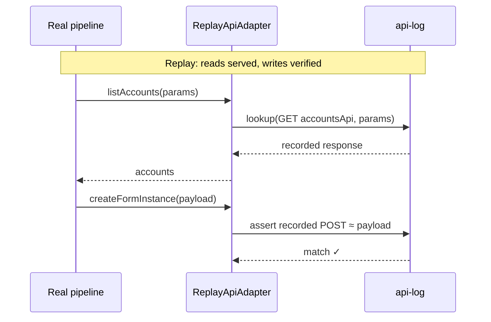

# Architecture review — record/replay feature

_2026-07-22_

**Legend:** `□ module` · `---> seam` · `===> leakage` · `▓ deep module`

Cross-cutting observation: record/replay is inverted. Recording happens at the _output_ seam (`res.send`) and replay happens at the _service-method_ layer, while the one dependency the feature exists to neutralize — the ISC API — flows through unrecorded. Every candidate below hangs off moving the feature to the `IscApiAdapter` seam. No `docs/adr/` directory exists; conflicts are against OpenSpec specs and are flagged inline.

This review is scoped to the record/replay subsystem. The 2026-07-21 full-codebase review at `ARCHITECTURE-REVIEW.md` covers broader concerns (Match step, FusionRun consolidation, FusionAccount façade, test seams, client call, account assembly, messaging). Candidate 4 there ("One test seam at the platform boundary", never implemented) is the direct ancestor of candidates 1 and 3 here.

---

## 1. Record and replay at the IscApiAdapter seam

**Strength:** `Strong` | **Category:** mock (true external — ISC is third-party)

**Files:** `src/services/recordingService.ts`, `src/services/clientService/iscApiAdapter.ts`, `sdkApiAdapter.ts`, `clientService.ts`, `src/operations/__tests__/chain/harness/ReplayAdapter.ts`, `fakeApiAdapter.ts`, `src/utils/operationHandler.ts`, `scripts/record-chain.js`

### Before / After

```text
Before: record misses the dependency; replay re-implements the pipeline

  RECORD                                   REPLAY
  operation → services → client.call ──► ISC API
                 │                           ▲ (nothing recorded)
   res.send ──tee┘                           │
   snapshot ──► scenario.json      FakeApiAdapter = {} as any
                                       ▲
        ReplayAdapter mocks ~25 service methods by hand ──┘
        (758 lines · hand-synced · double-mocks
         processFusionAccounts · undefined nativeId latent crash)

After: one seam, two adapters, the real pipeline under test

  operation → services → client.call → ▓▓▓▓▓▓▓▓▓▓▓▓▓▓▓▓▓▓▓▓▓▓▓▓▓▓▓▓▓▓▓
                                       ▓ IscApiAdapter seam             ▓
                                       ▓                               ▓
       record:  SdkApiAdapter ──► RecordingApiAdapter ──► api-log.ndjson
           logs (method, args) → response per call                     ▓
                                       ▓                               ▓
       replay:  ReplayApiAdapter serves api-log by (method, args)      ▓
           unknown request → fail loudly (drift detector)              ▓
                                       ▓▓▓▓▓▓▓▓▓▓▓▓▓▓▓▓▓▓▓▓▓▓▓▓▓▓▓▓▓▓▓
```

### Problem

Recording captures outputs and `FusionRun` snapshots but not ISC API responses — so replay cannot substitute the API and instead re-mocks ~25 service methods by hand, a parallel implementation of the pipeline that drifts freely, double-mocks `processFusionAccounts`, and crashes on an undefined `nativeId` in the fallback path.

### Solution

Add two adapters at the `IscApiAdapter` seam: `RecordingApiAdapter` (decorates `SdkApiAdapter`, appends request→response pairs to an api-log) and `ReplayApiAdapter` (serves the log by method+args key, fails on unrecorded requests); replay runs the real pipeline and `ReplayAdapter.ts` is deleted.

### Benefits

- locality: ISC API knowledge in one module
- leverage: one api-log serves chain, unit, and debug
- interface is the test surface
- ReplayAdapter can't drift — pipeline _is_ the test
- deletion test: −758 lines, −25 mocks, −FakeApiAdapter
- seam already real: SdkApiAdapter + FakeApiAdapter = 2 adapters

---

## 2. Retire `FusionRun.restore()` as a replay mechanism

**Strength:** `Worth exploring` | **Category:** in-process

**Files:** `src/model/fusionRun.ts` (`restore()`, L677–725), `src/model/__tests__/fusionRun.test.ts`, `openspec/specs/ubiquitous-language/spec.md` (FusionRun entry)

### Before / After

```text
Before: restore() — dead, lossy, speculative generality
  ┌────────────────────────────────┐
  │ interface: restore(snapshot)   │  ████████████ tall
  ├────────────────────────────────┤
  │ production callers: 0          │
  │ skips: managedAccountsByIdentityId          │
  │        _fusionIdentityMap                   │
  │        _linkedAccountKeyIndex               │
  │        _candidateRegistry                   │
  │        trigramIndexByAttribute              │
  │        _tracker · analysisRecorder          │
  │        WeakMap caches                       │
  │ key derivation: (account as any).id         │
  │                 ?? (account as any).name    │  ████████ shorter
  └────────────────────────────────┘

After: snapshot() = assertion artifact; restore() deleted
  ┌────────────────────────────────┐
  │ interface: snapshot()           │  ███ short
  ├────────────────────────────────┤
  │ replay: pipeline rebuilds state│
  │ via recorded API data.         │
  │ assert: snapshot() ≈ recorded  │
  │ stateAfter (deep equity check) │  ████████████ tall
  └────────────────────────────────┘
```

### Problem

`restore()` exists to support old state-injection replay, has zero production callers, silently restores a fraction of run state, and uses `as any` casts for key derivation — a shallow module whose interface promises fidelity the implementation ignores.

### Solution

With replay at the API seam, the pipeline rebuilds state itself through recorded data; `restore()` loses its only purpose. Keep `snapshot()` as the recorded artifact replay asserts against — a stronger check than output-only comparison.

### Benefits

- deletion test passes: complexity vanishes
- snapshot gains a truthful role
- state assertion catches bugs output misses

> ⚠ **Spec update required.** `openspec/specs/ubiquitous-language/spec.md` FusionRun entry: _"Exposes `snapshot()` and `restore()` for recording and replay."_ The archived fusion-run spec also mandates both. Both need one-line edits removing `restore()` and updating the rationale.

---

## 3. One harness: drive every operation test through the real ServiceRegistry

**Strength:** `Strong` | **Category:** mock

**Files:** `src/operations/__tests__/harness/mockRegistry.ts`, `registryMocking.ts`, `testRegistry.ts`, `operationTestRegistry.ts`, `src/operations/__tests__/chain/framework/ChainRunner.ts`, `chain/harness/ReplayAdapter.ts`, `dryRun.test.ts`

### Before / After

```text
Before: four seams, mocks pin the implementation
 ┌─ context overrides (15 branches)
 ├─ mockRegistry.ts      ─┐ overlap ~80%, both cast `as any`
 ├─ registryMocking.ts   ─┘ renames fail at runtime or never
 └─ ReplayAdapter.ts (758 lines) re-implements the pipeline
    with 25 hand-synced service-method mocks

After: one seam — everything else real
 ┌────────────────────────────────────────┐
 │ operation → real ServiceRegistry       │
 │   real services · real pipeline        │
 │   ─ ─ ─ ReplayApiAdapter seam ─ ─ ─    │  ◀ the only substitute
 └────────────────────────────────────────┘
   unit-style tests: hand-authored mini api-logs
   chain tests:      captured api-logs
   mockRegistry.ts · registryMocking.ts · ReplayAdapter.ts → deleted
```

### Problem

Two harnesses mock the pipeline's internal call graph (38 `vi.fn()` in `dryRun.test` alone, `as any` casts so renames fail silently), and any phase-structure refactor forces coordinated harness edits with no locality between a change and its test fallout.

### Solution

Drive all operation tests through the real `ServiceRegistry` with only `IscApiAdapter` substituted — hand-authored mini-recordings for focused unit-style tests, captured recordings for scenario tests — and delete the duplicate mock registries and hand-rolled `ReplayAdapter`.

### Benefits

- tests cross one seam, type-checked
- refactors stop bouncing off harnesses
- leverage: one adapter, all operations
- two harness files deleted

> This is the 2026-07-21 review's candidate 4, restated as the replay half of the record/replay feature. Candidate 1 above makes it achievable — `ReplayApiAdapter` _is_ the one substitute.

---

## 4. Side effects as first-class recorded citizens

**Strength:** `Worth exploring` | **Category:** in-process (once #1 lands)

**Files:** `src/services/recordingService.ts` (`buildScenario`), `src/operations/__tests__/chain/harness/ReplayAdapter.ts` (`compareOutputs`), `docs/guides/testing-process.md`, write call sites in `formService.ts`, `sourceService.ts`

### Before / After



### Problem

The ubiquitous-language spec defines **Side effects** as a testing concept captured in side-effect files, and `testing-process.md` describes `sideEffects.*.generated.json` — but nothing writes them; the actual code records only `scenario.json` with different structure, and form-creation / correlation-PUT / state-save calls are invisible to replay assertions.

### Solution

With recording at the API seam, every mutating call (POST/PATCH/PUT/DELETE) naturally appears in the api-log. During replay, the adapter serves reads from the log and _asserts_ writes: each recorded mutating call is matched against the replayed call by method+args; drift or extra writes fail. Order-insensitive matching (mutating calls sorted by target resource, then by exact args).

### Benefits

- side-effect files become real via api-log
- no additional recording mechanism needed
- resolves doc/code drift: pick one layout
- spec's **Side effects** term earns its definition

> ⚠ **Doc format drift.** `docs/guides/testing-process.md` describes `test-data/scenarios/<id>/` with `output.sweepN.expected.json` + `sideEffects.*.generated.json`. The code implements `test-data/recordings/<chain>/scenario.json`. Reconcile into the recording layout and update the doc, or rename the recording layout to match. (Recommend: keep the recording layout — it's what the actual test runner discovers.)

---

## 5. Determinism controls for byte-identical replay output

**Strength:** `Worth exploring` | **Category:** in-process

**Files:** `src/services/definitionService/` (unique attribute definitions: `$UUID`, `$counter`), `src/model/fusionAccount.ts` (history entry timestamps), `src/operations/__tests__/chain/harness/ReplayAdapter.ts:675` (date sanitizer in `compareOutputs`)

### Before / After

```text
Before: sanitizer knows about output shape — shallow layering
  compareOutputs(actual, expected)
    → sanitizeHistoryDates()    ← leak: comparison knows history schema
    → stripTimestamps()
  problems: sanitizer grows with new data types; papered-over
            non-determinism hides real output drift

After: non-determinism behind an injectable seam
  Real:  DefinitionService.clock = Date, .uuid = crypto.randomUUID
  Replay: DefinitionService.clock = fixed(2026-01-01T00:00:00Z),
           .uuid = seeded-GUID
  → byte-identical output · no sanitizer
```

### Problem

`$UUID` generation, counters, and history-timestamp sources are hard-wired to real clock/UUID, so replay output is never byte-identical — the harness papers over it with ad-hoc sanitizers that know the output shape, and sanitizer logic grows with each new non-deterministic data type.

### Solution

Inject clock and UUID generators into `DefinitionService` (and any other history-writing module); record stores the seed, replay re-uses it so the same API data produces byte-identical output. Sanitizers become unnecessary — output comparison is direct deep-equals.

### Benefits

- interface: time→injectable value, no sanitizer
- locality: determinism knowledge in one module
- replay becomes truly reproducible
- sanitizers deleted

### Open question

Seeded non-determinism requires defining the seed/slice boundary: a per-step seed ("step N = UUID 0..K, clock=T_start + elapsed") is simpler but fragile across internal refactors; a per-call seed ("call 1 UUID 0, call 2 UUID 1") is more stable but couples the seed domain to the call order. Worth grilling before committing.

---

## 6. Recording lifecycle: config-owned modes, finalize on operation end

**Strength:** `Speculative` | **Category:** in-process

**Files:** `src/model/fusionRun.ts:170` (RECORD_MODE), `src/services/recordingService.ts:37,130,147` (RECORD_CHAIN_NAME, VERBOSE_RECORDING), `src/services/serviceRegistry.ts:170-174` (conditional RecordingService init), `scripts/record-chain.js:41-43`

### Before / After

```text
Before: env flags in 3 files, singleton, finalize only on SIGINT/SIGTERM
  FusionRun:         RECORD_MODE       ──┐
  RecordingService:  RECORD_CHAIN_NAME ──┼─ scattered env reads
                     VERBOSE_RECORDING ──┘
  ServiceRegistry:   conditionally news up process-wide singleton
  record-chain.js:   sets env vars, spawns child process
  finalize:          SIGINT / SIGTERM only — clean exit loses scenario.json

After: one RecordingConfig, finalized by operation handler
  FusionConfig.recording: { mode, chainName, verbose }
    → ServiceRegistry owns a per-run (non-singleton) RecordingService
    → createOperationHandler: on beforeExit/finally: service.finalize()
    → record-chain.js: no env vars needed (mode set via config override)
```

### Problem

Record mode flags are split across `FusionRun` (partially centralized), `RecordingService` (two reads), and `record-chain.js` (env-only interface); the singleton has no per-run lifecycle; `finalize()` only fires on signals — a clean exit (process end without signal) produces `steps.ndjson` but never compiles `scenario.json`.

### Solution

Fold all recording flags into `RecordingConfig` owned by `FusionConfig`; `ServiceRegistry` constructs a per-run `RecordingService` (drop the singleton); `createOperationHandler` calls `finalize()` in its finally block, not just on signals; `record-chain.js` passes config rather than env vars.

### Benefits

- locality: recording config in one place
- finalize survives clean exits
- per-run isolation removes singleton
- record-chain.js simplifies

> ⚠ **Extends a recorded design decision.** The 2026-07-20 `branch-audit-map-define-match` change decided to read `RECORD_MODE` once and attach it to `FusionRun` — this was a step toward centralization. This candidate finishes the job by moving the remaining two env-var reads and the lifecycle out of the service implementation.

---

## Suggested context

Domain terms discovered during analysis, worth formalising in `openspec/specs/ubiquitous-language/spec.md`:

- **API log** — the recorded request→response pairs captured during a recording session. A golden-artifact type alongside **Scenario** and **Side effects**. Currently unnamed; lives implicitly in the recording as `steps[*].stateAfter` fields that _approximate_ API data but aren't actually recorded.
- **Chain** — used in code (`RECORD_CHAIN_NAME`, `ChainRunner`, `chainName`) but not in the ubiquitous-language spec. The spec term **Scenario** captures the same concept (a self-contained test case with input data, configuration, and expected outputs). Recommend retiring "chain" in favor of the spec's **Scenario**.
- **Drift detection** — the property that replay fails loudly when replayed API calls diverge from recorded ones (new request, different args, missing request). A quality attribute of the `ReplayApiAdapter`, not a service. Worth naming in the Testing section so AI agents and developers share a term for this failure mode.

---

## Top recommendation

**Candidate 1 — Record and replay at the `IscApiAdapter` seam.** This is the keystone: it fixes the inversion (record at the platform seam, not the output seam), deletes the most code (−758-line `ReplayAdapter`, −25 mocks, −FakeApiAdapter), implements the 2026-07-21 review's candidate 4 as a by-product, and unlocks candidates 2–4. The seam already has two adapters, and `client.call()` (the 2026-07-21 review's candidate 5) has already consolidated all ISC API traffic through it — the plumbing is ready.

Candidates 1 and 3 together form a tight iteration: 1 builds the adapters, 3 migrates all test harnesses to them. Pair them.

---

_Next: review the candidates and ask yourself — which one would you like to explore? I'll run the `/grilling` skill to walk constraints, dependencies, interface shape, and what tests survive for the one you pick._
