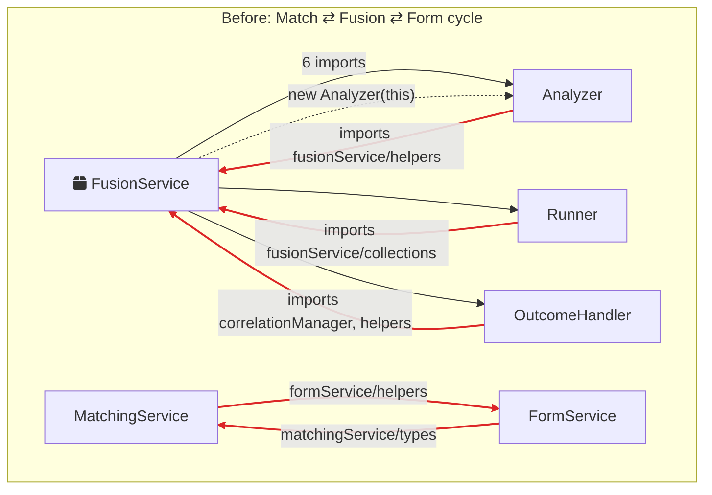

# Architecture review — colab-saas-conn-sailpoint-identity-fusion

_2026-07-21_

**Legend:** `□ module` · `---> seam` · `===> leakage` · `▓ deep module`

Cross-cutting observation: the codebase is mid-migration (FusionRun encapsulation, processor extraction, matching move all landed in the last weeks). The dominant friction is not any single god-object — it's **extraction without seam-formation**: logic moved to new files while the glue that makes the moves correct was duplicated instead of deepened. Candidates 1, 3, and 6 are that pattern from three angles.

---

## 1. Deepen the Match step into one module

**Status:** `Implemented` — `MatchOutcomeDispatcher` created in `src/services/matchingService/matchOutcomeDispatcher.ts`; old analyzer/runner/outcome-handler files deleted; resolution switches removed from `FusionService`.

**Strength:** `Strong` | **Category:** in-process

**Files:** `src/services/matchingService/managedAccountAnalyzer.ts`, `managedAccountMatchingRunner.ts`, `managedAccountOutcomeHandler.ts`, `candidateRegistry.ts`, `src/services/fusionService/fusionService.ts`, `src/services/formService/helpers.ts`

### Before / After



```text
After: one direction, one seam
┌─────────────────────────────────────────────┐
│ FusionService                                │
│   match(accounts, run) ─────┐                │
└─────────────────────────────┼───────────────┘
                              ▼
              ▓▓▓▓▓▓▓▓▓▓▓▓▓▓▓▓▓▓▓▓▓▓▓▓▓▓▓▓
              ▓  Match step module (deep)    ▓
              ▓  ┌────────────────────────┐  ▓
              ▓  │ analyzer · runner      │  ▓
              ▓  │ outcome dispatch       │  ▓
              ▓  │ candidate registry     │  ▓
              ▓  │ (helpers moved inside) │  ▓
              ▓  └────────────────────────┘  ▓
              ▓▓▓▓▓▓▓▓▓▓▓▓▓▓▓▓▓▓▓▓▓▓▓▓▓▓▓
```

### Problem

The **Match** step — a concept the ubiquitous-language spec assigns to MatchingService — spans 6 files across 2 packages, with circular imports (matching→fusion, matching⇄form) and 7 closures over private FusionService internals passed through an 18-member deps bag; `new ManagedAccountAnalyzer(this)` makes FusionService's implementation surface the interface.

### Solution

Move outcome dispatch and the fusionService helpers the Match modules consume inside the Match module, invert the dependency to one direction (fusion → matching), and expose one verb.

### Benefits

- interface: 18-member deps bag → one verb
- locality: Match changes stop crossing packages
- deletion test: today the split *fails* it
- tests exercise Match without FusionService

### Suggested context

- **Match outcome dispatch** — routing a scored candidate to exact/partial/deferred/non-match handling. Currently unnamed; lives in `managedAccountOutcomeHandler.ts` but the concept is referenced from fusionService and decisionProcessor without a canonical term.

---

## 2. Make FusionRun the single source of truth the spec says it is

**Status:** `Implemented in this change` — dead fields removed, `sourcesByName` deduplicated, tracker/recorder access moved behind run verbs (`queueDisableOperation`, `removeMatchAccount`, `trackFailed`, deferred-candidate registry).

**Strength:** `Strong` | **Category:** in-process

**Files:** `src/model/fusionRun.ts`, `src/services/sourceService/sourceService.ts`, `src/services/formService/formService.ts`, `src/services/fusionService/fusionService.ts`, `src/services/matchingService/matchingService.ts`, `src/services/fusionService/aggregationTracker.ts`

### Before / After

```text
Before: run state in 5 places — snapshot() captures a fraction
┌──────────┐ ┌──────────┐ ┌──────────┐ ┌──────────┐ ┌──────────┐
│ FusionRun│ │SourceSvc │ │ FormSvc  │ │FusionSvc │ │MatchSvc  │
│ 14 fields│ │~12 fields│ │7 live +  │ │tracker,  │ │trigram   │
│          │ │sourcesBy │ │4 DEAD    │ │disable   │ │index,    │
│ sourcesBy│ │Name (dup)│ │fields    │ │queue,    │ │norm      │
│ Name     │ │inventory │ │counters, │ │sweep     │ │caches    │
│          │ │maps      │ │form cache│ │machine   │ │          │
└────┬─────┘ └────┬─────┘ └────┬─────┘ └────┬─────┘ └────┬─────┘
     └────────────┴──── hand-synced ───────┴────────────┘

After: one home — snapshot()/restore() becomes truthful
┌──────────────────────────────────────────────────────────┐
│ ▓▓▓▓▓▓▓▓▓▓▓▓▓▓▓▓▓▓▓▓▓▓ FusionRun ▓▓▓▓▓▓▓▓▓▓▓▓▓▓▓▓▓▓▓▓▓▓▓ │
│ ▓ inventory · work queue · decisions · tracker ·        ▓ │
│ ▓ trigram index · sweep state — all behind              ▓ │
│ ▓ intention-revealing methods, raw Maps hidden          ▓ │
│ ▓▓▓▓▓▓▓▓▓▓▓▓▓▓▓▓▓▓▓▓▓▓▓▓▓▓▓▓▓▓▓▓▓▓▓▓▓▓▓▓▓▓▓▓▓▓▓▓▓▓▓ │
└──────────────────────────────────────────────────────────┘
```

### Problem

The spec mandates "no service SHALL hold mutable run-scoped state," yet run state lives in five places: two hand-synced `sourcesByName` maps, four fossil fields in FormService that were never removed after migration, FormService's live counters invisible to `snapshot()`, the tracker on FusionService, and the per-run trigram index on MatchingService — so the recording/replay seam silently captures a subset of the truth.

### Solution

Absorb every per-run mutable field into FusionRun (inventory maps, form counters, tracker, trigram index, sweep state machine), delete the dead fields, and narrow the interface from ~68 members exposing raw Maps to domain operations.

### Benefits

- locality: one place for run state
- snapshot/replay seam becomes truthful
- kills 4 dead fields, 2 duplicate maps
- interface shrinks: ~68 members → verbs
- deletion test passes on duplicates

---

## 3. Collapse the FusionAccount façade into behavior-rich objects

**Strength:** `Worth exploring` | **Category:** in-process

**Files:** `src/model/fusionAccountBase.ts`, `fusionAccountAccessors.ts`, `fusionAccountState.ts`, `fusionAccountMatcher.ts`, `fusionAccountUtils.ts`, `fusionAccountTypes.ts`, `src/model/fusionAccountRules/` (8 files)

### Before / After

```text
Before: shallow — interface ≈ implementation
┌──────────────────────────┐
│ interface: ~115 members  │  ████████████████ tall
├──────────────────────────┤
│ impl: 1–3 line delegations│  ████████████████ tall
│ → 54 rule fns, 13 files  │
│ each rule: 1 caller      │
└──────────────────────────┘
 "blend a managed account" bounces:
 layerRules → matcher → collectionRules → historyRules

After: deep — domain verbs, private state
┌──────────────────────────┐
│ interface: domain verbs  │  ███ short
├──────────────────────────┤
│                          │
│  ▓ collections           │
│  ▓ correlation           │  ████████████████ tall
│  ▓ layers                │
│  ▓ (state fully private) │
│                          │
└──────────────────────────┘
```

### Problem

FusionAccount is a ~115-member pass-through façade over 54 rule functions that each have exactly one production caller, spread across 13 files — understanding one behavior ("blend a managed account") bounces through four files, and callers must choose between duplicate accessors (`identityId` vs `identityIdAttribute`, `attributes` vs `currentAttributes` vs `attributeBag`) plus a hidden global invariant (`FusionAccount.configure(config)`).

### Solution

Regroup façade + rules + state into a few behavior-rich objects (collections, correlation, layers) with state fully private, so callers see domain verbs instead of 115 delegations.

### Benefits

- interface: ~115 members → domain verbs
- locality: one behavior, one file
- kills duplicate accessors, hidden global
- rules gain real tests at one seam

---

## 4. One test seam at the platform boundary

**Strength:** `Strong` | **Category:** mock

**Files:** `src/operations/__tests__/harness/mockRegistry.ts`, `registryMocking.ts`, `src/operations/__tests__/chain/harness/ReplayAdapter.ts`, `fakeApiAdapter.ts`, `src/services/serviceRegistry.ts`

### Before / After

```text
Before: four seams, mocks pin the implementation
 ┌─ context overrides (15 branches)
 ├─ mockRegistry.ts      ─┐ overlap ~80%,
 ├─ registryMocking.ts   ─┘ both cast `as any`
 └─ ReplayAdapter (758 lines) re-implements the 438-line
    pipeline: real MappingService/DefinitionService wired
    over mock pieces — drifts from corePipeline freely

After: one seam — everything else real
 ┌────────────────────────────────────────┐
 │ operation → real ServiceRegistry       │
 │              │                         │
 │   real services · real pipeline        │
 │              │                         │
 │   ─ ─ ─ ─ IscApiAdapter seam ─ ─ ─ ─   │  ◀ the only mock
 └────────────────────────────────────────┘
```

### Problem

Tests mock the pipeline's internal call graph (38 `vi.fn()` in dryRun.test alone, both registries cast `as any` so renames fail at runtime or never), and the 758-line ReplayAdapter re-codes Map/Define evaluation order as a parallel implementation of the operation run — so any refactor of the phase structure forces coordinated harness edits with no locality between a change and its test fallout.

### Solution

Drive operations through the real ServiceRegistry with only `IscApiAdapter` + `Context` substituted, delete the duplicate mock registry, and make ReplayAdapter run the real pipeline instead of re-implementing it.

### Benefits

- interface: tests cross one seam
- mocks type-check against real adapter
- refactors stop bouncing off harnesses
- ReplayAdapter can't drift from pipeline
- leverage: one harness, all operations

---

## 5. One verb for an ISC API call

**Strength:** `Worth exploring` | **Category:** ports & adapters

**Files:** `src/services/clientService/clientService.ts`, `queue.ts`, `helpers.ts`, `iscApiAdapter.ts`, `sdkApiAdapter.ts` + ~25 `execute*` wrappers in `identityService.ts`, `messagingService.ts`, `formService.ts`, `sourceService.ts`

### Before / After

```text
Before: policy smeared, raw SDK reachable
  caller ──► client.accountsApi (raw getter, ×13) ──► bypass!
  caller ──► executeXxx wrapper (×25, in 5 services)
                │ timeout ─ clientService.execute
                │ retry loop ─ queue.executeRequest
                │ retry predicate + backoff ─ helpers
  pagination: 4 entry points, divergent failure semantics

After: one verb, policy behind it
  caller ──► ▓▓▓▓▓▓▓▓▓▓▓▓▓▓▓▓▓▓▓▓▓▓▓▓▓▓
             ▓ client.call(api, params, policy) ▓
             ▓  queue · retry · timeout ·       ▓
             ▓  pagination · error normalization ▓
             ▓▓▓▓▓▓▓▓▓▓▓▓▓▓▓▓▓▓▓▓▓▓▓▓▓▓
```

### Problem

"How an ISC API call behaves" has no locality: retryability is decided in `helpers.shouldRetry`, delay in `helpers.calculateRetryDelay`, the loop in `queue.executeRequest`, timeout and error normalization in `clientService.execute`, and priority at each of ~25 per-service wrappers — while 13 raw SDK getters let callers silently bypass the whole policy.

### Solution

Collapse the getters and wrappers into one verb (`call`) with retry/timeout/priority/pagination as a policy object owned by the queue; delete the dead throttle/axios-retry paths.

### Benefits

- locality: call policy in one module
- interface: 13 getters + 25 wrappers → 1 verb
- no silent policy bypass
- two adapters already justify the seam

---

## 6. One account-assembly recipe behind the processors

**Status:** `Implemented` — `AccountAssembly` extracted into `src/services/accountAssembly/` and shared by `FusionService`, `IdentityProcessor`, and `DecisionProcessor`.

**Strength:** `Worth exploring` | **Category:** in-process

**Files:** `src/services/fusionService/fusionService.ts`, `decisionProcessor.ts`, `identityProcessor.ts`, `src/services/matchingService/managedAccountOutcomeHandler.ts`

### Before / After

```text
Before: same recipe cloned per processor
 fusionService.ts      decisionProcessor   identityProcessor  outcomeHandler
 ├ isAggregation..()   ├ isAggregation..() ├ isAggregation..() ├ isAggregation..()   ← 4 copies
 ├ shouldPrune..()     ├ shouldPrune..()   ├ shouldPrune..()   │                     ← 3 copies
 ├ applyAttribute..()  ├ applyAttribute..()├ applyAttribute..()│                     ← 3 copies
 ├ addManagedAccount   ├ addManagedAccount ├ addManagedAccount │                     ← 3 copies
 │   Layer(...)        │   Layer(...)      │   Layer(...)      │
 └ setFusionAccount()  └ setFusionAccount()└ setFusionAccount()│                     ← 3 copies

After: processors differ only in what varies
 ┌────────────────────────────────────────────────────┐
 │ ▓ account assembly (deep)                          ▓ │
 │ ▓  mode gates · layer application · Map/Define ·   ▓ │
 │ ▓  registration — one recipe                       ▓ │
 │ └────────────────────────────────────────────────── ▓ │
 │   ◄ FusionAccount processor  (what varies)         ▓ │
 │   ◄ identity processor       (what varies)         ▓ │
 │   ◄ decision processor       (what varies)         ▓ │
 └────────────────────────────────────────────────────┘
```

### Problem

The processor extraction moved methods but cloned the glue — ~15 blocks duplicated across 4 files (`isAggregationAccountListMode` ×4, `shouldPruneDeletedManagedAccounts` ×3, `applyAttributeProcessing` ×3, the `addManagedAccountLayer` invocation ×3 with its `skipBlendHistoryForManagedKeys` normalization ×2) — so any change to "how an account absorbs layers" requires coordinated edits in 3–4 files, and two of the three processors have no tests of their own.

### Solution

Extract the shared recipe once as an account-assembly collaborator owning mode gates, layer application, attribute processing, and registration; processors supply only what varies.

### Benefits

- locality: recipe edits touch one file
- leverage: one recipe, 3+ processors
- processors become independently testable
- deletion test passes on the copies

---

## 7. Re-cut messaging along domain nouns

**Strength:** `Speculative` | **Category:** in-process

**Files:** `src/services/messagingService/` (2,117 lines), `src/services/reportService.ts`, `src/services/fusionService/fusionReportBuilder.ts`, `src/operations/helpers/generateReport.ts`, `dryRunHelpers.ts`, `buildDryRunPayload.ts`, `src/services/formService/formService.ts`

### Before / After

```text
Before: report logic in 4 places, messaging knows everything
 messagingService ──► form email · workflow scheduling ·
                      report render · report delivery · mkdir
                      · 5 raw workflow pass-throughs
     ===> imports matchingService scoring internals
     <=== formService passes form structure + scores in
 report rendering: messaging helpers · reportService ·
                   fusionReportBuilder · dry-run builders

After: three modules on domain nouns
 ┌─ WorkflowService   schedule/execute workflows
 ├─ EmailRenderer     templates · locales
 └─ Report module     build · render · deliver
```

### Problem

MessagingService cannot answer "what is a message?" without also answering "what is a report directory?" — it mixes form email, delayed-aggregation scheduling, report rendering/delivery, and filesystem duties (~20 public methods), imports match-scoring internals, receives review-form structure from FormService, and report rendering lives in four places across three directories.

### Solution

Re-cut along the domain nouns: workflow scheduling, email rendering, and one Report module owning build + render + deliver, so form, match, and report types stop crossing the messaging seam.

### Benefits

- locality: report shape in one module
- match/form types stop leaking
- interface: 20 methods → three small ones
- duplicated mkdir/render deleted

---

## Top recommendation

**Candidate 1 — Deepen the Match step into one module.** It sits on the hottest file in the repo (fusionService.ts, 79 commits) and the hottest workflow, the spec already names the owner (MatchingService owns **Match** — the seam is pre-named by the domain, no vocabulary invention needed), and it currently *fails* the deletion test in its extracted shape. It's also the unlock for candidates 2 and 6: breaking the fusion⇄matching⇄form cycle is what makes the FusionRun consolidation and the processor-glue collapse safe to do. Candidate 4 (one test seam) is the enabler to do any of this without mock drift — pair them if you take 1.

See candidate #1 above.
