# Identity Fusion NG

> **Disclaimer:** Identity Fusion NG is the newest Identity Fusion version and supersedes any Identity Fusion v1.x previous release. Version 1.x is now **deprecated**. For those needing to upgrade an existing deployment, please refer to the [migration guide](docs/guides/migration-from-previous-fusion.md).

Identity Fusion NG is an Identity Security Cloud (ISC) connector that addresses the complex challenge of identity and account data aggregation through a streamlined **map-define-match framework**. This concept represents the high-level operation of the connector, which can execute all three steps or just one, but always in this logical sequence:

### The Map, Define, Match Framework

**The Three Pillars**
Map your attributes from different sources and accounts to align with your identity schema. Define new attributes from the existing ones, like unique identifiers, normalised versions of the original attributes and other powerful transformations. Finally, match your new accounts with existing identities to avoid creating duplicates, using all the previously processed attributes with a series of comparison algorithms to pick and choose.

1. **Map (Consolidation)**
   Map your attributes from different sources and accounts to align with your identity schema. Strict correlation often fails when data is inconsistent. Creating, normalizing, and combining attributes from multiple sources is complex. The connector provides flexible merging strategies when multiple sources contribute to the same attribute (first found, list, concatenate, or source preference).

2. **Define (Unique identifiers / Computation)**
   Define new attributes from the existing ones, like unique identifiers, normalised versions of the original attributes and other powerful transformations. ISC has no built-in way to generate unique identifiers and handle value collision. The connector provides powerful attribute definition using Apache Velocity templates, unique ID generation with disambiguation counters, immutable UUID assignment, and computed attributes.

3. **Match (Matching / Correlation)**
   Match your new accounts with existing identities to avoid creating duplicates, using all the previously processed attributes with a series of comparison algorithms to pick and choose. The connector provides similarity-based match detection comparing the resulting mapped and defined Fusion accounts against your identity baseline. It offers optional manual review workflows and configurable merging of account attributes.

### Operation Modes

Identity Fusion NG features three distinct operation modes:

- **Authoritative accounts**
- **Records**
- **Orphan accounts**

**Deployment Architecture**
The connector can be used side by side with any sources except when the goal is matching authoritative accounts to avoid duplication, in which case it acts like an umbrella of any source it manages and replaces the identity profile with its own.

You can use the **map**, **define**, and **match** capabilities independently or together. For **matching**, the Identity Fusion NG source should be **authoritative** in most cases—so it can determine which incoming managed accounts create a new identity and which correlate to an existing one. For **mapping and defining only** (unique IDs, calculated or consolidated attributes), Fusion is rarely configured as authoritative; adding managed account sources is optional and depends on your Map requirements.

---

## Configuration at a glance

Configuration is grouped into menus in the connector source in ISC. Each menu contains multiple sections with specific settings.

### Connection Settings

Authentication and connectivity to the ISC APIs.

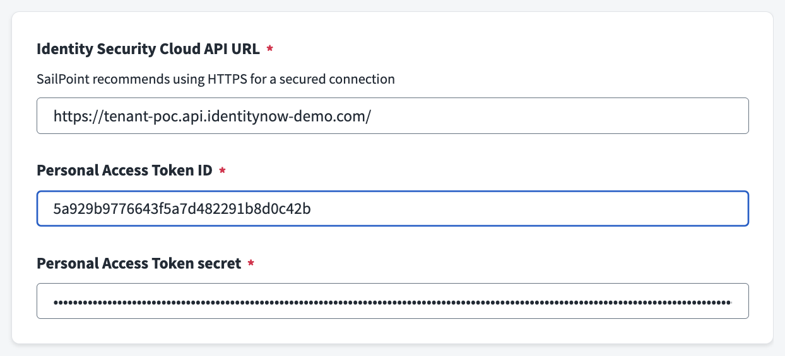

| Field                               | Description                                    | Required                         | Notes                                                                                 |
| ----------------------------------- | ---------------------------------------------- | -------------------------------- | ------------------------------------------------------------------------------------- |
| **Identity Security Cloud API URL** | Base URL of your ISC tenant                    | Yes                              | Format: `https://<tenant>.api.identitynow.com`                                        |
| **Personal Access Token ID**        | Client ID from your PAT                        | Yes                              | Must have required API permissions for sources, identities, accounts, workflows/forms |
| **Personal Access Token secret**    | Client secret from your PAT                    | Yes                              | Keep secure; rotate as needed                                                         |
| **API request retries**             | Maximum retry attempts for failed API requests | No (shown when retry is enabled) | Default: 20; also configurable from Advanced Settings                                 |
| **Requests per second**             | Maximum API requests per second (throttling)   | No (shown when queue is enabled) | Default: 10; also configurable from Advanced Settings                                 |

> **Note:** **API request retries** and **Requests per second** also appear in **Advanced Settings → Advanced Connection Settings**. They control the same underlying settings; Connection Settings provides quick access, while Advanced Settings groups them with related queue and retry options.

> **Tip:** Create a dedicated identity for Identity Fusion and generate a PAT for your source configuration.

### Source Settings

Controls which identities and sources are in scope and how processing is managed.

For an in-depth explanation of source types, aggregation rules, correlation modes, and account lifecycle, see the [Source configuration](docs/guides/source-configuration.md) guide.

| Section                | Description                                                                                                                                                                                               |
| ---------------------- | --------------------------------------------------------------------------------------------------------------------------------------------------------------------------------------------------------- |
| **Scope**              | Determines if identities are included in the processing scope and defines an optional identity filter query.                                                                                              |
| **Sources**            | Configures authoritative sources, source behavior, aggregation/correlation modes, plus dual account filters: `Accounts API filter` (server-side) and `Accounts JMESPath filter` (client-side, page-wise). |
| **Processing Control** | Manages history retention, empty account deletion, and behavior when unique identifiers are missing.                                                                                                      |

> **Note:** Managed machine accounts (`isMachine=true`) are not supported by Identity Fusion NG. The connector skips them during managed-account ingestion and logs warning messages with discarded counts.
>
> Filter references: [Accounts list API](https://developer.sailpoint.com/docs/api/v2025/list-accounts), [JMESPath](https://jmespath.org/).

### Attribute Mapping Settings

Controls how source account attributes are mapped into the Fusion account and how values from multiple sources are merged.

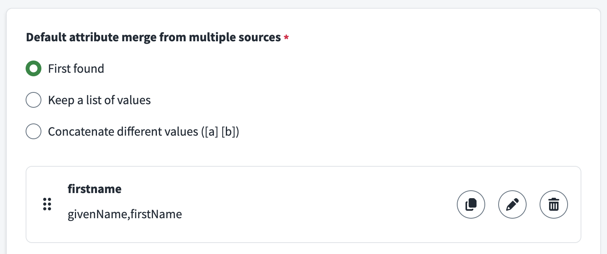

#### Attribute Mapping Definitions Section

| Field                                             | Description                                                | Required | Notes                                                                                                                                                                                |
| ------------------------------------------------- | ---------------------------------------------------------- | -------- | ------------------------------------------------------------------------------------------------------------------------------------------------------------------------------------ |
| **Default attribute merge from multiple sources** | Default method for combining values from different sources | Yes      | Options: **First found** (first value by source order), **Keep a list of values** (distinct values as array), **Concatenate different values** (distinct values as `[a] [b]` string) |
| **Attribute Mapping**                             | List of attribute mappings                                 | No       | Each mapping defines how source attributes feed a Fusion attribute                                                                                                                   |

**Per-attribute mapping configuration:**

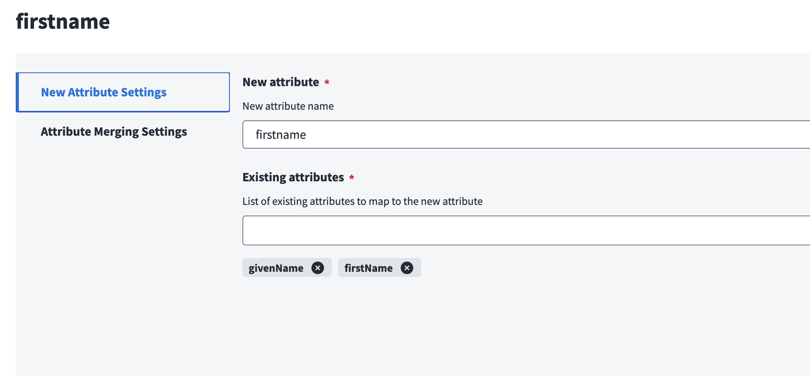

| Field                                                        | Description                                             | Required                | Notes                                                                          |
| ------------------------------------------------------------ | ------------------------------------------------------- | ----------------------- | ------------------------------------------------------------------------------ |
| **New attribute**                                            | Name of the attribute on the Fusion account             | Yes                     | Will appear in the discovered schema                                           |
| **Existing attributes**                                      | List of source attribute names that feed this attribute | Yes                     | Names must match source account schema (case-sensitive)                        |
| **Default attribute merge from multiple sources** (override) | Override default merge for this specific mapping        | No                      | Same options as default, plus **Source name** (use value from specific source) |
| **Source name**                                              | Specific source to use for this attribute               | Yes (when merge=source) | Takes precedence when multiple sources have values                             |

> **Tip:** You can use mapping settings to predefine an attribute and redefine the same attribute using attribute definition. The mapped value is available to the definition expression.

> **Tip:** Concatenated attributes are displayed in alphabetical order and duplicate values are removed. They can sometimes be good candidates for matching.

> **Tip:** You can keep all values found for a given attribute and generate a multi-valued attribute. You can get a comma-separated list of them if the schema attribute in question is not multi-valued.

### Attribute Definition Settings

Controls how attributes are generated (Define step), including unique identifiers, UUIDs, counters, and Velocity-based computed attributes.

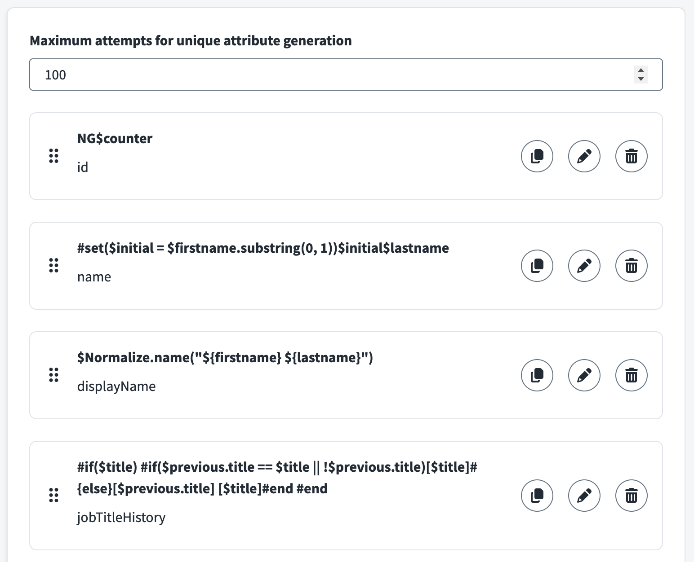

#### Attribute Definition Settings Section

| Field                                             | Description                                                | Required | Notes                                                        |
| ------------------------------------------------- | ---------------------------------------------------------- | -------- | ------------------------------------------------------------ |
| **Maximum attempts for unique Define generation** | Maximum attempts to generate unique value before giving up | No       | Default: 100; prevents infinite loops with unique/UUID types |
| **Attribute Definitions**                         | List of attribute definition rules                         | No       | Each definition specifies how an attribute is built          |

**Per-attribute definition configuration:**

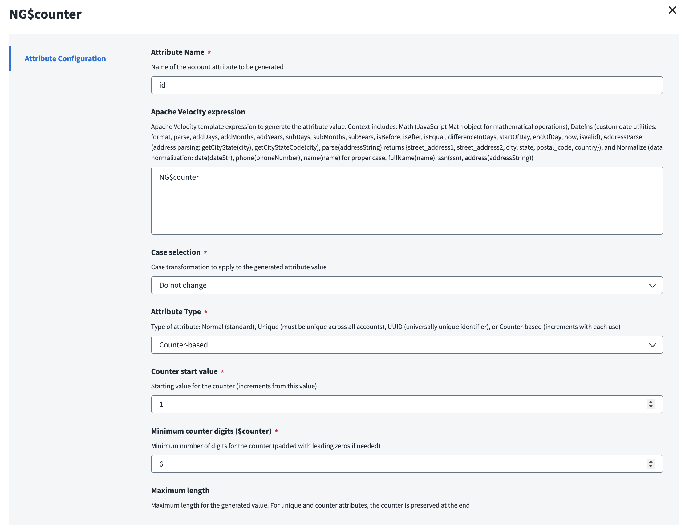

| Field                                 | Description                                         | Required                   | Notes                                                                                                                                                                                                                                                                                                                                                                                                                                       |
| ------------------------------------- | --------------------------------------------------- | -------------------------- | ------------------------------------------------------------------------------------------------------------------------------------------------------------------------------------------------------------------------------------------------------------------------------------------------------------------------------------------------------------------------------------------------------------------------------------------- |
| **Attribute Name**                    | Name of the account attribute to generate           | Yes                        | Will appear in the discovered schema                                                                                                                                                                                                                                                                                                                                                                                                        |
| **Apache Velocity expression**        | Template expression to generate the attribute value | No                         | Context includes: mapped account attributes, `$accounts`, `$sources`, `$previous`, optional `$identity`, `$originSource`, `$originAccount` (id), `$account` (origin snapshot object), plus `$Math`, `$Datefns` (format, parse, add/sub days/months/years, isBefore, isAfter, differenceInDays, etc.), `$AddressParse` (getCityState, getCityStateCode, parse), and `$Normalize` (date, phone, name, fullName, ssn, address). Example: `#set($initial = $firstname.substring(0, 1))$initial$lastname` |
| **Case selection**                    | Case transformation to apply                        | Yes                        | Options: **Do not change**, **Lower case**, **Upper case**, **Capitalize**                                                                                                                                                                                                                                                                                                                                                                  |
| **Attribute Type**                    | Type of attribute                                   | Yes                        | **Normal** (standard attribute), **Unique** (must be unique across accounts; counter added if collision), **UUID** (generates immutable UUID), **Counter-based** (increments with each use)                                                                                                                                                                                                                                                 |
| **Counter start value**               | Starting value for counter                          | Yes (counter type)         | Example: 1, 1000, etc.                                                                                                                                                                                                                                                                                                                                                                                                                      |
| **Minimum counter digits ($counter)** | Minimum digits for counter (zero-padded)            | Yes (counter/unique types) | Example: 3 → `001`, `002`; for unique type, counter is appended on collision                                                                                                                                                                                                                                                                                                                                                                |
| **Maximum length**                    | Maximum length for generated value                  | No                         | Truncates to this length; for unique/counter types, counter is preserved at end                                                                                                                                                                                                                                                                                                                                                             |
| **Normalize special characters?**     | Remove special characters and quotes                | No                         | Useful for IDs and usernames                                                                                                                                                                                                                                                                                                                                                                                                                |
| **Remove spaces?**                    | Remove all spaces from value                        | No                         | Useful for IDs and usernames                                                                                                                                                                                                                                                                                                                                                                                                                |
| **Trim leading and trailing spaces?** | Remove leading/trailing whitespace from value       | No                         | Cleans up extra whitespace from source data                                                                                                                                                                                                                                                                                                                                                                                                 |
| **Refresh on each aggregation?**      | Recalculate value every aggregation                 | No                         | Only available for **Normal** type; unique/UUID/counter preserve state                                                                                                                                                                                                                                                                                                                                                                      |

**Note:** When an account is **enabled**, all attributes (including unique) are force refreshed and recalculated (internal mechanism to reset unique attributes).

> **Tip:** If you want to change a unique attribute other than the account name or ID, you can disable the Fusion account and re-enable it. This is handy in situations where a surname change affects a username, etc.

> **Tip:** When dealing with multiple managed sources, generate your own Fusion account ID (`nativeIdentity`) and name, and ensure both are unique. Two Fusion accounts with the same name correlate to the same identity. In fact, any account evaluated for correlation is automatically correlated to an identity whose name (not username) matches. An identity name is defined by the name of the account that originated it. Only the last Fusion account returned from a list of Fusion accounts with the same ID is processed.

> **Tip:** Do not use a unique attribute or username that you may want to reset down the line as the Fusion account name. Use any other account attribute, and reserve your account name for an immutable unique attribute that is as human-friendly as possible.

> **Tip:** Use attribute normalizers (`$Normalize`) to align different formats across different sources.

> **Tip:** You can define extra attributes in your configuration and not include them in your schema. You can use them as ephemeral support attributes to create new ones. Remember that previously processed attributes are available to the next ones. All normal attributes are available to unique attributes, as these are the last ones to be processed. Don't use a unique attribute in your matching settings, as it won't be available on the managed account being processed at runtime.

> **Tip:** Remember that normal attributes are automatically refreshed when new data is found. You don't need to force global or individual attribute refresh unless there's a good reason, like troubleshooting, testing, or if the attribute definition is time-sensitive.

> **Note:** In Velocity context, managed account snapshots (`$accounts` and `$sources`) include each source account’s **`attributes`** plus **`_id`** and **`_name`** (from the ISC account’s top-level `id` and `name` / `nativeIdentity`), **`_source`** (source name), and **`IIQDisabled`** (IdentityIQ-style disabled flag where `true` means disabled). `$accounts` is deterministic: sources follow configured order, accounts keep insertion order within each source, and non-configured sources are appended. **`$originAccount`** is the immutable origin id string; **`$account`** is the origin snapshot (managed shape or identity-backed when the origin is `Identities`).

### Attribute Matching Settings

Controls Match behavior, including similarity matching and manual review workflows.

#### Matching Settings Section

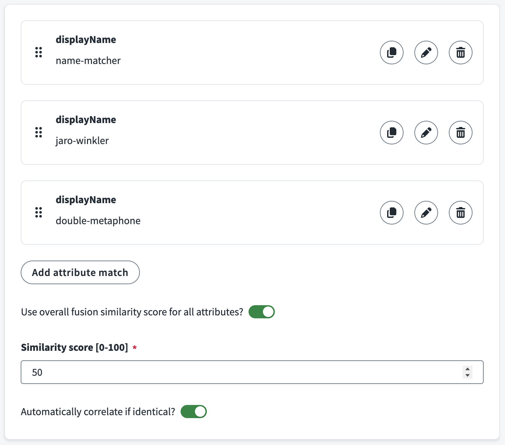

| Field                                                       | Description                                                    | Required                         | Notes                                                                                                                                                                                                                                                      |
| ----------------------------------------------------------- | -------------------------------------------------------------- | -------------------------------- | ---------------------------------------------------------------------------------------------------------------------------------------------------------------------------------------------------------------------------------------------------------- |
| **Fusion attribute matches**                                | List of identity attributes to compare for match detection     | Yes                              | At least one attribute match required; each match specifies an attribute and algorithm                                                                                                                                                                     |
| **Use overall fusion similarity score for all attributes?** | Use single overall score instead of per-attribute thresholds   | No                               | When enabled, the overall (average) threshold must be met and any evaluated mandatory attribute must also meet its own threshold. When disabled, every mandatory attribute must match, and if none are mandatory, all attributes are treated as mandatory. |
| **Similarity score [0-100]**                                | Minimum overall similarity score for auto-correlation          | Yes (when overall score enabled) | Typical range: 70-90; higher = stricter; only used when "Use overall fusion similarity score" is enabled                                                                                                                                                   |
| **Automatically correlate if identical?**                   | Auto-merge when attributes meet criteria without manual review | No                               | Use when you trust the algorithm and thresholds; skips manual review for high-confidence matches                                                                                                                                                           |

**Per-attribute match configuration:**

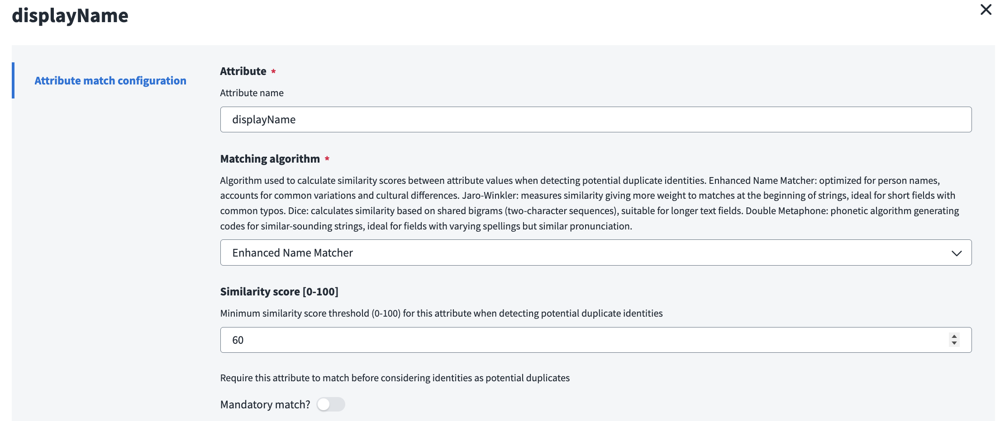

| Field                        | Description                                                   | Required | Notes                                                                                                                                                                                                                                                                                                                                                                                  |
| ---------------------------- | ------------------------------------------------------------- | -------- | -------------------------------------------------------------------------------------------------------------------------------------------------------------------------------------------------------------------------------------------------------------------------------------------------------------------------------------------------------------------------------------- |
| **Attribute**                | Identity attribute name to compare                            | Yes      | Must exist on identities in scope                                                                                                                                                                                                                                                                                                                                                      |
| **Matching algorithm**       | Algorithm for similarity calculation                          | Yes      | **Enhanced Name Matcher** (person names, handles variations), **Jaro-Winkler** (short strings with typos, emphasizes beginning), **LIG3** (Levenshtein-based with intelligent gap penalties, excellent for international names and multi-word fields), **Dice** (longer text, bigram-based), **Double Metaphone** (phonetic, similar pronunciation), **Custom** (from SaaS customizer) |
| **Similarity score [0-100]** | Minimum similarity score for this attribute                   | No       | Required when not using overall score mode. A mandatory attribute must meet or exceed this threshold or the match fails. In overall score mode, non-mandatory attributes may be below threshold, but a failed mandatory attribute still invalidates the match. When no attribute is mandatory, all attributes are treated as mandatory.                                                |
| **Mandatory match?**         | Require this attribute to match before considering as a match | No       | When Yes: this attribute's score must be ≥ its threshold or the match fails. When No: attribute still has a threshold; when overall score is disabled and no attribute is mandatory, every attribute is effectively mandatory (all must meet thresholds).                                                                                                                              |
| **Skip match if missing**    | Ignore this rule when one side is missing                     | No       | Default: Yes. Missing means `null`, `undefined`, or empty after trim. When enabled, the rule is skipped (neither positive nor negative). When disabled, the rule is evaluated even with missing values and counts toward the final result.                                                                                                                                             |

> **Tip:** Use Fusion reports to fine-tune your matching thresholds and algorithms.

> **Tip:** Remember that mandatory match configurations scoring below their threshold invalidate the match. Add them to the top of the list to avoid unnecessary overhead.

> **Note:** During managed-account analysis, Identity Fusion evaluates identity-backed candidates first. Duplicate checks against newly discovered unmatched Fusion accounts are only executed when no identity-backed match is found. If such a duplicate is detected, it is logged/reported as **deferred** and no ISC account is emitted for that path until a later aggregation correlates that Fusion account to an identity.

#### Review Settings Section

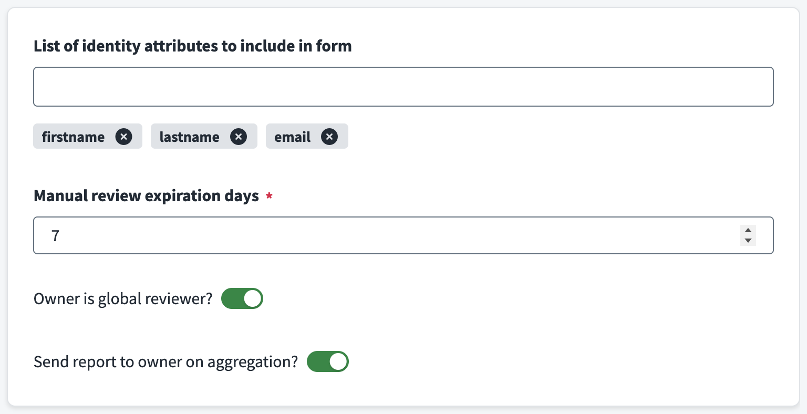

| Field                                              | Description                                      | Required | Notes                                                                                                                                                                                                                                                                                                                   |
| -------------------------------------------------- | ------------------------------------------------ | -------- | ----------------------------------------------------------------------------------------------------------------------------------------------------------------------------------------------------------------------------------------------------------------------------------------------------------------------- |
| **List of identity attributes to include in form** | Attributes shown on manual review form           | No       | Helps reviewers make informed decisions; examples: name, email, department, hire date                                                                                                                                                                                                                                   |
| **Manual review expiration days**                  | Days before review form expires                  | Yes      | Default: 7; ensures timely resolution                                                                                                                                                                                                                                                                                   |
| **Owner is global reviewer?**                      | Add Fusion source owner as reviewer to all forms | No       | Ensures at least one global reviewer is always assigned alongside dedicated reviewer entitlements for managed sources. For migration scenarios, it is recommended **not** to enable this until after the initial validation run has succeeded, so that review workflows cannot interfere with the first migration pass. |
| **Send report to owner on aggregation?**           | Email report to owner after each aggregation     | No       | Includes potential matches and processing summary                                                                                                                                                                                                                                                                       |

### Advanced Settings

Fine-tuning for API behavior, resilience, debugging, and proxy mode.

#### Developer Settings Section

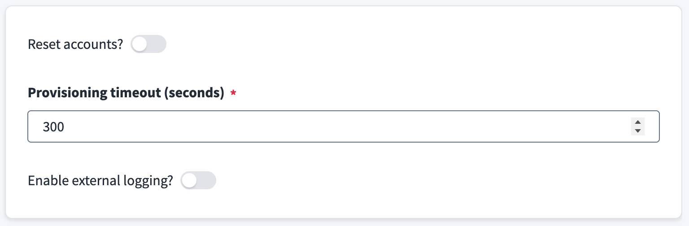

| Field                         | Description                                                   | Required                                    | Notes                                                                                                                                                                                         |
| ----------------------------- | ------------------------------------------------------------- | ------------------------------------------- | --------------------------------------------------------------------------------------------------------------------------------------------------------------------------------------------- |
| **Reset accounts?**           | Force rebuild of all Fusion accounts from scratch on next run | No                                          | **Use with caution in production**; useful for testing config changes; disable after one run                                                                                                  |
| **Enable concurrency check?** | Prevent concurrent account aggregations via a processing lock | No                                          | Default: true. When enabled, a lock is set at the start of each aggregation. If a prior run left the lock stuck, it is auto-reset and an error asks you to retry. Disable only for debugging. |
| **Enable external logging?**  | Send connector logs to external endpoint                      | No                                          | For centralized monitoring and analysis                                                                                                                                                       |
| **External logging URL**      | Endpoint URL for external logs                                | No (required when external logging enabled) | HTTPS recommended                                                                                                                                                                             |
| **External logging level**    | Minimum log level to send externally                          | No (required when external logging enabled) | Options: **Error**, **Warn**, **Info**, **Debug**                                                                                                                                             |

> **Tip:** You can use the built-in remote log server from the project to send your logs to your computer and save them to a file. Just use `npm run remote-log-server` from the connector's Node project folder and use the generated URL as your remote log server.

#### Advanced Connection Settings Section

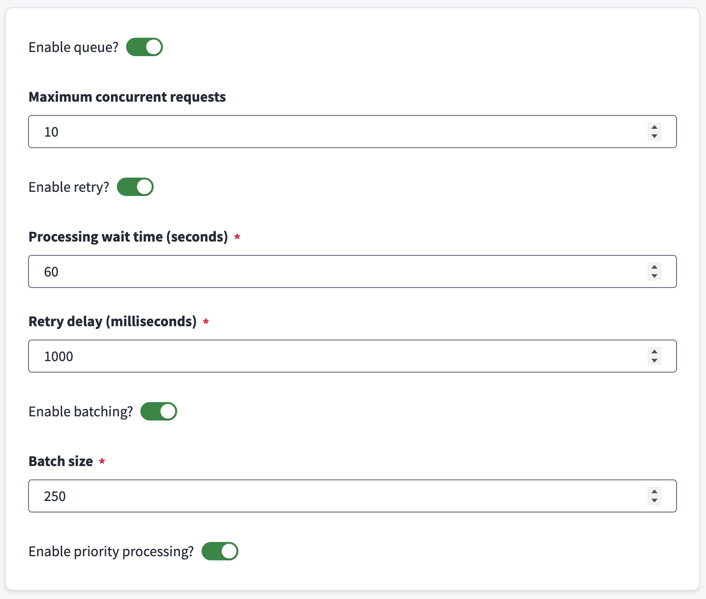

| Field                              | Description                                                        | Required                         | Notes                                                                             |
| ---------------------------------- | ------------------------------------------------------------------ | -------------------------------- | --------------------------------------------------------------------------------- |
| **Provisioning timeout (seconds)** | Maximum wait time for provisioning operations                      | Yes                              | Default: 300; increase for large batches or slow APIs                             |
| **Enable queue?**                  | Enable queue management for API requests                           | No                               | Enables rate limiting and concurrency control                                     |
| **Maximum concurrent requests**    | Maximum simultaneous API requests                                  | No (required when queue enabled) | Default: 10; adjust based on API capacity and tenant limits                       |
| **Enable retry?**                  | Enable automatic retry for failed API requests                     | No                               | Recommended for production; handles transient failures                            |
| **Processing wait time (seconds)** | Interval between keep-alive signals during long-running operations | Yes                              | Default: 60; used for account list and account update to prevent timeouts         |
| **Retry delay (milliseconds)**     | Base delay between retry attempts                                  | Yes                              | Default: 1000; for HTTP 429, uses `Retry-After` header when present               |
| **Enable batching?**               | Group requests in queue for better throughput                      | No                               | Can improve efficiency for bulk operations                                        |
| **Batch size**                     | Requests per batch                                                 | Yes (when batching enabled)      | Default: 250; adjust based on operation type and payload size                     |
| **Enable priority processing?**    | Prioritize important requests in queue                             | No                               | Default: enabled when queue is enabled; ensures critical operations process first |

#### Proxy Settings Section

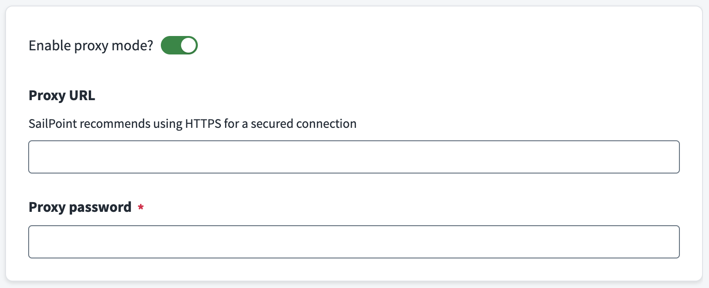

| Field                  | Description                                  | Required                         | Notes                                                                                |
| ---------------------- | -------------------------------------------- | -------------------------------- | ------------------------------------------------------------------------------------ |
| **Enable proxy mode?** | Delegate all processing to external endpoint | No                               | For running connector logic on your own infrastructure                               |
| **Proxy URL**          | URL of external proxy endpoint               | No (required when proxy enabled) | Must accept POST with command type, input, and config                                |
| **Proxy password**     | Secret for proxy authentication              | Yes (when proxy enabled)         | Set same value as `PROXY_PASSWORD` environment variable on proxy server; keep secure |

---

For detailed field-by-field guidance and usage patterns, see the [usage guides](docs/guides/) linked above.

---

## Overview

| Topic                                                                                    | Description                                                                                                  |
| ---------------------------------------------------------------------------------------- | ------------------------------------------------------------------------------------------------------------ |
| [Map](docs/guides/map.md)                                                                | Attribute mapping, merging, and consolidation from multiple sources.                                         |
| [Define](docs/guides/define.md)                                                          | Attribute definitions (Velocity computed attributes, unique identifiers, UUIDs, counters).                   |
| [Match](docs/guides/match.md)                                                            | Detect and resolve potential matching identities using one or more sources.                                  |
| [Source configuration](docs/guides/source-configuration.md)                              | In-depth guide on source settings, scope, aggregation timing, and correlation modes.                         |
| [Migration from previous Identity Fusion](docs/guides/migration-from-previous-fusion.md) | Migrate from an earlier Identity Fusion version: add the old source as managed, align schemas, then migrate. |
| [Advanced connection settings](docs/guides/advanced-connection-settings.md)              | Queue, retry, batching, rate limiting, and logging.                                                          |
| [Proxy mode](docs/guides/proxy-mode.md)                                                  | Run connector logic on an external server and connect ISC to it via proxy.                                   |
| [Troubleshooting](docs/guides/troubleshooting.md)                                        | Common issues, logs, and recovery steps.                                                                     |

---

## Quick start

1. **Add the connector to ISC** — Upload the Identity Fusion NG connector (e.g. via SailPoint CLI or your organization's process).
2. **Create a source** — In Admin → Connections → Sources, create a new source using the Identity Fusion NG connector. Mark it **Authoritative** when you need Match (so Fusion decides which incoming accounts create new identities vs. correlate to existing ones). For Map & Define only, Fusion is rarely authoritative.
3. **Configure connection** — Set Identity Security Cloud API URL and Personal Access Token (ID and secret). Use **Review and Test** to verify connectivity.
4. **Configure the connector** — Depending on your goal:
    - **Map & Define only:** Set [Source Settings](docs/guides/source-configuration.md) (identity scope and/or sources), [Attribute Mapping Settings](docs/guides/map.md) for the **Map** step, and [Attribute Definition Settings](docs/guides/define.md) for the **Define** step.
    - **Match:** Configure [sources and baseline](docs/guides/source-configuration.md), then [Attribute Matching Settings](docs/guides/match.md) (matching and review) for the **Match** step.
5. **Discover schema** — Run **Discover Schema** so ISC has the combined account schema.
6. **Identity profile and aggregation** — Create an identity profile and provisioning plan as required by ISC, then run entitlement and account aggregation.

For step-by-step instructions and UI details, see the [Map](docs/guides/map.md), [Define](docs/guides/define.md), and [Match](docs/guides/match.md) guides.

---

## Custom command: `custom:report`

Use `custom:report` to run a **non-persistent aggregation analysis**. It evaluates managed accounts with the same matching logic used for reports, but it does not execute the persistence/writeback phase used by `std:account:list`.

### Input options

`custom:report` supports optional runtime controls in the command input:

- `includeBaseline` (boolean): Emit rows categorized as baseline.
- `includeUnmatched` (boolean): Emit rows categorized as unmatched.
- `includeMatched` (boolean): Emit rows whose `matching.status` is `matched`.
- `includeDeferred` (boolean): Emit rows whose `matching.status` is `deferred`.
- `includeReview` (boolean): Emit rows with `review.pending === true`.
- `includeDecisions` (boolean): Emit rows linked to processed fusion review decisions.

All `include*` options default to `false`. If none are enabled, no account rows are streamed.
`summary` is always emitted by default and is not a runtime option.

### What it returns

- Streams final ISC account rows (`key`, `attributes`, `disabled`) like account list output.
- Adds root-level `matching` to every streamed row with:
    - `status`: `matched`, `deferred`, `non-matched`, `review-error`, or `not-analyzed`
    - `matches`: candidate identities and per-attribute scores when available
    - `sourceContext`: source provenance (`originSource`, `originAccount`, `sources`)
    - `correlationContext`: linked and missing account context (`accounts`, `missing-accounts`, `reviews`, `statuses`)
- Adds root-level `review` only for rows categorized as `review` or `decisions`:
    - `pending`: whether there is an active pending form instance linked to any account id in `attributes.accounts`
    - `forms`: pending form references (`formInstanceId`, `url`)
    - `reviewers`: resolved reviewer identities (`id`, `name`, `email`)
    - `candidates`: candidate identity details (`id`, `name`, `scores`, `attributes`)
- Adds root-level `reportCategories` to every streamed row, listing all matched output categories for that row.
- Sends a final summary object with `type: custom:report:summary` containing row totals, managed-account analysis totals, diagnostics, and processing time.

### Typical use cases

- Tune Match thresholds and algorithms before production changes.
- Validate source ordering and account provenance (`originSource`) behavior.
- Inspect correlated vs non-correlated outcomes without persisting state changes.

---

## Standard account schema attributes

Every Identity Fusion NG account exposes the following built-in attributes. These are always present regardless of Attribute Mapping or Attribute Definition configuration.

| Attribute            | Type                 | Multi | Description                                                                                                                                                                                                                                                                                          |
| -------------------- | -------------------- | ----- | ---------------------------------------------------------------------------------------------------------------------------------------------------------------------------------------------------------------------------------------------------------------------------------------------------- |
| **id**               | string               | No    | Unique account identifier (native identity)                                                                                                                                                                                                                                                          |
| **name**             | string               | No    | Account display name                                                                                                                                                                                                                                                                                 |
| **history**          | string               | Yes   | Dated log entries tracking account lifecycle events                                                                                                                                                                                                                                                  |
| **statuses**         | string (entitlement) | Yes   | Current status labels (e.g. `baseline`, `uncorrelated`, `orphan`, `activeReviews`). **Note:** Status entitlements are static and **not** requestable.                                                                                                                                                |
| **actions**          | string (entitlement) | Yes   | Assigned actions (e.g. `correlated`, `reviewer:<sourceId>`). **Note:** All Action entitlements are requestable. The `report` entitlement can be requested to generate a report of the potential aggregated results without actually aggregating the source.                                          |
| **accounts**         | string               | Yes   | IDs of all contributing managed source accounts                                                                                                                                                                                                                                                      |
| **missing-accounts** | string               | Yes   | IDs of managed source accounts not yet correlated                                                                                                                                                                                                                                                    |
| **reviews**          | string               | Yes   | URLs to pending fusion review forms                                                                                                                                                                                                                                                                  |
| **sources**          | string               | No    | Comma-separated list of managed source names currently contributing to this account                                                                                                                                                                                                                  |
| **mainAccount**      | string               | No    | Managed account ID evaluated first when present. If populated with a valid managed account ID, that managed account is evaluated first for mapping and definition context.                                                                                                                           |
| **originSource**     | string               | No    | Name of the source that originally created this account. Set once at creation and never modified. Equals the managed account source name when the account originates from a source account, or `Identities` when it originates from an identity. Useful for auditing and tracing account provenance. |
| **originAccount**    | string               | No    | Identity id or managed account id that originally created this Fusion account. Set once at creation and never modified. Pairs with **`$account`** in Velocity for the origin snapshot object. |

> **Note:** In addition to these standard attributes, the discovered schema includes any attributes defined via **Attribute Mapping** and **Attribute Definition** settings.

> **Tip:** Do not include attributes you don't need in your schema, and do not remove internal attributes.

> **Tip:** You can use status entitlements in search to find identities in different situations, such as those included in a pending Fusion review, your Fusion reviewers, identities with uncorrelated managed accounts, baseline-only identities, unmatched identities, identities with manual assignments, etc.

> **Tip:** Account name definition is ignored for baseline Fusion accounts to ensure the Fusion account is automatically correlated with the identity that originated it.

---

## Best practices and tips

- Order always matters. Sources are evaluated in the configured order, attribute mappings, attribute definitions, and matching settings. Everything.
- Account for your manager correlation when dealing with multiple managed sources. A Fusion account with managed accounts from two sources may have a manager on either source, both, or none. If you want to use source manager correlation, you must persist the original manager correlation value pair in your Fusion schema, but the manager will never change. It is best to use a correlation rule in combination with a transform to implement dynamic manager correlation.
- When no identity matching is needed, Identity Fusion can be set as a non-authoritative source to create unique and/or derived attributes. It's usual to have Fusion create unique identifiers associated with one or more authoritative sources. One can configure those sources and the desired attribute definition, and force managed source aggregation before processing, so identifiers are created right after managed sources are aggregated under the same schedule, all controlled by Fusion.

---

## Contributing

Contributions are welcome. Please open an issue or pull request in the repository. Do not forget to add or update tests and documentation as needed.

## License

Distributed under the MIT License. See [LICENSE.txt](LICENSE.txt) for more information.
