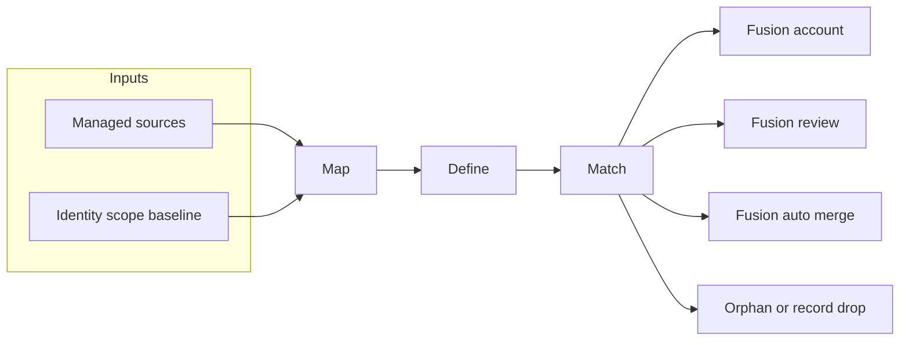

# Identity Fusion NG

**Turn messy, multi-source account data into clean identities — without brittle exact-match correlation alone.**

Identity Fusion NG is an **Identity Security Cloud (ISC) connector** that consolidates managed source accounts, computes derived attributes, and optionally matches them to existing identities. It replaces the deprecated Identity Fusion v1.x line; see the [migration guide](docs/use-guides/deployment/migrating-from-identity-fusion-v1.md) if you are upgrading.

## Map → Define → Match

Identity Fusion NG is built around a three-step framework. The connector can run all three steps or just one — but when multiple steps are enabled, they always execute in this order:

```mermaid
flowchart LR
    subgraph inputs [Inputs]
        MS[Managed sources]
        ID[Identity scope baseline]
    end
    MS --> Map
    ID --> Map
    Map --> Define
    Define --> Match
    Match --> FA[Fusion account]
    Match --> FR[Fusion review]
    Match --> AM[Fusion auto merge]
    Match --> DROP[Orphan or record drop]
```

| Step | What it does | Why it matters |
| --- | --- | --- |
| **Map** | Align attributes from managed sources into a single Fusion account schema; merge values from multiple sources (first found, list, concatenate, or source preference). | Correlation fails when source data is inconsistent. Map normalizes the input *before* you correlate. |
| **Define** | Create derived attributes — unique IDs, UUIDs, counters, normalized names/phones/dates — using Apache Velocity templates and collision-safe generators. | ISC has no built-in way to mint unique identifiers or run rich attribute computation at aggregation time. |
| **Match** | Score Fusion accounts against identities in scope with configurable similarity algorithms; route uncertain hits to manual review forms. | Find duplicates and near-duplicates that strict correlation rules would miss. |

Each capability works independently or together. For **matching**, the Fusion source is usually **authoritative** so it decides which accounts create identities and which correlate to existing ones. For **mapping and defining only** (unique IDs, consolidated attributes), Fusion is often deployed as a side-car — authoritative mode is optional.

Operation modes (**Authoritative**, **Records**, **Orphan**) change how each step behaves at the edges. See [Getting started — Operation modes](docs/getting-started/index.md#operation-modes).

## When to use it

- **Consistent attributes** across messy or multi-source account data before correlation
- **Generated identifiers** — usernames, employee numbers, UUIDs — with disambiguation when values collide
- **Similarity-based matching** when authoritative correlation rules are not enough
- **Manual review** for uncertain matches via ISC forms
- **Records mode** — register unique values without emitting Fusion accounts
- **Orphan mode** — enrich Match scoring from supplemental sources without creating identities

## Documentation

Full product documentation lives in [`docs/`](docs/README.md) and on the [documentation site](https://fernando-delosrios-sp.github.io/colab-saas-conn-sailpoint-identity-fusion/). Use the site (not this README) for setup, configuration, and operations.

| Start here | Link |
| --- | --- |
| Home (Map → Define → Match) | [docs/index.md](docs/index.md) |
| Getting started | [docs/getting-started/index.md](docs/getting-started/index.md) |
| Map, Define, Match guides | [Mapping](docs/use-guides/configuration/mapping-attributes.md) · [Defining](docs/use-guides/configuration/defining-attributes.md) · [Matching](docs/use-guides/configuration/matching-identities.md) |
| Configuration reference | [docs/configuration/index.md](docs/configuration/index.md) |
| Use guides | [docs/use-guides/configuration/index.md](docs/use-guides/configuration/index.md) |

Preview locally: `npm run docs:serve` (see [docs/README.md](docs/README.md) for build details).

## Changelog

Release history: [CHANGELOG.md](CHANGELOG.md) (mirrored on the [documentation site](https://fernando-delosrios-sp.github.io/colab-saas-conn-sailpoint-identity-fusion/CHANGELOG/) after `npm run docs:prepare`).

## License

Distributed under the MIT License. See [LICENSE.txt](LICENSE.txt).
