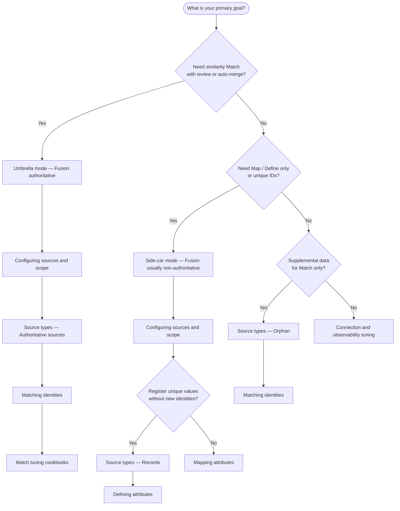

# Which guide do I need?

Use this decision tree to find the right configuration guide for your deployment goal.

## Outcome table

| Your goal | Start here | Also read |
| --- | --- | --- |
| **HR + AD deduplication (umbrella Match)** | [Configuring sources and scope](../use-guides/configuration/configuring-sources-and-scope.md) | [Matching identities](../use-guides/configuration/matching-identities.md) · [Match tuning cookbooks](../use-guides/configuration/match-tuning-cookbooks.md) |
| **Username / ID pool (Records side-car)** | [Source types — Records](../use-guides/configuration/source-types.md) | [Defining attributes](../use-guides/configuration/defining-attributes.md) · [Match tuning cookbooks](../use-guides/configuration/match-tuning-cookbooks.md) |
| **Contractor orphan cleanup** | [Source types — Orphan](../use-guides/configuration/source-types.md) | [Matching identities](../use-guides/configuration/matching-identities.md) |
| **Map only — merge multi-source attributes** | [Mapping attributes](../use-guides/configuration/mapping-attributes.md) | [Configuring sources and scope](../use-guides/configuration/configuring-sources-and-scope.md) |
| **Reverse correlation to managed source** | [Managing correlation](../use-guides/configuration/managing-correlation.md) | [ISC PAT scopes](../reference/pat-scopes.md) |
| **Debug aggregation logs** | [Config to account-list phases](../reference/config-to-phases.md) | [Troubleshooting](../use-guides/validation-and-troubleshooting/troubleshooting.md) |
| **First-time setup (Day 1–7)** | [Getting started overview](overview.md) | [First aggregation](first-aggregation.md) |

## Glossary quick links

- [Umbrella mode](../glossary.md#deployment-and-integration) — authoritative Fusion Match deployment
- [Side-car mode](../glossary.md#deployment-and-integration) — non-authoritative Map/Define or Orphan
- [Sources scope](../glossary.md#deployment-and-integration) — managed accounts from configured sources
- [Identity scope](../glossary.md#deployment-and-integration) — optional ISC identity baseline for Match
