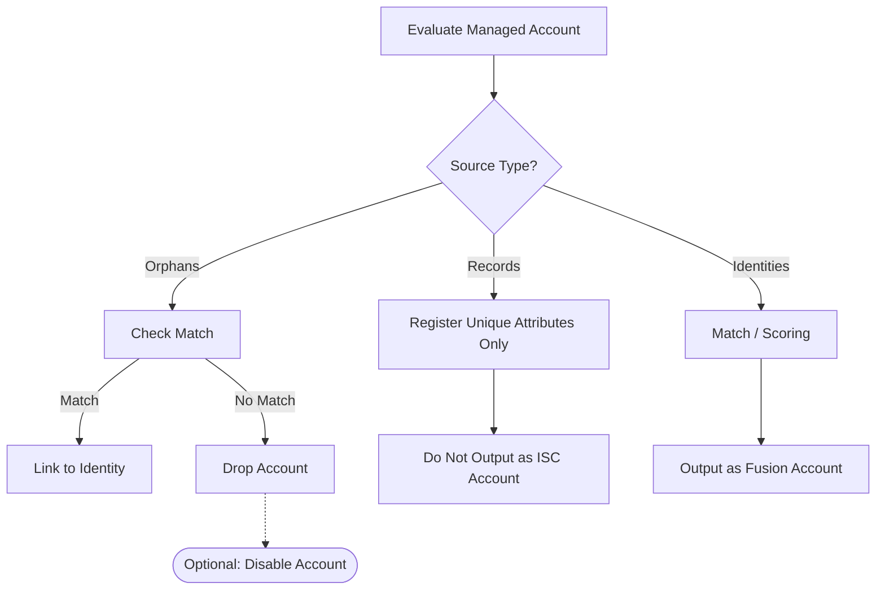
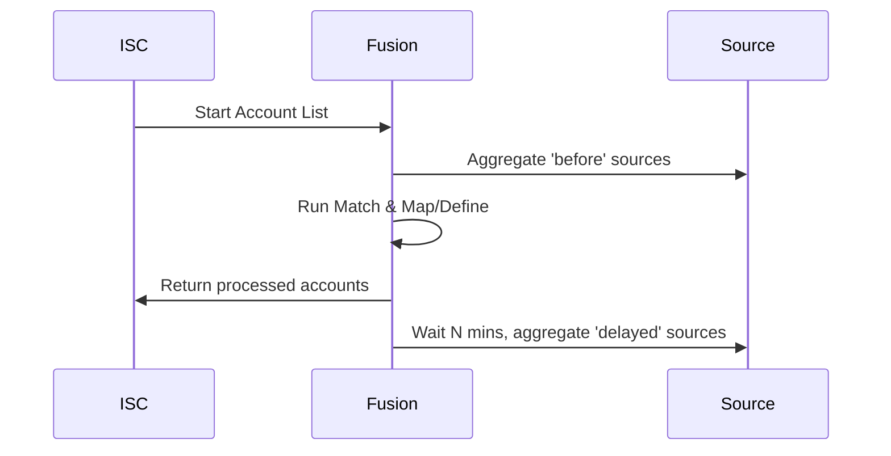
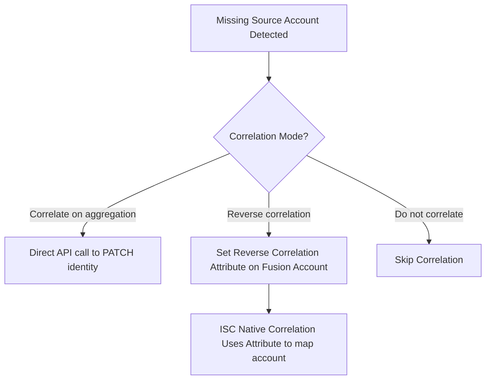

# Source Configuration

This guide expands on the Identity Fusion NG Source Settings, detailing how to configure your identity scope, authoritative account sources, aggregation modes, correlation rules, and processing controls.

#### Scope Section

| Field                                | Description                                                                | Required                              | Notes                                                                                                                                                                                     |
| ------------------------------------ | -------------------------------------------------------------------------- | ------------------------------------- | ----------------------------------------------------------------------------------------------------------------------------------------------------------------------------------------- |
| **Include identities in the scope?** | Include identities in addition to managed accounts from configured sources | No                                    | Enable for identity-only Defines or to define the baseline for Match (sources scope = managed accounts from configured sources).                                                          |
| **Identity Scope Query**             | Search/filter query to limit which identities are evaluated                | Yes (when include identities enabled) | Uses [ISC search syntax](https://documentation.sailpoint.com/saas/help/search/building-query.html); examples: `*` (all), `attributes.cloudLifecycleState:active`, `source.name:"Workday"` |

> **Tip:** You may or may not include identities in your scope. When not included, only those managed accounts previously processed that turned into an identity will be considered as your baseline to compare new uncorrelated managed accounts. When included, all your existing identities in the scope will be part of that baseline from the beginning, as well as managed accounts that turn into identities over time. When including identities in the scope, the Fusion attribute definition context can also access the `$identity` object.

#### Sources Section

| Field                             | Description                                                 | Required | Notes                                         |
| --------------------------------- | ----------------------------------------------------------- | -------- | --------------------------------------------- |
| **Authoritative account sources** | List of sources whose accounts will be merged and evaluated | Yes      | Each source has sub-configuration (see below) |

**Per-source configuration:**

| Field                                           | Description                                                           | Required               | Notes                                                                                                                                                                                                                                                                                                    |
| ----------------------------------------------- | --------------------------------------------------------------------- | ---------------------- | -------------------------------------------------------------------------------------------------------------------------------------------------------------------------------------------------------------------------------------------------------------------------------------------------------- |
| **Source name**                                 | Name of the authoritative account source                              | Yes                    | Must match the source name in ISC exactly (case-sensitive)                                                                                                                                                                                                                                               |
| **Enabled**                                     | Include this source in processing                                     | No                     | Defaults to enabled. Disabled sources are excluded from aggregation and fusion entirely.                                                                                                                                                                                                                 |
| **Source type**                                 | How accounts from this source are processed                           | Yes                    | Options: **Authoritative accounts** (default, creates new identities), **Records** (registers unique attributes but doesn't output ISC accounts), **Orphan accounts** (drops non-matching accounts).                                                                                                     |
| **Include record accounts in Match**            | Run Match scoring for record sources                                  | No (only for Records)  | Default on. When off, identity and deferred-peer scoring are skipped; Map & Define and unique-attribute registration still run (for example to reserve third-party identifiers without matching).                                                                                                       |
| **Disable non-matching accounts**               | Disable non-matching orphan accounts via background op                | No (only for Orphan)   | When enabled, triggers an account disable operation for orphans lacking a match.                                                                                                                                                                                                                         |
| **Same-aggregation matching**                   | Optional deferred matching within the same aggregation run            | No (only for Authoritative)| When enabled, unmatched accounts are compared against other unmatched peer accounts from the same aggregation. If the only match is a peer, identity creation is deferred. Turn on when the same person might appear as multiple accounts in one run.                                              |
| **Accounts API filter**                         | Server-side filter query to limit which accounts are fetched from ISC | No                     | Uses ISC account-list filter syntax (`filters` parameter). Example: `attributes.department:"Engineering"`. References: [Accounts list API](https://developer.sailpoint.com/docs/api/v2025/list-accounts), [JMESPath](https://jmespath.org/)                                                              |
| **Accounts JMESPath filter**                    | Client-side JMESPath expression to further filter fetched accounts    | No                     | Applied page-wise on `{ "accounts": [...] }`. Expression must return an array of account objects to keep. Example: `accounts[?attributes.department == 'Engineering']`. References: [JMESPath](https://jmespath.org/), [Accounts list API](https://developer.sailpoint.com/docs/api/v2025/list-accounts) |
| **Aggregation batch size**                      | Maximum accounts to aggregate per run                                 | No                     | Leave empty for all accounts; useful for initial loading of datasets.                                                                                                                                                                                                                                    |
| **Account aggregation mode**                    | When to trigger fresh aggregation for this source                     | Yes                    | Options: **Do not aggregate** (none), **Aggregate before processing** (ensures current data but blocks processing), **Delayed aggregation** (triggers aggregation in background after returning accounts).                                                                                               |
| **Aggregation task result retries**             | Number of times to poll aggregation task status for this source       | No (before mode)       | Default: 5. Used only when **Account aggregation mode** is **Aggregate before processing**.                                                                                                                                                                                                              |
| **Aggregation task result wait time (seconds)** | Wait time between aggregation task status checks for this source      | No (before mode)       | Default: 60 seconds. Used only when **Account aggregation mode** is **Aggregate before processing**.                                                                                                                                                                                                     |
| **Aggregation delay (minutes)**                 | Wait time before delayed aggregation                                  | Yes (for delayed mode) | Default: 5 minutes.                                                                                                                                                                                                                                                                                      |
| **Optimized aggregation**                       | Only reprocess changed accounts during aggregation                    | No                     | Enable for performance. Disable if using **reverse correlation** so all accounts are processed.                                                                                                                                                                                                          |
| **Correlation mode**                            | How to handle missing source accounts                                 | Yes                    | Options: **Correlate missing accounts on aggregation** (direct API patch), **Reverse correlation from managed source** (sets an attribute for ISC native correlation), **Do not correlate** (none).                                                                                                      |
| **Correlation attribute name**                  | Attribute used for reverse correlation                                | Yes (for reverse mode) | Technical name for the dedicated Fusion attribute.                                                                                                                                                                                                                                                       |
| **Correlation display name**                    | UI display name for the correlation attribute                         | Yes (for reverse mode) | Human-readable name.                                                                                                                                                                                                                                                                                     |

> **Note:** Machine accounts (`isMachine=true`) are not supported for managed-source processing. Because `isMachine` is not an ISC account-list API filter, the connector applies this exclusion client-side and skips those accounts after fetching.

> **Execution order:** 1) `Accounts API filter` (server-side, ISC), 2) `Accounts JMESPath filter` (client-side, page-wise on `{ "accounts": [...] }`), 3) built-in machine account exclusion (`isMachine=true`).

> **Tip:** You can use the **Aggregate before processing** option to ensure a managed source has newer data than the last time Identity Fusion ran and/or synchronize aggregation schedules. If you don't need the absolute latest data blocking the aggregation response, consider **Delayed aggregation** to speed up the account list operation.

> **Cross-guide note:** If you keep **Include record accounts in Match** enabled, record sources participate in Match scoring using your global Match rules. See [Match guide](match.md) for threshold, mandatory rule, and skip-if-missing tuning.

<b>View Graphic: Source Types & Flow</b>

<b>View Graphic: Aggregation Timing</b>

<b>View Graphic: Correlation Modes</b>

#### Processing Control Section

| Field                                              | Description                                                              | Required | Notes                                                                                                  |
| -------------------------------------------------- | ------------------------------------------------------------------------ | -------- | ------------------------------------------------------------------------------------------------------ |
| **Maximum history messages**                       | Maximum history entries retained per Fusion account                      | No       | Default: 10; older entries are discarded when limit exceeded                                           |
| **Delete accounts with no managed accounts left?** | Remove Fusion accounts when all contributing source accounts are removed | No       | Useful for automated cleanup when users leave                                                          |
| **Skip accounts with missing unique ID?**          | Skip processing accounts without a fusion identity attribute value       | No       | Skipped accounts are logged for review; useful when some source accounts lack required identifier data |

> **Note:** **Force Normal-type attribute refresh on each aggregation?** is located at **Advanced Settings → Developer Settings**. It forces Normal-type attributes to refresh every run. Applies only to Normal attributes; Unique attributes are only computed when a Fusion account is first created or when an existing account is activated. Can be expensive for large datasets.

> **Tip:** When testing or onboarding large amounts of managed accounts, it is best to disable all kinds of managed account correlation. Already processed uncorrelated managed accounts are part of their associated Fusion accounts internally, so it doesn't interfere in the normal connector operation. Correlation is a heavy process and must be carefully planned. It's often a good idea to have mixed correlation strategies depending on the implementation stage or managed source.

> **Tip:** Remember that managed accounts must be uncorrelated for them to be evaluated for matches. Correlated managed accounts are directly included in your baseline.

> **Tip:** When failing to generate an account ID (`nativeIdentity`), the aggregation fails unless the **Skip accounts with missing unique ID?** option is enabled. All your Fusion accounts must have a valid ID, but you can deliberately generate an empty one with the skip option to prevent including that account in the final results.
