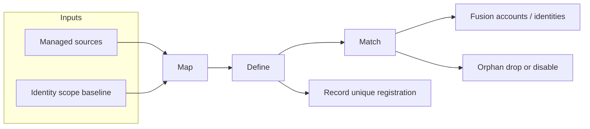

# Identity Fusion NG

!!! warning "Disclaimer"
    Identity Fusion NG is the newest Identity Fusion version and supersedes any Identity Fusion v1.x previous release. Version 1.x is now **deprecated**. For those needing to upgrade an existing deployment, please refer to the [migration guide](./use-guides/deployment/migrating-from-identity-fusion-v1.md).

Identity Fusion NG is an **Identity Security Cloud (ISC) connector** that consolidates account data from one or more managed sources, lets you **map** attributes into a single Fusion account schema, **define** derived and unique values (including Velocity-based computation), and optionally **match** new or changed accounts to existing identities so you can avoid duplicate identities without brittle exact-match correlation alone.

## The Map, Define, Match framework

Identity Fusion NG addresses identity and account data aggregation through a **map-define-match framework**. The connector can execute all three steps or just one, but always in this logical sequence:

| Step | Purpose | Records / Orphan behavior |
| --- | --- | --- |
| **Map** | Align managed account attributes with your Fusion account schema and merge values from multiple sources. | Runs for all source types, including **Records** and **Orphan** sources. |
| **Define** | Create derived attributes, unique identifiers, UUIDs, and Velocity-based transformations. | **Records** sources register unique values without creating Fusion accounts. **Orphan** sources use Define output only when a match exists. |
| **Match** | Compare Fusion accounts to identities in scope using similarity rules and optional manual review. | **Records** can optionally participate in Match scoring. **Orphan** sources never create identities for non-matched rows. |

### Map (Consolidation)

Align managed account attributes with your Fusion account schema and merge values from multiple sources. Map runs first whenever managed sources are configured.

- **Authoritative sources:** Map feeds Define and Match for full identity lifecycle decisions.
- **Records sources:** Map and Define run; unique values are registered even when no Fusion account is emitted.
- **Orphan sources:** Map prepares supplemental attributes used during Match; non-matched rows are dropped.

See [Mapping attributes](./use-guides/configuration/mapping-attributes.md) and [Attribute Mapping Settings](./configuration/mapping.md).

### Define (Computation)

Create derived attributes, unique identifiers, UUIDs, and Velocity-based transformations. Define runs after Map (when sources exist) and before Match scoring for normal attributes.

- **Unique IDs and counters:** Generate usernames, employee numbers, or UUIDs with collision handling.
- **Records mode:** Register unique attribute values globally without persisting a Fusion account row.
- **Normalization:** Format names, phones, addresses, and dates before Match scoring.

See [Defining attributes](./use-guides/configuration/defining-attributes.md) and [Attribute Definition Settings](./configuration/definition.md).

### Match (Correlation)

Compare Fusion accounts to identities in scope using similarity rules and optional manual review.

- **Authoritative Match:** Non-matched accounts can create new identities when Fusion is authoritative.
- **Records + Match:** Optionally include record accounts in Match scoring to find duplicates before registering identifiers.
- **Orphan Match:** Accounts that fail to match an existing identity are dropped (or optionally disabled on the managed source).

See [Matching identities](./use-guides/configuration/matching-identities.md) and [Attribute Matching Settings](./configuration/matching.md).

For authoritative, Records, and Orphan source-type details, see [Getting started — Operation modes](./getting-started/overview.md#operation-modes).

## When to use it

| Use case | Why Identity Fusion NG |
| --- | --- |
| **Consistent attributes** | Normalize messy or multi-source account data before correlation. |
| **Generated identifiers** | Produce unique IDs, UUIDs, counters, or formatted strings that standard sources do not provide. |
| **Similarity-based matching** | Find potential duplicates when authoritative correlation rules are not enough. |
| **Manual review** | Queue uncertain matches for human decision with ISC forms. |
| **Records (register-only)** | Generate and register unique attribute values (for example usernames or employee IDs) from a source without creating Fusion accounts or identities. |
| **Orphan (match-only)** | Use supplemental directory data to improve Match scoring without ever creating identities from that source. |

## Read next

| Step | Resource |
| --- | --- |
| Shortest path to a first aggregation | [Getting started — First aggregation](./getting-started/first-aggregation.md) |
| Prerequisites and operation modes | [Getting started — Overview](./getting-started/overview.md) |
| Field-level configuration reference | [Configuration reference](./configuration/index.md) |
| Scenario-driven setup guides | [Use guides overview](./use-guides/index.md) |
| Connector operations (APIs ISC calls) | [Connector operations reference](./operations/index.md) |

## Documentation map

| Topic | Description |
| --- | --- |
| [Mapping attributes](./use-guides/configuration/mapping-attributes.md) | Attribute mapping, merging, and consolidation from multiple sources. |
| [Defining attributes](./use-guides/configuration/defining-attributes.md) | Velocity computed attributes, unique identifiers, UUIDs, counters. |
| [Matching identities](./use-guides/configuration/matching-identities.md) | Detect and resolve potential matching identities. |
| [Configuring sources](./use-guides/configuration/configuring-sources.md) | Source settings, scope, aggregation timing, and correlation modes. |
| [Connection and observability tuning](./use-guides/operation/connection-and-observability-tuning.md) | Queue, retry, timeouts, rate limiting, and logging. |
| [Proxy deployment](./reference/proxy-mode.md) | Run connector logic on an external server and connect ISC via proxy. |
| [Troubleshooting](./use-guides/validation-and-troubleshooting/troubleshooting.md) | Common issues, logs, and recovery steps. |

## Quick start

1. **Add the connector to ISC** — Upload the Identity Fusion NG connector (for example via SailPoint CLI or your organization's process).
2. **Create a source** — In Admin → Connections → Sources, create a new source using the Identity Fusion NG connector. Mark it **Authoritative** when you need Match.
3. **Configure connection** — Set Identity Security Cloud API URL and Personal Access Token (ID and secret). Use **Review and Test** to verify connectivity. See [PAT scopes](./reference/pat-scopes.md) for required API permissions.
4. **Configure the connector** — Use the [Configuration reference](./configuration/index.md) and [Use guides](./use-guides/index.md) for Map, Define, and Match settings.
5. **Discover schema** — Run **Discover Schema** so ISC has the combined account schema.
6. **Identity profile and aggregation** — Create an identity profile and provisioning plan as required by ISC, then run entitlement and account aggregation.

See [First aggregation](./getting-started/first-aggregation.md) for the full checklist.
