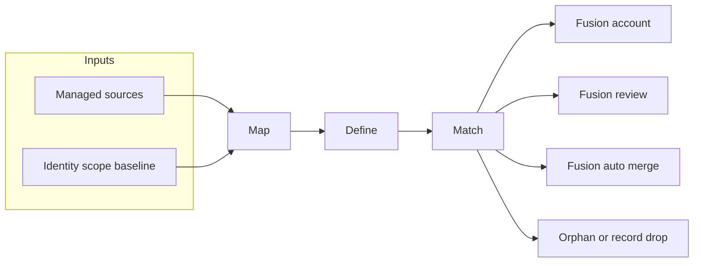

# Identity Fusion NG

!!! warning "Disclaimer"
    Identity Fusion NG is the newest Identity Fusion version and supersedes any Identity Fusion v1.x previous release. Version 1.x is now **deprecated**. For those needing to upgrade an existing deployment, please refer to the [migration guide](./use-guides/deployment/migrating-from-identity-fusion-v1.md).

Identity Fusion NG is an **Identity Security Cloud (ISC) connector** that consolidates account data from one or more managed sources, lets you **map** attributes into a single Fusion account schema, **define** derived and unique values (including Velocity-based computation), and optionally **match** new or changed accounts to existing identities so you can avoid duplicate identities without brittle exact-match correlation alone.

## The Map, Define, Match framework

Identity Fusion NG addresses identity and account data aggregation through a **map-define-match framework**. The connector can execute all three steps or just one, but always in this logical sequence:

| Step | Purpose | Authoritative accounts | Orphan accounts | Records |
| --- | --- | --- | --- | --- |
| **Map** | Align managed account attributes with your Fusion account schema and merge values from multiple sources. | Full Map feeds Define and Match for identity lifecycle decisions. | Map prepares supplemental attributes used during Match. | Map runs; attributes feed Define and optional Match. |
| **Define** | Create derived attributes, unique identifiers, UUIDs, and Velocity-based transformations. | Normal and Unique definitions evaluated before Match scoring. | Define output used only when a match exists. | Unique values registered; non-matched managed source accounts do not emit Fusion accounts. |
| **Match** | Compare Fusion accounts to identities in scope using similarity rules and optional manual review. | Outcomes: Fusion account, Fusion review, Fusion auto merge, or new identity when Fusion is authoritative. | Non-matched managed source accounts are dropped (optional disable on managed source); never create identities. | Optional Match participation; non-matched managed source accounts register unique values and drop. |

### Map (Consolidation)

Align managed account attributes with your Fusion account schema and merge values from multiple sources. Map runs first whenever managed sources are configured.

- **Authoritative sources:** Map feeds Define and Match for full identity lifecycle decisions.
- **Records sources:** Map and Define run; unique values are registered even when no Fusion account is emitted.
- **Orphan sources:** Map prepares supplemental attributes used during Match; non-matched managed source accounts are dropped.

See [Mapping attributes](./use-guides/configuration/mapping-attributes.md) and [Attribute Mapping Settings](./configuration/mapping.md).

### Define (Computation)

Create derived attributes, unique identifiers, UUIDs, and Velocity-based transformations. Define runs after Map (when sources exist) and before Match scoring for normal attributes.

- **Unique IDs and counters:** Generate usernames, employee numbers, or UUIDs with collision handling.
- **Records mode:** Register unique attribute values globally without persisting a Fusion account.
- **Normalization:** Format names, phones, addresses, and dates before Match scoring.

See [Defining attributes](./use-guides/configuration/defining-attributes.md) and [Attribute Definition Settings](./configuration/definition.md).

### Match (Correlation)

Compare Fusion accounts to identities in scope using similarity rules and optional manual review.

- **Authoritative Match:** Non-matched accounts can create new identities when Fusion is authoritative.
- **Records + Match:** Optionally include record accounts in Match scoring to find duplicates before registering identifiers.
- **Orphan Match:** Accounts that fail to match an existing identity are dropped (or optionally disabled on the managed source).

See [Matching identities](./use-guides/configuration/matching-identities.md) and [Attribute Matching Settings](./configuration/matching.md).

For authoritative, Records, and Orphan source-type details, see [Getting started — Operation modes](./getting-started/index.md#operation-modes).

## When to use it

| Use case | Why Identity Fusion NG |
| --- | --- |
| **Consistent attributes** | Normalize messy or multi-source account data before correlation. |
| **Generated identifiers** | Produce unique IDs, UUIDs, counters, or formatted strings that standard sources do not provide. |
| **Similarity-based matching** | Find potential duplicates when authoritative correlation rules are not enough. |
| **Manual review** | Queue uncertain matches for human decision with ISC forms. |
| **Records (register-only)** | Generate and register unique attribute values (for example usernames or employee IDs) from a source without creating Fusion accounts or identities. |
| **Orphan (match-only)** | Use supplemental directory data to improve Match scoring without ever creating identities from that source. |

For full **Authoritative**, **Records**, and **Orphan** source-type behavior, see [Getting started — Operation modes](./getting-started/index.md#operation-modes).

## Read next

| Step | Resource |
| --- | --- |
| Install, configure, and run your first aggregation | [Getting started](./getting-started/index.md) |
| Correlation modes and planning | [Managing correlation](./use-guides/configuration/managing-correlation.md) |
| Reviewer assignment | [Managing reviewers](./use-guides/configuration/managing-reviewers.md) |
| Field-level configuration reference | [Configuration reference](./configuration/index.md) |
| Connector operations (APIs ISC calls) | [Connector operations reference](./operations/index.md) |

## Documentation map

| Topic | Description |
| --- | --- |
| [Mapping attributes](./use-guides/configuration/mapping-attributes.md) | Attribute mapping, merging, and consolidation from multiple sources. |
| [Defining attributes](./use-guides/configuration/defining-attributes.md) | Velocity computed attributes, unique identifiers, UUIDs, counters. |
| [Matching identities](./use-guides/configuration/matching-identities.md) | Detect and resolve potential matching identities. |
| [Configuring sources and scope](./use-guides/configuration/configuring-sources-and-scope.md) | Source settings, scope, umbrella vs side-car, aggregation timing. |
| [Source types](./use-guides/configuration/source-types.md) | Authoritative, Records, and Orphan processing modes. |
| [Operation guides](./use-guides/operation/index.md) | Monitor, tune, dry-run, proxy, recording, and reset workflows. |
| [Proxy deployment](./reference/proxy-mode.md) | Run connector logic on an external server and connect ISC via proxy. |
| [Troubleshooting](./use-guides/validation-and-troubleshooting/troubleshooting.md) | Common issues, logs, and recovery steps. |

## Quick start

1. **Add the connector to ISC** and create a Fusion source — mark it **Authoritative** when you need Match.
2. **Configure connection** — set the ISC API URL and Personal Access Token; use **Review and Test**. See [PAT scopes](./reference/pat-scopes.md).
3. **Configure Map, Define, and Match**, then run Discover Schema, entitlement aggregation, and account aggregation.

See [Getting started](./getting-started/index.md) for the full setup checklist, first-aggregation verification, and guide index.

