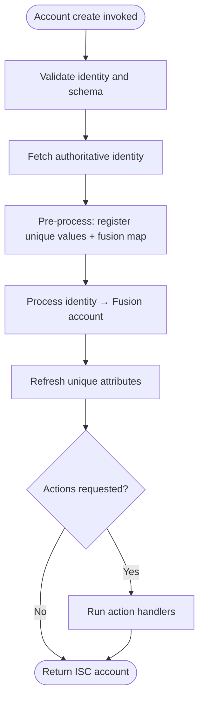
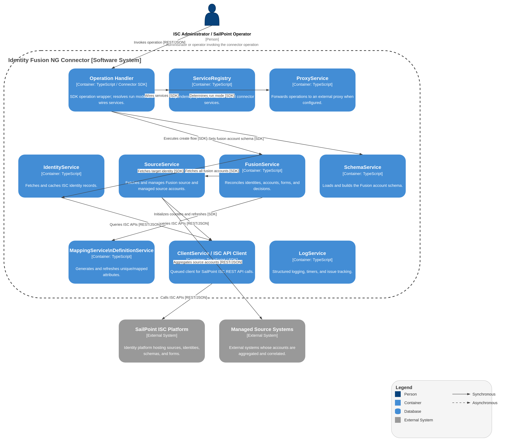

# Account Create Operation

## Description

The Account Create operation creates a new fusion account for a specific identity. It loads the identity's data, registers any unique attributes to prevent collisions, processes the identity to form a fusion account, executes any requested initial actions (like reporting or correlation), and returns the resulting ISC account.

## Process Flow

## Architecture diagram

1.  **Input Validation**:
    - Verifies that the `identity` (ID) and `schema` are provided in the input.
    - Loads the fusion account schema.
    - Determines the `identityName` from `input.attributes.name` or the `identity` ID.
    - Verifies that the `fusionDisplayAttribute` is present in the schema.
    - Resolves the final `identityName` using the display attribute if available.

2.  **Identity Fetching**:
    - Fetches the authoritative identity information from ISC using the resolved `identityName`.
    - Ensures the identity exists and has a valid ID.

3.  **Fusion Account Pre-processing**:
    - Fetches all existing fusion accounts from sources and initializes attribute counters.
    - Bulk-registers unique attribute values directly from managed source account data (lightweight path — avoids full account hydration).
    - Pre-processes fusion accounts to populate the identity map used for duplicate account detection.

4.  **Identity Processing**:
    - Processes the fetched identity to create an in-memory fusion identity.
    - Sets the `requested` status on the new fusion account.
    - Explicitly refreshes unique attributes (`refreshUniqueAttributes`) to generate collision-free values against the registered pool.

5.  **Action Execution**:
    - Checks for any actions specified in `input.attributes.actions` (normalized via `normalizeActionTokens`).
    - For each action token, the dispatcher in `operations/actions/index.ts` routes to the matching handler:
        - **Report** — Generates a fusion report (if configured). Remove is a no-op on create.
        - **Fusion** — Adds the `fusion` action entitlement on the Fusion account.
        - **Correlate / Correlated** — Runs the **correlate action** on this provisioning path: direct identity correlation (ISC PATCH) for missing managed source accounts. Both wire tokens map to the same handler. Reverse-correlation attribute writes are not applied on this path.
        - **Reviewer** — Assigns the source-specific reviewer entitlement. See [Action entitlements reference](account-update.md#action-entitlements-reference).

6.  **Response Generation**:
    - Converts the internal fusion identity into an ISC account object.
    - Returns the new account to ISC.

## Behavior Notes

- **nativeIdentity immutability**: The `nativeIdentity` (account identifier) is determined at creation time and is never changed afterwards. This prevents disconnection between the existing Fusion account and the platform during subsequent updates, reads, or enable/disable cycles.
- **Account name immutability**: The account `name` (display attribute) is also locked at creation. It always reflects the hosting identity's name. This prevents destruction of the identity linkage if an attribute definition would otherwise overwrite it.
- **Unique attributes**: Unique attribute values (e.g. generated usernames) are freshly calculated during creation with collision detection against all existing Fusion accounts. These values remain stable unless the account is disabled and re-enabled (which triggers a unique attribute reset).

