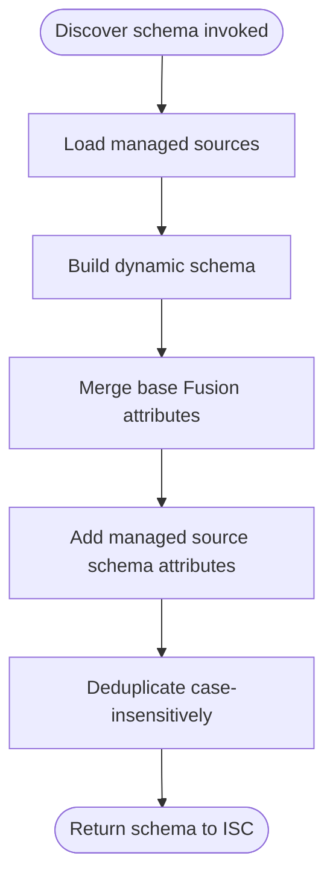

# Account Discover Schema Operation

## Description

The Account Discover Schema operation generates the schema definition for fusion accounts. The schema is dynamic, meaning it is built programmatically based on the configuration and the aggregate schemas of all managed sources.

## Process Flow

1.  **Setup**:
    - Loads all managed sources to access their schemas.

2.  **Schema Build**:
    - Calls `schemas.buildDynamicSchema()`.
    - Combines the fixed base fusion attributes (identity, name, statuses, actions, accounts, etc.) with attributes derived from managed source schemas and identity attributes.
    - Deduplicates attribute names case-insensitively (ISC treats names as case-insensitive). When the same logical attribute appears with different casing (e.g. `FirstName` and `firstname`), the **first** variant in merge order is kept.

3.  **Output**:
    - Returns the generated schema object to ISC.

