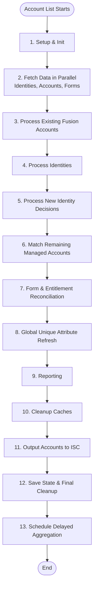
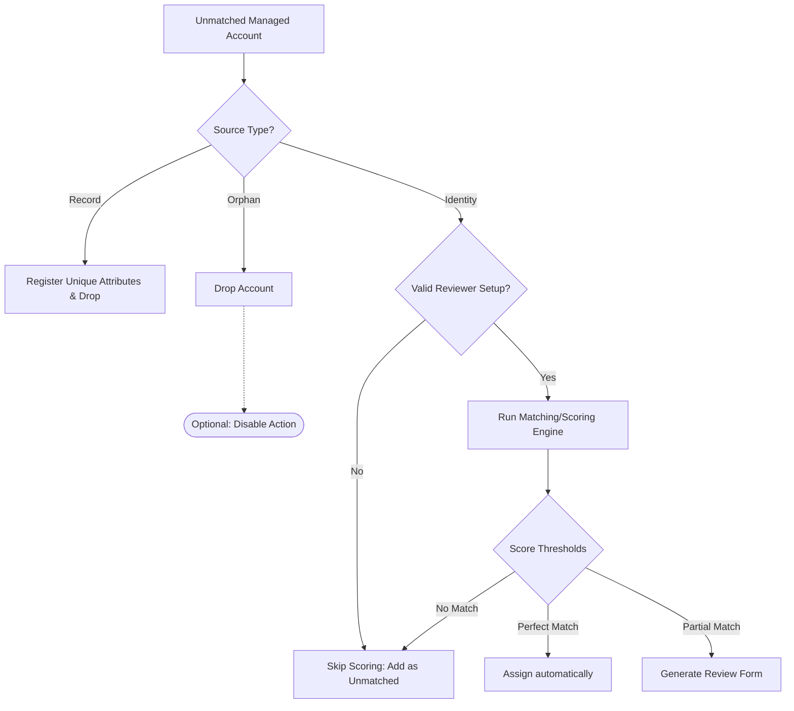

# Account List Operation

## Description

The Account List operation is the main entry point for identity fusion. It performs a full aggregation of all fusion accounts, identities, and managed accounts. It uses a "Work Queue" pattern to process accounts efficiently, match identities, and handle complex logic like unique attribute definition, form state reconciliation, and reporting.

## Process Flow

1.  **Setup & Initialization**:
    - Loads all managed sources.
    - Acquires a **process lock** to prevent concurrent aggregations.
    - Checks for a "Reset" flag; if detected, it clears existing forms and resets state instead of performing aggregation.
    - Sets the fusion account schema.
    - **Reverse correlation setup**: Validates and updates reverse correlation transforms if sources are configured for reverse correlation.
    - Aggregates managed sources enabled for aggregation if they were not aggregated after the latest Fusion aggregation.
    - Initializes attribute counters.

2.  **Data Fetching (Parallel)**:
    - Fetches the following data in parallel to optimize performance:
        - Existing fusion accounts.
        - Identities (from ISC).
        - Managed accounts (from configured sources).
        - Message sender workflow.
        - Delayed aggregation sender workflow.
        - Current form data, including forms and associated form instances.
    - Managed machine accounts (`isMachine=true`) are discarded after fetch and never enter the work queue.
    - A warning is logged with discarded machine-account counts (per source and total).
    - If `fusionReportOnAggregation` is enabled and the fusion owner identity was not loaded in the parallel fetch, it is fetched separately.

3.  **Fusion Account Processing** (attribute mapping + normal definitions):
    - Processes all _existing_ fusion accounts. This step "depletes" the matching managed accounts from the work queue (the map of all managed accounts).
    - For each account:
        - Identity layer is applied to match collected identities with Fusion accounts.
        - Managed account layer is applied to match collected managed accounts with Fusion accounts.
        - Assignment decision layer is applied to match Fusion reviews that resulted in identity assignment.
        - Attribute mapping is applied first, then **normal** attribute definitions are evaluated. Normal attribute values feed into the Velocity context and are available for Fusion matching/scoring.
    - **Optimistic correlation**: When `correlateOnAggregation` is enabled, missing accounts are marked as correlated _immediately_ before the API call is enqueued, so the account output reflects a successful correlation without waiting for the queue to drain. Correlation API calls proceed as fire-and-forget in the background; any failures are logged and will be re-detected on the next aggregation.

4.  **Identity Processing** (attribute mapping + normal definitions):
    - Processes all identities. This creates new fusion identities for identities that don't yet have a fusion account but should. This step also "depletes" the matching managed accounts from the work queue (the map of all managed accounts).
    - For each identity:
        - Managed account layer is applied to match collected managed accounts with Fusion accounts.
        - Same attribute mapping + normal definition evaluation as step 3.
    - Clears the identity cache to free up memory as it's no longer needed.

5.  **New Identity Decisions**:
    - Processes Fusion reviews that resulted in new identities.

6.  **Managed Account Processing (Matching)**:
    - Processes any remaining managed accounts in the work queue.
    - These are accounts that were _not_ matched to an existing fusion account or an identity.
    - **Source Type Check**: Behavior changes based on the account's Source Type:
        - **Record**: Registers unique attributes but drops the account from ISC output.
        - **Orphan**: Drops the account entirely (and optionally triggers a background disable operation).
        - **Identity**: Proceeds to matching pipeline.
    - **Reviewer validation**: Before scoring begins, each managed source is checked for valid reviewers. Sources without a configured reviewer are logged once as an error and their accounts bypass scoring entirely, being added as unmatched directly.
    - For sources with valid reviewers, the full matching pipeline runs: scoring, automatic assignment on exact match (when enabled and scores are perfect), review form creation (for partial matches), or unmatched addition.

<b>View Graphic: Managed Account Processing (Step 6)</b>

7.  **Form & Entitlement Reconciliation**:
    - Updates processed Fusion accounts with review information.
    - Fusion identities involved in ongoing Fusion reviews are flagged as candidates.
    - Reviewer identities are updated with their corresponding pending Fusion reviews URL.

8.  **Unique Attribute Refresh** (unique definitions — runs after all matching):
    - Performs a batched global refresh of **unique** attributes for all fusion accounts (both existing and newly created).
    - Unique definitions run _after_ Fusion matching has completed, so they can reference normal attribute values produced in steps 3–6.
    - Ensures uniqueness constraints are met across the entire dataset.

9.  **Reporting (Conditional)**:
    - If `fusionReportOnAggregation` is enabled, generates a fusion report for the fusion owner.

### Report contents (what is included)

When report-on-aggregation is enabled, the generated Fusion report can include:

- **Header summary**
    - Report date
    - Total accounts analyzed
    - Potential matches count
- **Processing statistics**
    - Fusion totals (accounts, forms, assignments)
    - Review decisions and outcomes
    - Managed account found/processed metrics (including source-type breakdown)
    - Total processing time and memory used
- **Global warnings**
    - Duplicate Fusion account mappings per identity (when detected)
    - Guidance that this is generally caused by non-unique account names, with recommendation to review configuration and consider a unique account-name attribute
- **Aggregation issues summary (compact)**
    - Total warnings and total errors logged during aggregation
    - Short sampled warning/error messages (not full logs)
    - Samples are intentionally capped and truncated to reduce report size
- **Per-account detail cards**
    - Potential match account context (source, id, email, selected attributes)
    - Candidate identities with score breakdown by attribute/algorithm/threshold
    - Failed matching/form creation entries with error details
- **Optional non-match entries**
    - Included when non-match reporting is requested

### Report size safety

To reduce email/report payload growth:

- Aggregation issue details are summarized (counts + sampled messages only)
- Sample lists are capped and messages are truncated
- Full verbose log streams are not embedded in the report

10. **Cleanup & Memory Reclamation**:
    - Clears analyzed account caches and managed account caches.
    - Manages form cleanup.

11. **Output Generation**:
    - Iterates through all processed fusion accounts and sends them to ISC.
    - Accounts whose fusion identity attribute is empty are omitted when "Skip accounts with a missing identifier" is enabled (see Behavior Notes).

12. **State Saving & Final Cleanup**:
    - Saves attribute definition state (counters).
    - Saves batch cumulative counts.
    - State is saved _after_ output generation so that a failure during transmission prevents stale state from being persisted.
    - Clears fusion account caches from memory.
    - Releases the process lock. The lock is released in a `finally` block, so it is also released if the operation fails after acquisition.

13. **Schedule Delayed Aggregation**:
    - Triggers the delayed aggregation workflow for any managed sources configured with delayed aggregation mode.

## Behavior Notes

### Attribute evaluation order

Normal attributes are created **before** Fusion matching occurs (steps 3–6). Unique attributes are evaluated **after** all matching is complete (step 8). Attribute definitions can access previously defined attributes via the shared Velocity context, so definition order matters. Unique attributes can reference normal attribute values, but normal attributes cannot reference unique attributes because of the order in which they are calculated.
When the Fusion schema attribute `mainAccount` is populated with a valid managed account key (`sourceId::nativeIdentity`), that managed account is evaluated first for mapping/definition context (including `$accounts[0]`); if not set or invalid, managed-source order is used.

### Attribute mapping and unique definition synergy

Attribute mapping can be used in conjunction with unique attribute definitions to preload attributes from existing managed accounts, identities, and Fusion accounts into the Velocity context. The unique attribute definition then runs and sets a value guaranteed to be different from any other account or identity.

### Optimistic correlation provisioning

When `correlateOnAggregation` is enabled, correlations are applied optimistically: each missing account is marked as correlated before the API call is submitted to the queue. This allows the connector to return accounts reflecting a successful correlation without waiting for the queue to process all requests. The correlation API calls continue in the background after the handler returns. If a correlation fails, the error is logged and the next aggregation will re-detect the account as uncorrelated from ISC source data.

### Reviewer validation for managed account scoring

Before the managed account scoring loop begins, each managed source is validated for reviewer availability. Sources that lack a valid reviewer cannot create review forms for partial matches, making the scoring step unnecessary. Accounts from these sources skip scoring entirely and are added as unmatched. A single error is logged per source, avoiding the per-account warning that would otherwise repeat for every managed account without a reviewer.

### Machine account exclusion

Managed machine accounts (`isMachine=true`) are not supported by Identity Fusion NG. The connector fetches managed-source accounts first, then excludes machine accounts client-side (the ISC account-list API does not support filtering by `isMachine`), logs warning counts, and continues processing only non-machine accounts.

### Preventing Fusion account creation (empty nativeIdentity skip pattern)

One can purposely generate an empty `nativeIdentity` (by designing attribute definitions that produce an empty fusion identity attribute) in conjunction with the "Skip accounts with a missing identifier" processing option. When the fusion identity attribute evaluates to empty and the skip option is enabled, the account is omitted from the output, effectively preventing specific managed accounts or identities from generating Fusion accounts.
