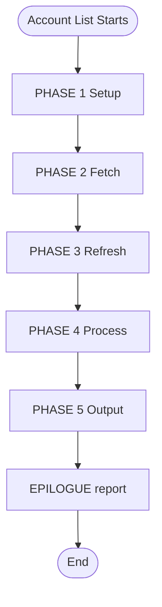
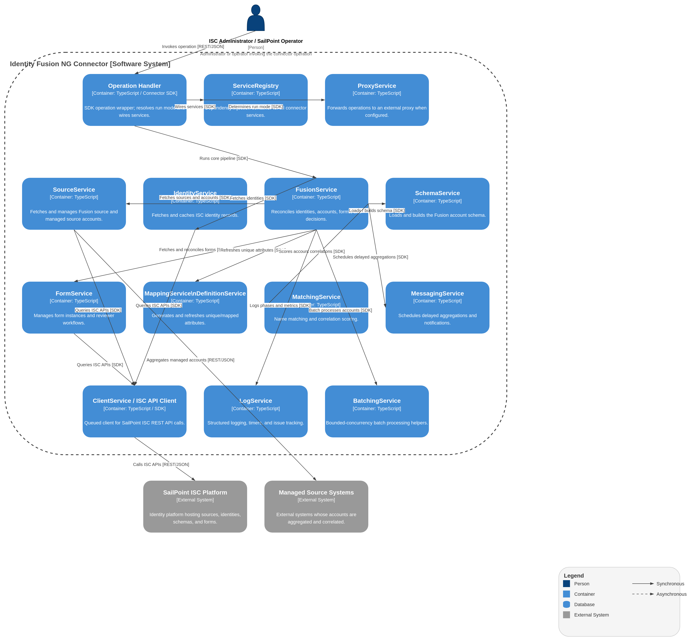
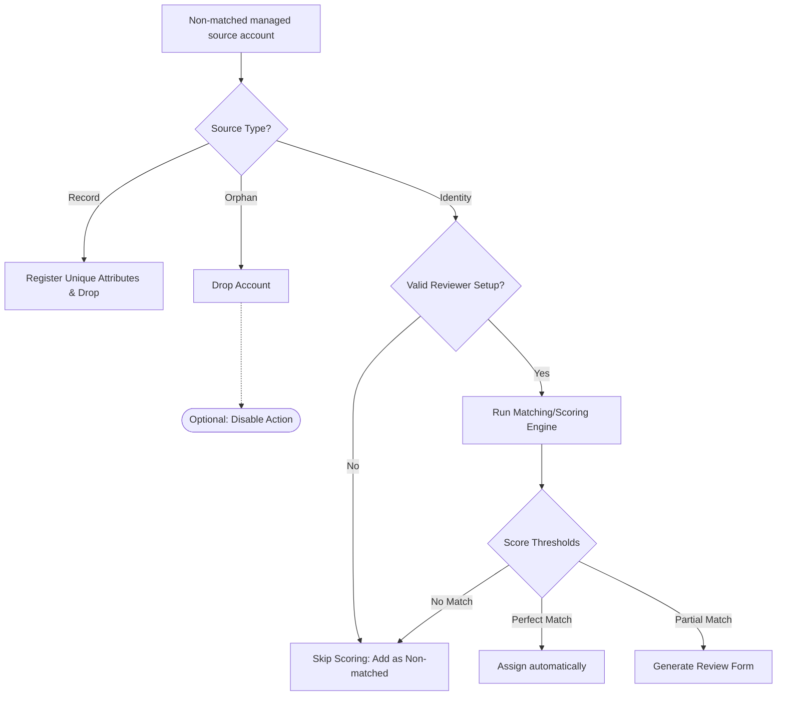

# Account List Operation

## Description

The Account List operation is the main entry point for identity fusion. It performs a full aggregation of all fusion accounts, identities, and managed accounts. It uses a "Work Queue" pattern to process accounts efficiently, match identities, and handle complex logic like unique attribute definition, form state reconciliation, and reporting.

## Process Flow

The operation runs as **five numbered phases** (matching `PHASE N` log lines), plus a report **epilogue** that always runs:

```mermaid
flowchart TD
    Start([Account List Starts]) --> P1["PHASE 1 Setup"]
    P1 --> P2["PHASE 2 Fetch"]
    P2 --> P3["PHASE 3 Refresh"]
    P3 --> P4["PHASE 4 Process"]
    P4 --> P5["PHASE 5 Output"]
    P5 --> Epilogue["EPILOGUE report"]
    Epilogue --> End([End])
```

## Architecture diagram

| Phase | Log prefix | Code | Summary |
| ----- | ---------- | ---- | ------- |
| 1 | `PHASE 1 Setup` | `setupPhase` | Sources, lock, reset flags, schema, reverse correlation |
| 2 | `PHASE 2 Fetch` | `fetchPhase` | Parallel fetch of identities, accounts, forms |
| 3 | `PHASE 3 Refresh` | `refreshPhase` | Existing fusion account processing |
| 4 | `PHASE 4 Process` | `processPhase` | Identities, decisions, managed-account sweeps, forms |
| 5 | `PHASE 5 Output` | `outputPhase` | Stream accounts, save state, schedule delayed aggregations |
| — | `EPILOGUE report` | `reportEpilogue` | Aggregation report, dry-run artifacts (always runs) |

Phase 4 (`Process`) emits `STEP` sub-step markers in log order: `process-identities` → `process-decisions` → `managed-account-init` → `orphan-identity-hydration` → `correlated-sweep` → `record-unique-registration` → `uncorrelated-sweep` → `await-disable-ops` → `form-reconcile`.

### Phase 1 — Setup & Initialization

    - Loads all managed sources.
    - Acquires a **process lock** to prevent concurrent aggregations.
    - Checks for **Reset forms?**; when enabled, deletes all Fusion review form definitions and auto-disables the flag (aggregation continues unless account reset is also set).
    - Checks for **Reset accounts?**; when enabled, clears persisted fusion state, auto-disables the flag, and exits Setup without performing aggregation (zero accounts emitted).
    - Checks for **Force attribute refresh on next aggregation?**; when enabled, the connector disables the flag immediately so it applies to a single aggregation only, then proceeds with the run (Normal-type attributes are recalculated when their definitions execute in step 3/step 4).
    - Sets the fusion account schema.
    - **Reverse correlation setup**: Validates and updates reverse correlation transforms if sources are configured for reverse correlation.
    - Aggregates managed sources enabled for aggregation if they were not aggregated after the latest Fusion aggregation.
    - Initializes attribute counters.

### Phase 2 — Data Fetching (Parallel)

    - Fetches the following data in parallel to optimize performance:
        - Existing fusion accounts.
        - Identities (from ISC).
        - Managed accounts (from configured sources).
        - Message sender workflow.
        - Delayed aggregation sender workflow.
        - Current form data, including forms and associated form instances.
    - Finished review forms emit **decision discovery** log lines (`… DECISION DISCOVERED`) and a `DETAIL action=fusion decisions discovered from forms` summary with a `decisions(…)` segment.
    - Managed machine accounts (`isMachine=true`) are discarded after fetch and never enter the work queue.
    - A warning is logged with discarded machine-account counts (per source and total).
        - If `fusionReportOnAggregation` is enabled and the fusion owner identity was not loaded in the parallel fetch, it is fetched separately.

### Phase 3 — Fusion Account Processing (Refresh)

    - Processes all _existing_ fusion accounts. This step "depletes" the matching managed accounts from the work queue (the map of all managed accounts).
    - For each account:
        - Identity layer is applied to match collected identities with Fusion accounts.
        - Managed account layer is applied to match collected managed accounts with Fusion accounts.
        - Assignment decision layer is applied to match Fusion reviews that resulted in identity assignment.
        - Merge decisions from finished review forms emit **decision applied** log lines (`MERGE DECISION APPLIED`) when layered onto the target fusion account.
        - Attribute mapping is applied first, then **normal** attribute definitions are evaluated. Normal attribute values feed into the Velocity context and are available for Fusion matching/scoring.
    - **Optimistic correlation**: For sources configured with **Correlation mode = Correlate missing accounts on aggregation** (`correlationMode: correlate`), missing accounts are marked as correlated _immediately_ before the API call is enqueued, so the account output reflects a successful correlation without waiting for the queue to drain. Correlation API calls proceed as fire-and-forget in the background; any failures are logged and will be re-detected on the next aggregation.

### Phase 4 — Process (identities, matching, forms)

Sub-steps map to `STEP` log markers inside `PHASE 4 Process`:

#### STEP `process-identities` — Identity Processing

- Processes all identities. Creates new fusion identities for identities that don't yet have a fusion account but should. Depletes matching managed accounts from the work queue.
- For each identity: managed account layer matching, attribute mapping + normal definition evaluation.
- Clears the identity cache to free memory when not in recording mode.

#### STEP `process-decisions` — New Identity Decisions

- Processes Fusion reviews that resulted in **new identity** outcomes (merge decisions are applied earlier during Refresh).
- Emits **decision applied** log lines (`NEW IDENTITY DECISION APPLIED`, `NO-MATCH DECISION APPLIED`) and a step `DETAIL` summary with applied/skipped counts and a `decisions(…)` segment.

#### STEPs `managed-account-init` through `uncorrelated-sweep` — Managed Account Processing (Matching)

- Processes remaining managed accounts in the work queue (not matched to an existing fusion account or identity).
- **Source Type Check**: Record registers unique attributes and drops from output; Orphan drops entirely; Identity proceeds to matching.
- **Reviewer validation**: Sources without a valid reviewer bypass scoring and are added as non-matched.

<b>View Graphic: Managed Account Processing (uncorrelated-sweep)</b>

```mermaid
flowchart TD
    A[Non-matched managed source account] --> B{Source Type?}
    B -- Record --> C[Register Unique Attributes & Drop]
    B -- Orphan --> D[Drop Account]
    D -.-> E([Optional: Disable Action])
    B -- Identity --> F{Valid Reviewer Setup?}
    F -- No --> G[Skip Scoring: Add as Non-matched]
    F -- Yes --> H[Run Matching/Scoring Engine]
    H --> I{Score Thresholds}
    I -- Perfect Match --> J[Assign automatically]
    I -- Partial Match --> K[Generate Review Form]
    I -- No Match --> G
```

#### STEP `form-reconcile` — Form & Entitlement Reconciliation

- Updates processed Fusion accounts with review information.
- Fusion identities involved in ongoing Fusion reviews are flagged as candidates.
- Reviewer identities are updated with their corresponding pending Fusion reviews URL.

!!! warning "Upgrade note: Fusion review form definitions"
    Candidate identities receive the `candidate` status from data stored on pending form instances. The connector declares a `candidates` field on the form definition so that value round-trips from ISC across aggregations. **Existing** form definitions that were created before that field existed are not updated automatically; they keep their old shape until removed. After upgrading the connector, delete stale fusion review form definitions (or use a reset that clears forms) so new definitions are created with the full input set, or candidate-related entitlements may not persist correctly for in-flight reviews until those forms are replaced.

- Review form names include the account identifier suffix (`<pattern> - <name> [<source>] (<nativeIdentity>)`), so reviewers can disambiguate forms when several Fusion accounts share the same display name and source. Existing forms keep their original names until replaced.

Unique attribute refresh (unique definitions) runs after all matching completes, ensuring uniqueness constraints are met across the entire dataset.

### Phase 5 — Output

Sub-steps map to `STEP` log markers inside `PHASE 5 Output` (in execution order):

- **`clear-managed-accounts`**: Clears managed account caches before streaming (skipped in recording mode).
- **`send-accounts`**: Iterates through all processed fusion accounts and sends them to ISC. Accounts whose fusion identity attribute is empty are omitted when "Skip accounts with a missing identifier" is enabled (see Behavior Notes). Dry-run runs through this step and returns before persistent-only sub-steps below.
- **`form-cleanup`**, **`save-state`**, **`schedule-aggregations`**, **`await-form-deletes`**: Persistent-run only — form cleanup, attribute counter persistence, batch cumulative counts, delayed aggregation scheduling, and pending form deletion drain. These run _after_ account streaming so that a failure during transmission prevents stale state or form cleanup side effects from being applied.

After Phase 5, fusion account caches are cleared from memory and the process lock is released in a `finally` block (also on failure).

### Epilogue — Reporting (Conditional)

Runs as `EPILOGUE report` after phases complete (including on pipeline failure):

- If `fusionReportOnAggregation` is enabled, generates a fusion report for the fusion owner.

### Report contents (what is included)

When report-on-aggregation is enabled, the generated Fusion report can include:

- **Header summary**
    - Report date
    - Total accounts analyzed
    - Potential matches count
- **Processing statistics**
    - Fusion totals (accounts, forms, assignments)
    - Review decisions and outcomes
    - Managed account found/processed metrics (including source-type breakdown)
    - Total processing time and memory used
- **Global warnings**
    - Duplicate Fusion account mappings per identity (when detected)
    - Guidance that this is generally caused by non-unique account names, with recommendation to review configuration and consider a unique account-name attribute
- **Aggregation issues summary (compact)**
    - Total warnings and total errors logged during aggregation
    - Short sampled warning/error messages (not full logs)
    - Samples are intentionally capped and truncated to reduce report size
- **Per-account detail cards**
    - Potential match account context (source, id, email, selected attributes)
    - Candidate identities with score breakdown by attribute/algorithm/threshold
    - Failed matching/form creation entries with error details
- **Optional non-match entries**
    - Included when non-match reporting is requested

### Report size safety

To reduce email/report payload growth:

- Aggregation issue details are summarized (counts + sampled messages only)
- Sample lists are capped and messages are truncated
- Full verbose log streams are not embedded in the report

## Dry-run mode

The account list operation supports an optional **dry-run mode** for non-persistent analysis. Pass `{ dryRun: { enabled: true } }` on the input to run the full pipeline with `DryRunApiAdapter` write inhibition: account rows stream identically to persistent aggregation, while ISC PATCH/POST/DELETE calls are suppressed. Process lock acquisition and delayed-aggregation scheduling remain skipped in dry-run.

Dry-run is intended for local or out-of-platform execution when tuning Match, validating Map/Define output, previewing streamed account rows, or generating an HTML report before production changes. Optional `saveFile` and `sendEmail` input flags write or email a report titled **Identity Fusion Dry Run Report**; a run summary is always logged to `console.log` after the epilogue.

See [Dry-run mode](dry-run.md) for the full contract, adapter-based write suppression, and invocation examples.

## Behavior Notes

### Attribute evaluation order

Normal attributes are created **before** Fusion matching occurs (Phase 4 Process). Unique attributes are evaluated **after** all matching is complete. Attribute definitions can access previously defined attributes via the shared Velocity context, so definition order matters.
When the Fusion schema attribute `mainAccount` is populated with a valid managed account key (`sourceId::nativeIdentity`), that managed account is evaluated first for mapping/definition context (including `$accounts[0]`); if not set or invalid, managed-source order is used.

### Attribute mapping and unique definition synergy

Attribute mapping can be used in conjunction with unique attribute definitions to preload attributes from existing managed accounts, identities, and Fusion accounts into the Velocity context. The unique attribute definition then runs and sets a value guaranteed to be different from any other account or identity.

### Optimistic correlation provisioning

When a source is configured with `correlationMode: correlate`, correlations are applied optimistically: each missing account is marked as correlated before the API call is submitted to the queue. This allows the connector to return accounts reflecting a successful correlation without waiting for the queue to process all requests. The correlation API calls continue in the background after the handler returns. If a correlation fails, the error is logged and the next aggregation will re-detect the account as uncorrelated from ISC source data.

### Reviewer validation for managed account scoring

Before the managed account scoring loop begins, each managed source is validated for reviewer availability. Sources that lack a valid reviewer cannot create review forms for partial matches, making the scoring step unnecessary. Accounts from these sources skip scoring entirely and are added as non-matched. A single error is logged per source, avoiding the per-account warning that would otherwise repeat for every managed account without a reviewer.

### Machine account exclusion

Managed machine accounts (`isMachine=true`) are not supported by Identity Fusion NG. The connector fetches managed-source accounts first, then excludes machine accounts client-side (the ISC account-list API does not support filtering by `isMachine`), logs warning counts, and continues processing only non-machine accounts.

### Preventing Fusion account creation (empty nativeIdentity skip pattern)

One can purposely generate an empty `nativeIdentity` (by designing attribute definitions that produce an empty fusion identity attribute) in conjunction with the "Skip accounts with a missing identifier" processing option. When the fusion identity attribute evaluates to empty and the skip option is enabled, the account is omitted from the output, effectively preventing specific managed accounts or identities from generating Fusion accounts.

