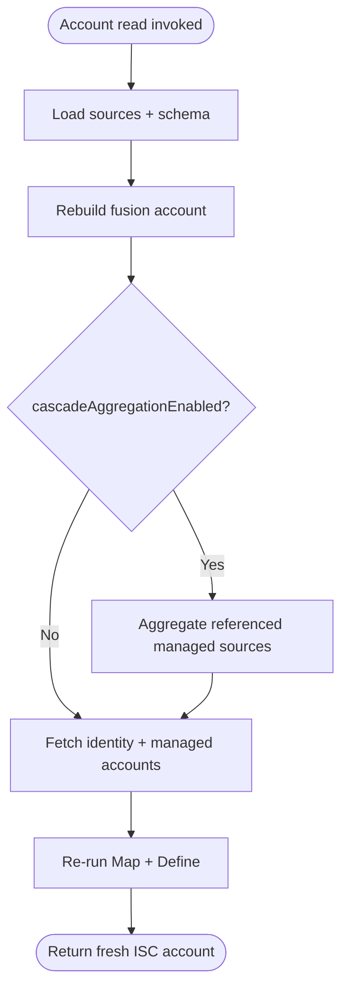

# Account Read Operation

## Description

The Account Read operation retrieves the current state of a specific fusion account. Crucially, it **rebuilds** the fusion account from its constituent parts (source accounts and identity data), ensuring the returned data is fresh and reflects the latest configuration.

## Process Flow

1.  **Setup**:
    - Verifies that the `identity` (ID) is provided.
    - Loads all managed sources (`sources.fetchAllSources()`).
    - Sets the fusion account schema from the input (`schemas.setFusionAccountSchema(input.schema)`).

2.  **Fusion Account Rebuild** (`rebuildFusionAccount` helper):
    - Fetches the stored fusion account definition for the requested identity.
    - Resolves the linked managed-account keys from the fusion account's `accounts` and `missing-accounts` attributes **and** the identity's own managed accounts (managed sources only).
    - **Cascade aggregation** (conditional): when `cascadeAggregationEnabled` is true and the rebuild has at least one unique source id, each referenced managed source is aggregated first to ensure the most up-to-date data is fetched from ISC. Errors during cascade aggregation are logged but do not stop the main read operation.
    - Fetches the authoritative identity and each linked managed account in batched parallel calls.
    - Re-runs the fusion logic via `fusion.processFusionAccount(account, attributeOperations)` to map attributes, apply transforms, and generate values.
    - **Attribute operations** (`ATTR_OPS_REFRESH`):
        - `refreshMapping`: True — re-evaluates attribute mappings from source accounts.
        - `refreshDefinition`: True — re-evaluates Velocity template definitions.
        - `resetDefinition`: False — does NOT clear existing unique values before processing.

3.  **Output Generation**:
    - Normalizes any pending form state for output (`fusion.normalizePendingFormStateForOutput()`).
    - Converts the rebuilt fusion account into an ISC account object via `fusion.getISCAccount(fusionAccount)`.
    - Sends the result back to ISC and emits a `log.timer().end(...)` line on success.

