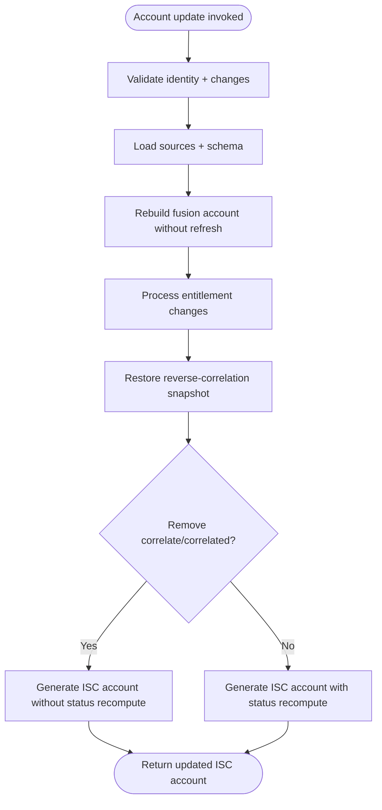
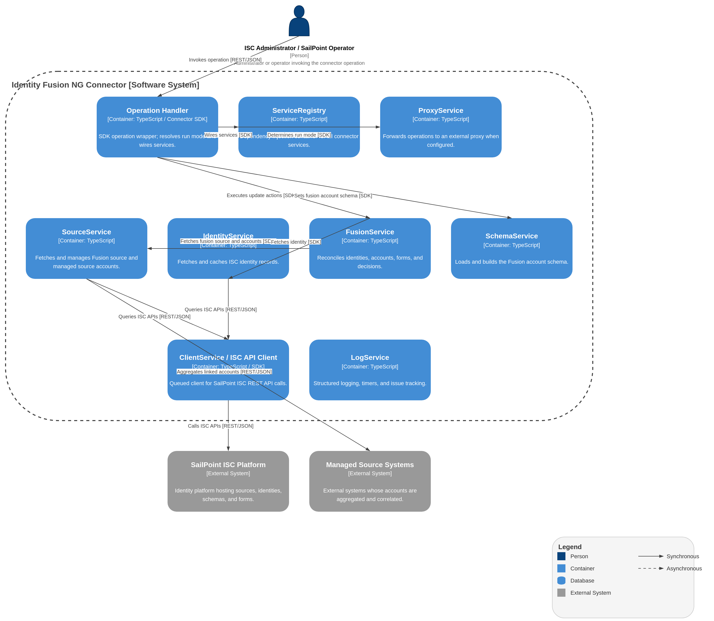

# Account Update Operation

## Description

The Account Update operation applies changes to a fusion account. Currently, it primarily supports **entitlement-based actions** (like "report", "fusion", "correlate") which are modeled as entitlement adds/removes in ISC.

## Process Flow

## Architecture diagram

1.  **Input Validation**:
    - Verifies that the `identity` (ID) and `changes` list are provided and that `changes` is non-empty.
    - Computes the list of reverse-correlation attributes from sources configured with `correlationMode: 'reverse'` and a `correlationAttribute`. An empty reverse-correlation snapshot is created.

2.  **Setup**:
    - Loads all managed sources (`sources.fetchAllSources()`).
    - If any reverse-correlation attributes are configured, the target fusion account is fetched pre-emptively and its existing attribute values for those keys are captured in the snapshot.
    - Sets the fusion account schema from the input.

3.  **Fusion Account Rebuild**:
    - Fetches the current fusion account, identity, and linked source accounts without recomputing any attribute values.
    - **Attribute operations** (`ATTR_OPS_NONE`):
        - `refreshMapping`: False — preserves existing mapped attribute values.
        - `refreshDefinition`: False — preserves existing Velocity-defined attribute values.
        - `resetDefinition`: False — unique values are not touched.

4.  **Change Processing**:
    - Iterates through the list of requested changes.
    - For each change, asserts the `attribute` field is present.
    - If the change targets the `actions` attribute, the change is dispatched to `executeActions()` in `operations/actions/index.ts`. Each action token (the substring before `:`) is routed to a handler. See [Action entitlements reference](#action-entitlements-reference).
    - The dispatcher detects `Remove` of `correlate`/`correlated` and skips correlation-status recomputation in step 6. **Remove does not undo established correlation links** — it only affects output generation.
    - For any other `attribute`, the operation crashes the connector log (`log.crash("Unsupported entitlement change: …")`).

5.  **Reverse-Correlation Snapshot Restore** (conditional):
    - If the operation captured a reverse-correlation attribute snapshot during setup (sources configured with `correlationMode: 'reverse'`), the rebuilt fusion account's reverse-correlation attributes are restored to their pre-rebuild values to prevent the rebuild from overwriting them with derived values.

6.  **Output Generation**:
    - Converts the rebuilt fusion account into an ISC account object via `fusion.getISCAccount(fusionAccount, includeUncorrelated=true, shouldRecomputeCorrelationStatus)`.
    - Returns the updated ISC account state.

## Action entitlements reference

| Action | Add (create or update) | Remove (create or update) |
|--------|------------------------|---------------------------|
| `report` | Runs the non-persistent **Fusion report** pipeline (dry-run Match preview, email to global owners, no account-list stream) | No-op |
| `fusion` | Adds the `fusion` action entitlement | Removes the `fusion` action entitlement |
| `correlate` / `correlated` | Runs the **correlate action**: direct ISC PATCH for missing managed source accounts on provisioning paths. No reverse-correlation writes on this path. | On **update only**: skips correlation-status recompute on output. Does **not** undo established correlation links. |
| `reviewer:<sourceId>` | Records the source as a reviewer scope on the Fusion account | Clears the reviewer scope for that source |

The **`correlated` entitlement id** listed by entitlement-list is the catalog entry ISC can request. On output, the connector also evaluates **correlated entitlement** as a build outcome: it appears when `missing-accounts` is empty after build, and is absent when any managed source account remains missing.

## Behavior Notes

- **No attribute refresh on update**: The account is rebuilt with `ATTR_OPS_NONE` (`refreshMapping: false`, `refreshDefinition: false`), preserving all existing attribute values including `nativeIdentity` and account `name`. The update operation only processes entitlement changes (actions) and does not regenerate attributes.

