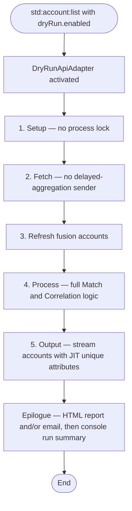
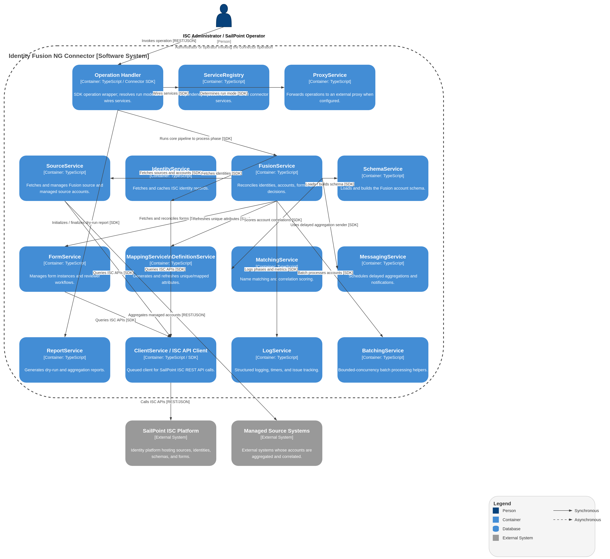

# Dry-run mode (account list)

## Description

Dry-run mode is a **non-persistent** variant of the [Account list](account-list.md) operation (`std:account:list`). It runs the full Map, Define, and Match pipeline against live ISC read APIs so you can analyze outcomes before changing production data.

Dry-run mode is activated by passing a `dryRun` object on the account-list input. It is intended for **local or out-of-platform execution** (for example `spcx`, proxy server, or connector development). ISC platform aggregations do not send this input, so scheduled aggregations remain persistent.

Write side effects are inhibited at the API adapter boundary (`DryRunApiAdapter`). Business logic (Match, Correlation, Output) runs identically to a persistent aggregation; only ISC write API calls are suppressed with synthetic responses.

Dry-run mode cannot be combined with recording mode (`recording.mode: record` or `replay`).

## When to use it

| Use case | Why dry-run |
| -------- | ----------- |
| Tune Match thresholds and algorithms | See potential matches, score breakdowns, and streamed account rows without mutating the tenant |
| Validate source ordering and attribute mapping | Confirm Map/Define output, JIT unique attributes, and `originSource` behavior before a production aggregation |
| Review correlation and matching context | Inspect managed-account counts, issue summaries, and phase timing with the same account stream ISC would receive |
| Large-tenant analysis | Use `saveFile: true` to write the HTML report to disk when the HTTP response is not the primary deliverable |

## Input options

Pass a `dryRun` object on the `std:account:list` input:

```json
{
  "dryRun": {
    "enabled": true,
    "saveFile": true,
    "sendEmail": ["reviewer@example.com"]
  }
}
```

| Option | Type | Default | Description |
| ------ | ---- | ------- | ----------- |
| `enabled` | boolean | `false` | Set to `true` to run in non-persistent dry-run mode. |
| `saveFile` | boolean | `false` | Write an HTML report to `./reports/dry-run-<host>-<timestamp>.html` on the connector host. |
| `sendEmail` | string or string[] | — | Deliver the dry-run report email to the specified address(es). |

When `enabled` is `false` or absent, the operation runs as a normal persistent aggregation and `saveFile` / `sendEmail` are silently ignored.

## Process flow

Dry-run reuses the same pipeline phases as a persistent aggregation. Phase 5 streams accounts; persistence-only tail steps (form cleanup, state save, delayed scheduling) are skipped.




## Architecture diagram



### What runs (same as aggregation)

- Managed source and identity fetch
- Fusion account refresh (Map + normal Define)
- Identity processing and managed-account matching (Match)
- Correlation-on-aggregation logic (writes inhibited at adapter)
- Account streaming via `forEachISCAccount` with JIT unique attribute refresh
- In-memory form reconciliation for report context

### What is suppressed (no tenant write side effects)

| Side effect | Persistent aggregation | Dry-run |
| ----------- | ---------------------- | ------- |
| Process lock | Acquired | Skipped |
| ISC write API calls | Executed | Inhibited via `DryRunApiAdapter` (synthetic responses) |
| Save attribute / batch state to tenant | Yes | Skipped (code may run; PATCH inhibited) |
| Form cleanup API deletes | Yes | Skipped |
| Delayed-aggregation workflow fetch and scheduling | Yes (when configured) | No fetch; no scheduling |
| Reset forms / reset accounts flags | Applied when set | Detected but not applied |

!!! note "Reset flags in dry-run"
    If **Reset accounts?** or **Reset forms?** is enabled, dry-run detects the flag and exits early without applying the reset or streaming accounts. Use a persistent aggregation (or clear the flag) when you intend to perform a reset.

## Output

### Account stream

Dry-run emits the same `StdAccountListOutput` rows as a persistent aggregation for the same ISC input state, including JIT unique attributes refreshed during Phase 5. No summary or metadata object is sent via `res.send`.

### Console run summary

After the pipeline completes, the connector logs a JSON run summary to `console.log`:

| Field | Description |
| ----- | ----------- |
| `rowsSent` | Number of account rows streamed via `res.send` |
| `identitiesFound` | Identities loaded during the run (scope fetch plus supplemental loads such as global reviewer or report-target owners) |
| `managedAccountsFound` | Managed accounts loaded during fetch |
| `fusionAccountsFound` | Fusion accounts loaded from the Fusion source |
| `totalProcessingTime` | Total elapsed time for the run |
| `phaseTiming` | Per-phase elapsed breakdown |
| `issueSummary` | Warning and error counts with sampled messages |
| `options` | `{ saveFile, sendEmail }` reflecting the input used |
| `reportHtmlOutputPath` | Present when `saveFile` wrote an HTML report |

### HTML report (`saveFile` or `sendEmail`)

When `saveFile` and/or `sendEmail` is set, the connector generates a report using the **same Handlebars template and section layout** as the aggregation report-on-aggregation email. The title is **Identity Fusion Dry Run Report** to distinguish analysis from persisted results.

Report contents align with the [Account list report section](account-list.md#report-contents-what-is-included):

- Header summary and processing statistics
- Potential match details with candidate score breakdowns
- Failed matching / form creation entries
- Global warnings (for example duplicate Fusion accounts per identity)
- Compact aggregation issues summary (counts + sampled messages, not full logs)

Non-match detail appears as **consolidated counters** in the report (`includeNonMatches: false`), not as per-account non-match rows.

### Epilogue ordering (durable-first)

When report artifacts are requested, the epilogue runs in this order:

1. Write HTML report file (`saveFile`)
2. Deliver report email (`sendEmail`)
3. Log run summary to `console.log`

The epilogue runs **even when the pipeline fails** partway through, so report files and emails are attempted before the operation error is propagated.

## Invocation examples

### Local development (`spcx`)

Build the connector, then run it locally and invoke account list with dry-run input in your spcx session or test harness:

```bash
npm run build
npm run dev
```

Pass `{ "dryRun": { enabled: true, "saveFile": true } }` on the `std:account:list` input together with your connector configuration.

### Proxy mode

When the proxy server receives `std:account:list`, include the `dryRun` object in the `input` payload. For large tenants, prefer `saveFile: true` so the HTML report is written on the server filesystem rather than relying on the full HTTP response stream.

See [Proxy mode](../reference/proxy-mode.md) for architecture and setup.

## Related documentation

- [Account list operation](account-list.md) — full persistent aggregation flow
- [Matching identities](../use-guides/configuration/matching-identities.md) — Match rules and thresholds
- [Analyze changes with dry-run](../use-guides/operation/analyze-with-dry-run.md) — non-persistent validation workflow
- [Tuning matching algorithms](../use-guides/configuration/tuning-matching-algorithms.md) — recommended testing approach
- [Glossary: dry-run mode](../concepts/glossary.md) — canonical term definition


