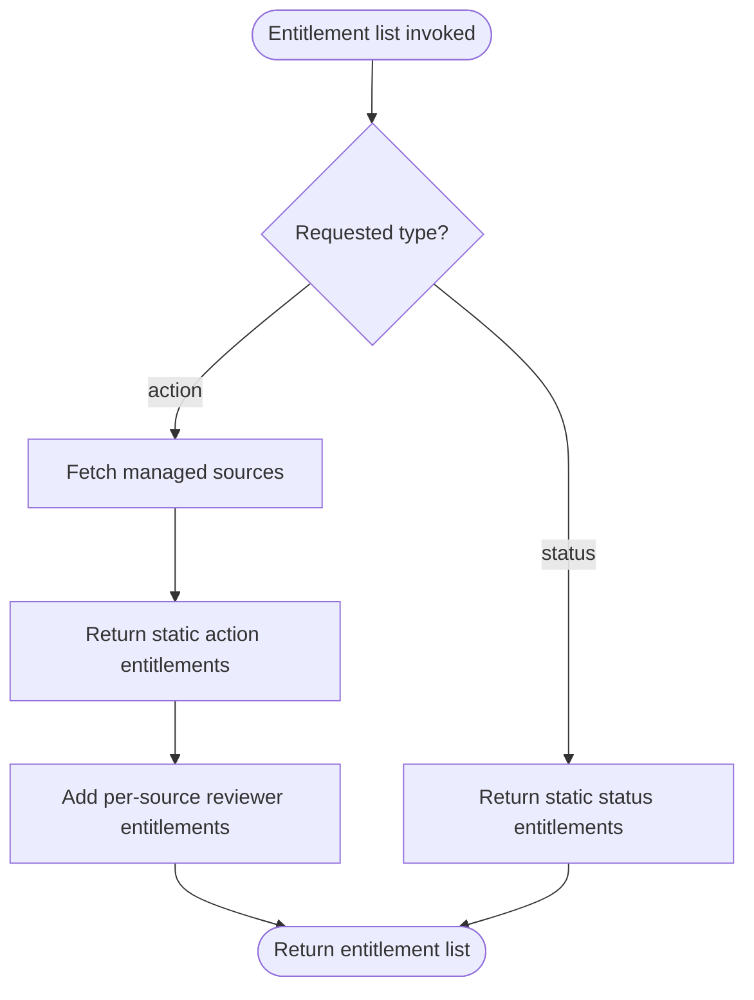
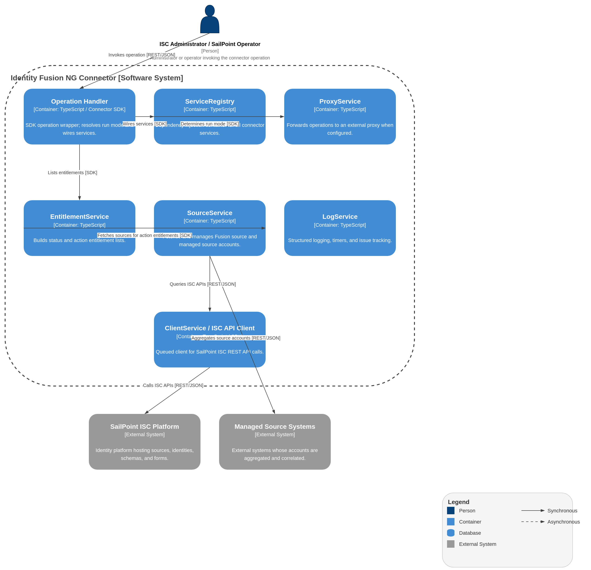

# Entitlement List Operation

## Description

The Entitlement List operation returns available entitlements for the fusion connector. It supports two types of entitlements: "status" (static) and "action" (dynamic).

## Process Flow

## Architecture diagram

1.  **Input Analysis**:
    - Checks the requested `type` of entitlement.

2.  **Status Entitlements**:
    - If `type` is "status":
    - Returns a static list of status values, including:
        - `authorized`
        - `auto`
        - `baseline`
        - `manual`
        - `orphan`
        - `nonMatched`
        - `reviewer`
        - `requested`
        - `uncorrelated`
        - `activeReviews`
        - `candidate`

    !!! note

        Status entitlements are static and **not** requestable.

3.  **Action Entitlements**:
    - If `type` is "action":
    - Fetches all managed sources.
    - Returns the static action entitlements (defined in `src/data/action.ts`):
        - `report` — "Fusion report": generate a **Fusion report** on demand (Match preview; not an aggregation report).
        - `fusion` — "Fusion account": mark an account as a fusion account.
        - `correlated` — "Correlated": the **correlated entitlement** catalog entry. On Fusion account output, this entitlement appears when all managed source accounts are correlated (`missing-accounts` empty). Assigning it on create/update runs the **correlate action** (direct PATCH for missing accounts).
    - Also returns one **per-source reviewer entitlement** for each managed source (sourced dynamically from the loaded managed sources): id `reviewer:<sourceId>`, name `<sourceName> reviewer`, description `Reviewer for potentially duplicated identities from <sourceName> source`. These drive the per-source reviewer role.
    - **Report Entitlement**:
        - Can be requested to generate a **Fusion report**: the same Match preview as dry-run, emailed to global owners, without persisting Fusion outcomes or streaming an account-list.
        - This entitlement must be made available to users through an access profile. The connector deliberately omits this entitlement from the target account so it can be requested multiple times.

    !!! note

        Actions are modeled as entitlements so they can be requested via access requests in ISC. All Action entitlements are requestable. The `correlate` and `correlated` wire tokens are both accepted by the action dispatcher on create/update and map to the same handler; the entitlement id exposed here is `correlated`.

4.  **Output**:
    - Returns the list of entitlements.

