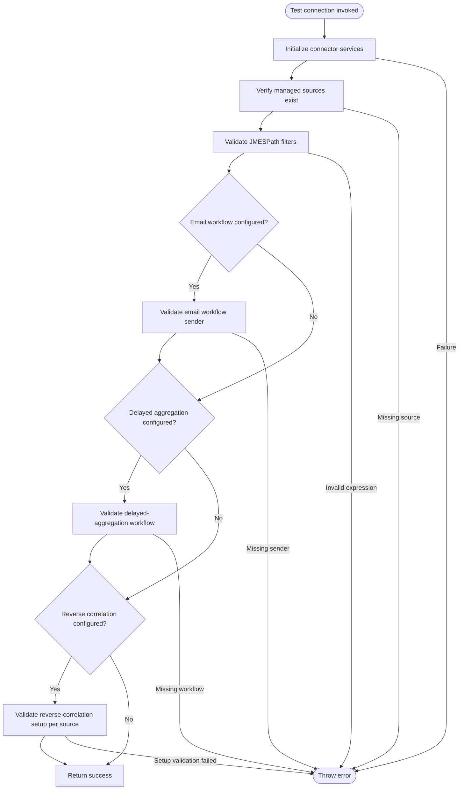
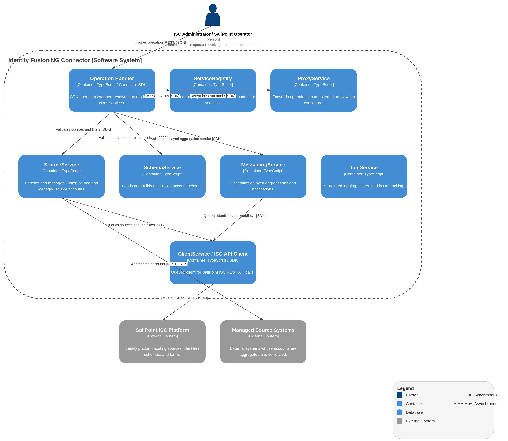

# Test Connection Operation

## Description

The Test Connection operation verifies that the connector is correctly configured and can communicate with required services (ISC API).

## Process Flow

## Architecture diagram

1.  **Execution**:
    - The operation is invoked by ISC.
    - It verifies access to the Fusion source and ensures that all configured managed sources exist.
    - It validates configured `Accounts JMESPath filter` expressions.
    - When email workflow delivery is configured, it validates that the email workflow sender is reachable.
    - If any source is configured for delayed aggregation, it validates delayed-aggregation workflow/sender availability.
    - If any sources are configured for reverse correlation, it validates reverse-correlation setup for each such source. Failures name the source and correlation attribute.
    - If the service registry, basic initialization, and these connectivity checks succeed, the connection is considered healthy.

2.  **Output**:
    - Returns an empty success response `{}`.
    - If any initialization step or connectivity check failed (e.g., missing API permissions, missing managed source), an error is thrown, signaling failure.

