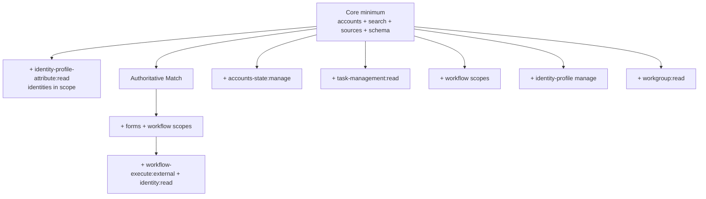

# ISC PAT scopes

Identity Fusion NG calls a fixed set of Identity Security Cloud APIs. Grant your connector Personal Access Token (PAT) the scopes below. Scopes are grouped into a **full set** (every connector feature) and **conditional** scopes that apply only when specific settings are enabled.

## Full PAT scope set

Use these thirteen scopes for a deployment that uses Map, Define, Match, review forms, email notifications, reverse correlation, identity schema discovery, and aggregation control:

```
idn:accounts:manage
idn:accounts-state:manage
idn:identity:read
sp:search:read
idn:sources:manage
idn:source-schema:manage
sp:forms:manage
sp:workflow:manage
sp:workflow-execute:external
idn:workgroup:read
idn:task-management:read
idn:identity-profile:manage
idn:identity-profile-attribute:manage
```

`idn:identity-profile-attribute:manage` covers both identity-attribute list (schema discovery) and reverse-correlation writes. For Map/Define with identities in scope and no reverse correlation, `idn:identity-profile-attribute:read` is enough.

## Scope-by-scope rationale

| Scope | API calls covered |
| --- | --- |
| `idn:accounts:manage` | List fusion and managed accounts; correlate managed accounts to identities (`PATCH /accounts/{id}`) |
| `idn:accounts-state:manage` | Disable managed accounts on the Orphan **Disable non-matching accounts** path via `POST /accounts/{id}/disable` |
| `idn:identity:read` | `GET /identities/{id}` — email address fallback for reviewers and report recipients when Search does not return `emailAddress` |
| `sp:search:read` | Identity lookups: scope query, fetch by ID/name, aggregation event search |
| `idn:sources:manage` | List/get/update sources; correlation config; load-accounts aggregation |
| `idn:source-schema:manage` | Read Fusion and managed source schemas; add reverse-correlation schema attributes |
| `sp:forms:manage` | Form definitions and instances for Match manual review (search, create, get-by-key, patch, delete definitions; search, create, patch instances) |
| `sp:workflow:manage` | Email sender and delayed-aggregation workflows (list, create, get, patch) |
| `sp:workflow-execute:external` | Deliver emails via `testWorkflow` on a disabled workflow |
| `idn:workgroup:read` | Resolve Fusion source owner (when it is a governance group) and management workgroup members as global reviewers or report recipients |
| `idn:task-management:read` | Poll aggregation task completion when `aggregationMode: before` |
| `idn:identity-profile:manage` | Add attribute transforms for reverse correlation |
| `idn:identity-profile-attribute:manage` | List identity attributes for Discover Schema; create or enable searchable identity attributes for reverse correlation |

## Conditional scopes

These scopes appear in both the full set and the conditional table because they are required only when specific features are enabled. Omit them for deployments that do not use those features.

| Scope | Required when… |
| --- | --- |
| `idn:accounts-state:manage` | **Disable non-matching accounts** on an Orphan source |
| `idn:identity:read` | Match review, aggregation/Fusion report email, or **Owners are global reviewers?** (identity profile fetch for email) |
| `idn:identity-profile-attribute:read` | **Include identities in the scope?** is on (default) — Discover Schema lists identity attributes. Skip if you already grant `:manage` |
| `idn:task-management:read` | `aggregationMode: before` is set on any managed source |
| `sp:forms:manage` | Match step is enabled (manual review workflow) |
| `sp:workflow:manage` | Review or report email, or delayed aggregation |
| `sp:workflow-execute:external` | Review or report email, or delayed aggregation |
| `idn:workgroup:read` | Fusion source owner is a governance group, a management workgroup is assigned, **Owners are global reviewers?**, or report email resolves those members |
| `idn:identity-profile:manage` | `correlationMode: reverse` is set on any managed source |
| `idn:identity-profile-attribute:manage` | `correlationMode: reverse` is set on any managed source (also satisfies identity-attribute list) |

## Core minimum (Map and Define only)

For a Map/Define side-car deployment with no Match, no email, no reverse correlation, no aggregation control, no orphan disable, and **Include identities in the scope?** set to **No**:

```
idn:accounts:manage
sp:search:read
idn:sources:manage
idn:source-schema:manage
```

When identities stay in scope (the default), also grant `idn:identity-profile-attribute:read` so Discover Schema can list identity attributes.

## Deployment pattern → scopes



## PAT scope recommender

Derive least-privilege scopes from an exported Fusion source configuration JSON:

```bash
npm run pat-scopes:recommend -- path/to/source-config.json
```

The script inspects managed sources (`aggregationMode`, `correlationMode`, `disableNonMatchingAccounts`), Match rules, review/report settings, identity scope, and global reviewer flags. It prints:

- **Core minimum** — Map/Define side-car with no extended features
- **Detected conditionals** — Match, delayed aggregation, reverse correlation, orphan disable, identity schema list, workgroup, and workflow features as applicable

Export the source config from ISC (Admin → Connections → Sources → your Fusion source → Export) or use a sanitized copy from scenario recordings.

## Caveats

1. **`GET /v2025/form-definitions`** — No explicit scope in the OpenAPI spec; `sp:forms:manage` is included conservatively because other form operations require it. `GET`/`PATCH` form definition by key use the same forms scope.
2. **`PATCH /v2025/form-instances/{id}`** — Any authenticated token can call this endpoint; no additional scope beyond a valid PAT.
3. **`sp:workflow-execute:external`** — Exact scope string for `POST /v2025/workflows/{id}/test`. Do not substitute `sp:workflow:manage`.
4. **Reverse correlation** — `idn:identity-profile:manage` and `idn:identity-profile-attribute:manage` are only exercised for writes when `correlationMode: reverse` is configured on at least one managed source.
5. **Identity attribute list** — `GET /identity-attributes` runs during Discover Schema when identities are in scope. That is independent of reverse correlation.
6. **Identities API** — Identity lookups normally use Search (`sp:search:read`). `GET /identities/{id}` is a fallback for email on reviewers and report recipients.
7. **Account disable** — `idn:accounts-state:manage` is only for Orphan **Disable non-matching accounts**. Delayed aggregation uses source load-accounts and workflow scopes, not account disable.
8. **Entitlement list operation** — Does not call ISC APIs; no additional PAT scope beyond source/account reads already listed above. `EntitlementsV2025Api` and `TransformsApi` are loaded on the client and unused.

## Related configuration

- [Connection Settings](../configuration/connection.md) — PAT ID and secret fields
- [Configuring sources and scope](../use-guides/configuration/configuring-sources-and-scope.md) — aggregation mode, identity scope, and correlation mode
- [Managing correlation](../use-guides/configuration/managing-correlation.md) — reverse correlation
- [Entitlement list](../operations/entitlement-list.md) — status and action entitlements the connector exposes
- [Tune API performance](../use-guides/operation/tune-api-performance.md) — resilience settings
