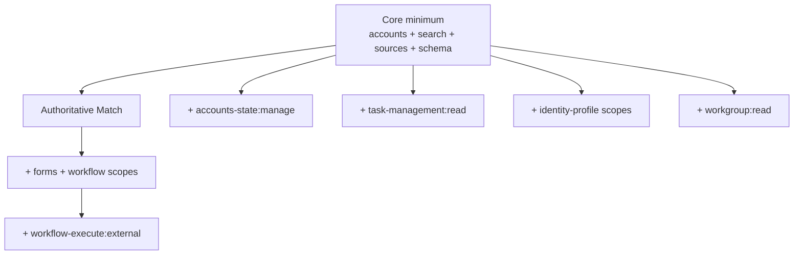

# ISC PAT scopes

Identity Fusion NG calls a fixed set of Identity Security Cloud APIs. Grant your connector Personal Access Token (PAT) the scopes below. Scopes are grouped into a **minimal set** (full connector feature set) and **conditional** scopes that apply only when specific settings are enabled.

## Minimal PAT scope set

Use these twelve scopes for a deployment that uses Map, Define, Match, review forms, email notifications, reverse correlation, and aggregation control:

```
idn:accounts:manage
idn:accounts-state:manage
sp:search:read
idn:sources:manage
idn:source-schema:manage
sp:forms:manage
sp:workflow:manage
sp:workflow-execute:external
idn:workgroup:read
idn:task-management:read
idn:identity-profile:manage
idn:identity-profile-attribute:manage
```

## Scope-by-scope rationale

| Scope | API calls covered |
| --- | --- |
| `idn:accounts:manage` | List fusion and managed accounts; correlate managed accounts to identities |
| `idn:accounts-state:manage` | Disable managed accounts in the delayed-aggregation path |
| `sp:search:read` | Identity lookups: scope query, fetch by ID/name, aggregation event search |
| `idn:sources:manage` | List/get/update sources; correlation config; load-accounts aggregation |
| `idn:source-schema:manage` | Read Fusion and managed source schemas; add reverse-correlation schema attributes |
| `sp:forms:manage` | Form definitions and instances for Match manual review |
| `sp:workflow:manage` | Email sender and delayed-aggregation workflows |
| `sp:workflow-execute:external` | Deliver emails via `testWorkflow` on a disabled workflow |
| `idn:workgroup:read` | Resolve Fusion source management workgroup members as global reviewers |
| `idn:task-management:read` | Poll aggregation task completion when `aggregationMode: before` |
| `idn:identity-profile:manage` | Add attribute transforms for reverse correlation |
| `idn:identity-profile-attribute:manage` | Create or enable searchable identity attributes for reverse correlation |

## Conditional scopes

| Scope | Required when… |
| --- | --- |
| `idn:accounts-state:manage` | `aggregationMode: delayed` is set on any managed source |
| `idn:task-management:read` | `aggregationMode: before` is set on any managed source |
| `sp:forms:manage` | Match step is enabled (manual review workflow) |
| `sp:workflow:manage` | Match email notifications or delayed aggregation are enabled |
| `sp:workflow-execute:external` | Match email notifications or delayed aggregation are enabled |
| `idn:workgroup:read` | Fusion source has a management workgroup assigned |
| `idn:identity-profile:manage` | `correlationMode: reverse` is set on any managed source |
| `idn:identity-profile-attribute:manage` | `correlationMode: reverse` is set on any managed source |

## Core minimum (Map and Define only)

For a minimal Map/Define deployment with no Match, no email, no reverse correlation, and no aggregation control:

```
idn:accounts:manage
sp:search:read
idn:sources:manage
idn:source-schema:manage
```

## Deployment pattern → scopes



## Caveats

1. **`GET /v2025/form-definitions`** — No explicit scope in the OpenAPI spec; `sp:forms:manage` is included conservatively because other form operations require it.
2. **`PATCH /v2025/form-instances/{id}`** — Any authenticated token can call this endpoint; no additional scope beyond a valid PAT.
3. **`sp:workflow-execute:external`** — Exact scope string for `POST /v2025/workflows/{id}/test`. Do not substitute `sp:workflow:manage`.
4. **Reverse correlation scopes** — Only exercised when `correlationMode: reverse` is configured on at least one managed source.

## Related configuration

- [Connection Settings](../configuration/connection.md) — PAT ID and secret fields
- [Configuring sources](../use-guides/configuration/configuring-sources.md) — aggregation mode and correlation mode
- [Connection and observability tuning](../use-guides/operation/connection-and-observability-tuning.md) — resilience settings
