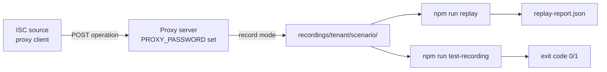

# Scenario recording (dev/CI)

Capture and replay ISC API interactions for offline regression and interactive debugging.

**Practical walkthrough:** [Capture scenarios for replay](../use-guides/operation/capture-scenarios-for-replay.md) · **Testing process:** [Testing and validation](../use-guides/validation-and-troubleshooting/testing-and-validation.md)

Artifacts live under `recordings/<tenant>/{scenarioName}/`, where `<tenant>` is derived from connection Base URL (fallback `unknown-tenant`).

---

## End-to-end workflow



1. **Build and start proxy server** — `npm run build && PROXY_PASSWORD=secret npm start`
2. **Configure ISC External Settings** — external processing, proxy mode, chain recording, recording name
3. **Run aggregation** — artifacts accumulate on the server host
4. **Replay or verify** — `npm run replay` (interactive) or `npm run test-recording` (CI)

---

## Capture (canonical: External Settings)

**Recommended:** enable capture on a proxy deployment via ISC **External Settings**:

| Field | Value |
| --- | --- |
| Enable external processing? | On |
| Enable proxy mode? | On (required for filesystem writes on the proxy host) |
| Enable chain recording? | On |
| Recording chain name (`recordingName`) | Scenario segment only (for example `baseline-hr-ad`) |

`safeReadConfig()` bridges this into `config.recording.mode = 'record'` and `config.recording.scenarioName` on the proxy server unless explicit `recording.mode` or env vars override.

### Artifact files

| File | Purpose |
| --- | --- |
| `api-log.ndjson` | Append-only ISC API request/response pairs |
| `steps.ndjson` | Per-operation inputs, outputs, and state snapshots |
| `phases.ndjson` | Phase boundary summaries (when account-list runs) |
| `scenario.json` | Compiled replay scenario (written on process exit) |
| `manifest.json` | Store type, artifact paths, and entry counts |
| `reports/aggregation.json` | Local aggregation report snapshot (when generated) |
| `reports/matching-results.json` | Per-account match outcomes with score breakdowns (record-mode account-list) |
| `replay-report.json` | Per-step results from the last automated replay run |
| `connector.log` | Stdout/stderr capture from local scripts |

`reports/matching-results.json` is written at the end of each record-mode account-list operation. Re-record existing scenarios to populate it.

### Environment overrides

When External Settings fields are unset, env vars on the proxy host can enable recording:

| Variable | Effect |
| --- | --- |
| `RECORD_MODE=record` | Force record mode |
| `RECORD_SCENARIO_NAME` | Scenario segment (preferred) |
| `RECORD_CHAIN_NAME` | Deprecated alias for scenario name |
| `VERBOSE_RECORDING` | Extra recording diagnostics |

Legacy `record-chain.js` and `replay-chain.js` scripts remain as deprecated wrappers that forward to the scenario scripts above.

### Legacy `npm run record` (deprecated)

```bash
npm run build
npm run record
```

Prints a deprecation warning — prefer External Settings for capture. Enter a scenario reference as **`tenant/scenarioName`** (for example `company12926-poc/fernando`). A bare name works when `BASEURL` or `ISC_BASEURL` is set.

---

## Replay (automated, interactive)

`npm run replay` spawns a local proxy-server connector in replay mode, auto-feeds every step from `scenario.json`, streams live output, compares goldens, and writes `replay-report.json`.

```bash
npm run build
npm run replay -- "company12926-poc/fernando"
```

**Debug flags:**

| Flag | Effect |
| --- | --- |
| `--no-verify` | Run steps without golden comparison |
| `--step <id>` | Run a single step (for example `step-3`) |
| `--pause-on-fail` | Wait for Enter after a failed step |

Omit the scenario argument to pick from scenarios that have a non-empty `api-log.ndjson`. **Quote refs that contain `/`** so the shell does not split them.

Replay serves all ISC calls from `api-log.ndjson` via `ReplayApiAdapter` — no live tenant API calls.

During replay, each step sets **simulated recording time** on the operation `FusionRun` from `steps.ndjson` (per-step `timestamp`, then `scenario.json` `recordedAt`). Form stale cleanup during fetch compares definition age against that simulated time and `fusionFormExpirationDays`, not the wall clock when you run replay. Aged recordings therefore verify without false drift from expired forms.

---

## Finalize (recovery)

If the connector exits without writing `scenario.json` (crash, `kill -9`):

```bash
npm run finalize -- "company12926-poc/fernando"
```

Normal Ctrl+C on a recording session auto-finalizes; use finalize only for recovery.

---

## Regression verification (offline)

Verify a scenario offline with golden output comparison (in-process harness, no proxy spawn):

```bash
npm run test-recording -- "company12926-poc/fernando"
```

Auto-runs all steps in `scenario.json`, compares outputs against recorded goldens, prints drift details, and exits non-zero on failure.

| Command | Use when |
| --- | --- |
| `npm run replay` | Interactive debugging with live connector output |
| `npm run test-recording` | Fast headless regression in CI or before commit |

Refresh stale report artifacts after connector upgrades:

```bash
npm run refresh-recording-reports -- "company12926-poc/fernando"
```

---

## Harness unit tests

No local recordings required. Use the scenario recording suite, not `npm test`:

```bash
npm run test:scenario
```

---

## `reports/matching-results.json` schema

Written after record-mode account-list completes:

- `version`, `recordedAt`, `operation` — artifact metadata
- `sweepSummary` — `{ processed, exact, partial, deferred, nonMatch }` counts
- `identityMatches` — identity-origin matches with candidate scores
- `deferredMatches` — deferred candidate rows with per-attribute scores
- `nonMatches` — analyzed non-match accounts
- `failedMatches` — accounts where matching failed

Record mode automatically enables managed-account report capture. Scenarios recorded before this artifact existed must be re-recorded.

