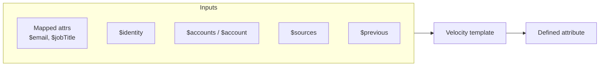

# Velocity context reference

The **Apache Velocity expression** field provides a templating language with access to utilities and data. Use this reference when writing [Attribute Definition](../use-guides/configuration/defining-attributes.md) expressions.

## Available data

Velocity templates combine mapped attributes, identity fields, and managed-account snapshots. Definitions evaluate **top to bottom** — each result is available to the next.



### Quick reference

| Access | What it is | Example |
| --- | --- | --- |
| `$firstname`, `$email` | Mapped attributes (or raw source attrs if Map is not used) | `$firstname $lastname` |
| `$identity.*` | ISC identity fields when identities are in scope | `$identity.name` |
| `$accounts[n]` | Ordered list of managed account snapshots | `$accounts[0].schema.id` |
| `$sources.SourceName` | Snapshots grouped by source name | `$sources.Workday[0].department` |
| `$account` | Origin snapshot only | `$account.schema.name` |
| `$originAccount` | Origin key string | `sourceId::nativeIdentity` or identity id |
| `$originSource` | Origin source name | `Identities`, `Workday` |
| `$previous.*` | Prior Fusion account state | `$previous.username` |
| `$counter`, `$UUID`, `$isUnique()` | Unique-definition helpers | See [Unique-only variables](#unique-only-variables) |

### Mapped and source attributes

After **Map**, reference mapped names directly:

```velocity
$jobTitle
$department
$email
```

When Attribute Mapping is not configured, use raw source attribute names (`$firstname`, `$hireDate`, …).

### Identity attributes

Available when **Include identities in the scope** is enabled.

| Variable | Meaning |
| --- | --- |
| `$identity.name` | Root identity name |
| `$identity.<attr>` | Any identity attribute by name |
| `$name` | Falls back to identity name for identity-origin rows when no mapped attribute named `name` exists |

```velocity
$identity.name
$identity.employeeNumber
```

### `$accounts` — managed account list

Each list entry is a snapshot containing:

| Part | Fields | Notes |
| --- | --- | --- |
| Attributes | All managed account attributes | Same names as on the source |
| `source` | `id`, `name` | `id` is absent for Identities rows |
| `schema` | `id`, `name` | Native identity and display name |
| Flags | `IIQDisabled` | Present when the source exposes it |

**Ordering rules:**

1. Configured source order (Source Settings list)
2. Insertion order within each source
3. Unknown sources appended last
4. When `mainAccount` is valid, that account moves to index `0`

!!! tip "$accounts[0] vs $account"
    `$accounts[0]` follows **configured source order**. `$account` is always the **origin** snapshot. When `mainAccount` points elsewhere, these two differ — use `$account` for origin-specific logic.

```velocity
$accounts[0].source.name
$accounts[0].schema.id
$accounts[0].schema.name
```

### `$sources` — accounts grouped by source

Map keyed by source name. Values are lists of the same snapshot shape as `$accounts[]`.

```velocity
## First Workday account's title
$sources.Workday[0].jobTitle

## Count AD accounts linked to this Fusion row
$sources.ActiveDirectory.size()
```

### Origin helpers

| Variable | Type | Description |
| --- | --- | --- |
| `$originSource` | String | Source that originally created the Fusion account |
| `$originAccount` | String | Origin key — managed: `sourceId::nativeIdentity`; identity: identity id |

### `$account` — origin snapshot

Same shape as a `$accounts[]` entry for managed origins.

For **Identities** origin rows:

- `source.name` = `Identities` (no `source.id`)
- `schema.name` / `schema.id` = display name and id
- `$account.name` is available for identity-origin rows

Use `$originAccount` when you need the key string; use `$account` when you need origin attribute values.

```velocity
$account.schema.name
$account.source.name
$originAccount
```

### `$previous`

Previous generated Fusion account state — useful for change detection or preserving prior values.

```velocity
#if($previous.username && $previous.username != "")
  $previous.username
#else
  $newUsername
#end
```

### Unique-only variables

| Variable | Applies to | Behavior |
| --- | --- | --- |
| `$counter` | Unique definitions | Empty on first attempt; padded suffix on collision. Auto-appended unless the expression contains Velocity directives (`#if`, `#set`, `#end`, …) |
| `$UUID` | Unique definitions | Fresh v4 UUID per attempt when referenced; on collision a new UUID is generated instead of appending `$counter` |
| `$isUnique(value)` | Unique definitions | Returns `true` when the value is not already registered (after the same case / trim / spaces / normalize / maxLength transforms) |

```velocity
## Collision-aware username
#set($base = "$firstname.$lastname")
#if($isUnique($base))$base#else$base$counter#end
```

---

## Available utilities

### Empty output on failure

Custom connector helpers (`$Normalize`, `$Datefns`, `$JSON`, `$AddressParse`, `$MD5`) return **empty output** when they cannot produce a valid result — for example when input is missing, null, or invalid. The attribute definition pipeline treats empty output as no value (undefined).

Use `$!variable` (quiet reference) when you need missing context variables to render as empty rather than the literal `$variable` text. Native `$Math` and `$String` follow JavaScript semantics and are not wrapped.

### $Math

JavaScript `Math` object — standard numeric operations.

| Method | Purpose |
| --- | --- |
| `$Math.round(x)` | Nearest integer |
| `$Math.floor(x)` | Round down |
| `$Math.ceil(x)` | Round up |
| `$Math.max(a, b)` / `$Math.min(a, b)` | Larger / smaller value |
| `$Math.abs(x)` | Absolute value |

```velocity
$Math.floor($Datefns.differenceInDays($Datefns.now(), $hireDate) / 365)
```

### $Datefns

[date-fns](https://date-fns.org/) helpers for formatting and date math.

| Method | Purpose |
| --- | --- |
| `$Datefns.format(date, pattern)` | Format a date |
| `$Datefns.parse(date, pattern)` | Parse a string to date |
| `$Datefns.parseISO(iso)` | Parse ISO-8601 |
| `$Datefns.addDays` / `addMonths` / `addYears` | Add interval |
| `$Datefns.subDays` / `subMonths` / `subYears` | Subtract interval |
| `$Datefns.differenceInDays(a, b)` | Day difference |
| `$Datefns.isBefore` / `isAfter` / `isEqual` | Comparisons |
| `$Datefns.startOfDay` / `endOfDay` / `now` / `isValid` | Boundaries and validation |

```velocity
$Datefns.format($hireDate, 'MMMM dd, yyyy')
```

### $AddressParse

Parse addresses and resolve state/region codes.

| Method | Purpose |
| --- | --- |
| `$AddressParse.parse(address)` | Parse a US address |
| `$AddressParse.getStateName(code, country)` | Code → full region name (`US`, `GB`, `UK`) |
| `$AddressParse.getStateCode(name, country)` | Name → ISO code (case-insensitive) |

!!! warning "Deprecated"
    `$AddressParse.getCityState` and `$AddressParse.getCityStateCode` are deprecated — city-only lookups are ambiguous (many cities share names across states).

```velocity
$AddressParse.getStateName("NY", "US")       ## "New York"
$AddressParse.getStateCode("New York", "US") ## "NY"
$AddressParse.getStateName("LND", "GB")      ## "Greater London"
```

### $Normalize

Standardize phones, dates, names, addresses, and ASCII transliteration.

#### Core methods

| Method | Purpose |
| --- | --- |
| `$Normalize.phone(phone, defaultCountry?)` | E.164-style normalization; optional default country (e.g. `"GB"`) |
| `$Normalize.date(date, ambiguousPriority?)` | Parse dates; optional priority like `"MM-dd-yyyy,dd-MM-yyyy"` |
| `$Normalize.name(name)` | Proper-case a personal name |
| `$Normalize.fullName(first, last)` | Format a full name |
| `$Normalize.ssn(ssn)` | Normalize SSN format |
| `$Normalize.address(address, country?)` | Normalize state/region in an address (`US`, `GB`, `UK`; default `US`) |
| `$Normalize.ascii(input, language?)` | Transliterate to ASCII; optional `de`, `no`, `da`, `sv` digraph rules |

#### Address examples

```velocity
$Normalize.address("Los Angeles, California 90001", "US")
## "Los Angeles, CA 90001"

$Normalize.address("London, Greater London SW1A 2AA", "GB")
## "London, LND SW1A 2AA"
```

#### ASCII / transliteration examples

```velocity
$Normalize.ascii("Müller", "de")     ## "mueller"
$Normalize.ascii("José García")      ## "jose garcia" (generic fallback)
$Normalize.name($Normalize.ascii("MÜLLER", "de"))  ## "Mueller"
```

### $JSON

| Method | Behavior |
| --- | --- |
| `$JSON.stringify(obj)` | Serialize to JSON; empty string on failure |
| `$JSON.parse(str)` | Parse JSON; empty output for null / empty / invalid input |

### $MD5

Compute a lowercase hex MD5 digest: `$MD5($email)`.

Returns empty string for null, non-string, or whitespace-only input.

!!! warning "Not for secrets"
    Use `$MD5` for **deterministic identifiers** compatible with downstream systems — not for password or secret hashing.

```velocity
$MD5($email)
## "b58996c504c5638798eb6b511e6f49af" when $email is "user@example.com"
```
