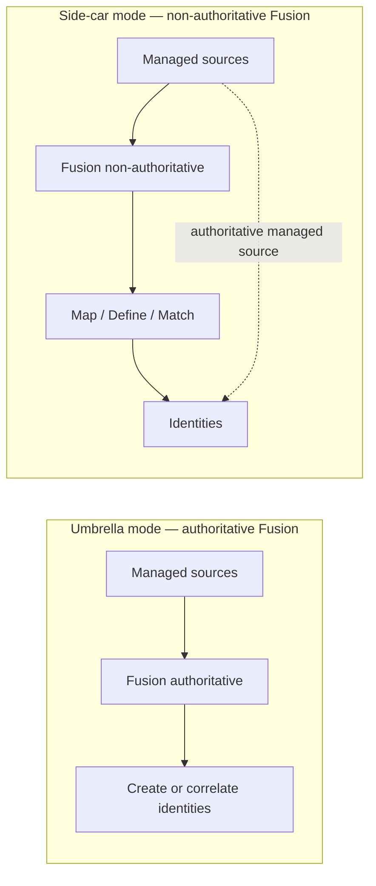
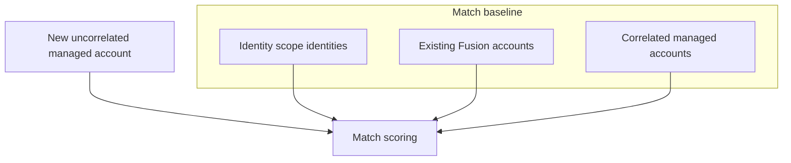
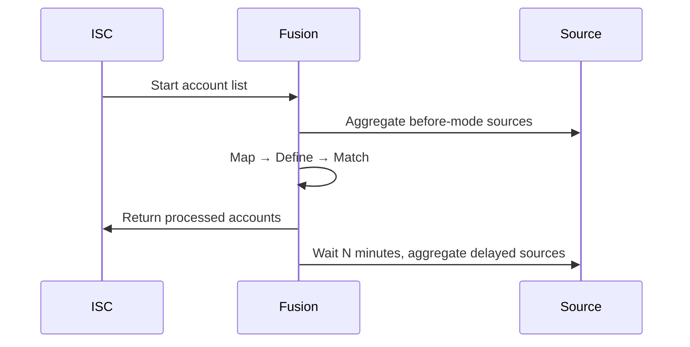

# Configuring sources and scope

Start here when wiring Identity Fusion NG to ISC. This guide covers **who and what is in scope**, how **umbrella** and **side-car** deployments differ, and how to configure **managed sources**, aggregation, and processing controls.

**Configuration reference:** [Source Settings](../../configuration/source.md)

For per-source processing modes (**Authoritative**, **Records**, **Orphan**), see the dedicated [Source types](source-types.md) guide.

!!! note "Didactic guide"
    This page explains **how and when** to configure settings with examples. For field keys, types, defaults, and constraints, see the linked **Configuration reference**.

## Deployment modes: umbrella vs side-car

Identity Fusion NG can run in two common patterns. The Fusion source **Authoritative** flag in ISC is the primary switch.

| Pattern | Fusion source authoritative? | Typical use | Match? | Map / Define? |
| --- | --- | --- | --- | --- |
| **[Umbrella mode](../../glossary.md#deployment-and-integration)** | **Yes** | Fusion owns correlation and identity-creation decisions for configured managed sources | Required for similarity-based deduplication | Yes |
| **[Side-car mode](../../glossary.md#deployment-and-integration)** | **No** | Managed sources contribute to identities the same as in umbrella mode; authoritative managed sources can still create identities themselves | Optional (Fusion source does not authoritatively create identities) | Yes |

**Umbrella mode** is what most **Match** deployments need. Fusion decides whether an incoming managed account creates a new identity, correlates to an existing one, or enters manual review.

**Side-car mode** — the Fusion source is usually **non-authoritative**. Managed sources still contribute to identities the same way they would in umbrella mode, including Map, Define, and Match. An **authoritative** managed source can create identities itself even when the Fusion source is not authoritative.

!!! tip "Choosing a mode"
    - Need similarity Match with review forms and authoritative correlation → **umbrella** (Fusion authoritative).
    - Need generated usernames or merged attributes only → **side-car** (Fusion usually non-authoritative).
    - Need orphan directory accounts to improve Match but never create identities from that source → **side-car** + **Orphan** source type. See [Source types](source-types.md).

## Scope: managed sources vs identity scope

Two scope concepts work together but answer different questions:

| Concept | Configuration | What it includes |
| --- | --- | --- |
| **[Sources scope](../../glossary.md#deployment-and-integration)** | **Authoritative account sources** list | Managed accounts fetched from each configured source (after filters) |
| **[Identity scope](../../glossary.md#deployment-and-integration)** | **Include identities in the scope?** + **Identity Scope Query** | ISC identities matching the search query |

### Do you need identities in scope?

This is the most common point of confusion.

**Often no** — when your intended population is already represented by managed accounts from configured sources:

- Uncorrelated managed accounts enter Match scoring directly.
- Managed accounts already correlated to identities are treated as part of the baseline.
- Fusion accounts built from prior aggregations also complement the baseline.

In this pattern, **Include identities in the scope?** can stay **off**. Your scope is defined by the sources you configure, not by a separate identity search.

**Enable identity scope when:**

| Scenario | Why |
| --- | --- |
| **Match against HR identities not yet in a managed source** | Seed baseline from Workday/HR identity profiles before all accounts are aggregated |
| **Identity-only Define** | Run Define expressions against `$identity` without a contributing managed account |
| **Active-employee filter** | Limit comparisons to `attributes.cloudLifecycleState:active` even when source accounts include contractors |
| **Cross-source baseline** | Compare new AD accounts against identities sourced from Workday only |

!!! note "Overlap is normal"
    Identity scope and sources scope can overlap — the same person may appear in both. Fusion deduplicates during processing.

### Identity scope fields

| Field | Description | Required | Notes |
| --- | --- | --- | --- |
| **Include identities in the scope?** | Include identities in addition to managed accounts | No | Off = baseline from managed/Fusion accounts only. On = adds ISC identities from the query below. |
| **Identity Scope Query** | Search filter limiting evaluated identities | Yes (when include enabled) | ISC search syntax; examples: `*`, `attributes.cloudLifecycleState:active`, `source.name:"Workday"` |

When **Include identities in the scope?** is enabled:

- The `$identity` object becomes available in Define expressions.
- Identities matching the query join the Match baseline immediately, even before a managed account exists for them.

When disabled:

- Baseline consists of managed source accounts previously processed by Fusion that became identities, plus correlated managed source accounts and existing Fusion accounts.
- `$identity` is unavailable unless an identity is loaded through another path (for example a global reviewer).

## Configuring managed sources

| Field | Description | Required | Notes |
| --- | --- | --- | --- |
| **Authoritative account sources** | Sources whose accounts are merged and evaluated | Yes | Each source has sub-configuration (see below) |

**Per-source configuration** (summary — full source-type behavior in [Source types](source-types.md)):

| Field | Description | Required | Notes |
| --- | --- | --- | --- |
| **Source name** | Exact ISC source name | Yes | Case-sensitive |
| **Enabled** | Include in processing | No | Default on |
| **Source type** | Authoritative accounts, Records, or Orphan accounts | Yes | See [Source types](source-types.md) |
| **Include record accounts in Match** | Match scoring for Records sources | No (Records only) | Default on |
| **Disable non-matching accounts** | Disable orphan non-matches | No (Orphan only) | Background disable on managed source |
| **[Deferred candidate matching](../../glossary.md#candidates)** | Same-run deferred-candidate comparison | No (Authoritative only) | Same source only; never cross-source |
| **Accounts API filter** | Server-side account list filter | No | ISC `filters` parameter |
| **Accounts JMESPath filter** | Client-side page filter | No | Applied to `{ "accounts": [...] }` |
| **Aggregation batch size** | Cap accounts per aggregation | No | Empty = all accounts |
| **Account aggregation mode** | none / before / delayed | Yes | See [Aggregation timing](#aggregation-timing) |
| **Aggregation wait timeout (minutes)** | Max wait for before-mode task | No (before mode) | Default 10; polls every 30s |
| **Aggregation delay (minutes)** | Delay before delayed aggregation | Yes (delayed mode) | Default 5 |
| **Optimized aggregation** | Reprocess changed accounts only | No | Disable when using reverse correlation |
| **Correlation mode** | correlate / reverse / none | Yes | See [Managing correlation](managing-correlation.md) |
| **Correlation attribute name** | Reverse-correlation attribute technical name | Yes (reverse) | |
| **Correlation display name** | Reverse-correlation display name | Yes (reverse) | |

!!! note "Machine accounts"
    Accounts with `isMachine=true` are excluded client-side after fetch. This is not an ISC account-list filter.

!!! note "Filter execution order"
    1. Accounts API filter (server-side)
    2. Accounts JMESPath filter (client-side, page-wise)
    3. Built-in machine account exclusion

## Aggregation timing

| Mode | Behavior | When to use |
| --- | --- | --- |
| **Do not aggregate** | Use last aggregated data only | Stable sources or testing |
| **Aggregate before processing** | Fresh data before Match; blocks until task completes or timeout | Need current data on every run |
| **Delayed aggregation** | Return accounts first; aggregate in background after delay | Faster account-list response |

Use **Aggregate before processing** to synchronize with other aggregation schedules. Use **Delayed aggregation** when slightly stale data is acceptable.

Conditional PAT scopes apply: `idn:task-management:read` for **before** mode, `idn:accounts-state:manage` for **delayed** mode and orphan disable. See [ISC PAT scopes](../../reference/pat-scopes.md).

## Reviewers

**Owners are global reviewers?** (under **Attribute Matching Settings → Review**) determines who receives review forms. Global reviewers use the Fusion source owner and governance group; per-source reviewers use entitlement access profiles. See [Managing reviewers](managing-reviewers.md).

## Processing control

| Field | Description | Default | Notes |
| --- | --- | --- | --- |
| **Maximum history messages** | Audit history entries per Fusion account | 10 | Older entries discarded |
| **Delete accounts with no managed accounts left?** | Remove Fusion account when all source accounts are gone | Off | Useful for leaver cleanup |
| **Skip accounts with missing unique ID?** | Skip managed source accounts without the Fusion identity attribute | Off | Logged for review |

**Force attribute refresh on next aggregation?** is under **Advanced Settings → Developer Settings**. It recalculates Normal-type attributes for one run only, then auto-disables. Unique attributes refresh only on account creation or activation.

## Practical tips

!!! tip "Testing large onboarding"
    Disable correlation on managed sources during initial load. Already-processed uncorrelated accounts remain linked internally; correlation is expensive and should be planned separately.

!!! tip "Uncorrelated accounts enter Match"
    Managed accounts must be **uncorrelated** to enter Match scoring. Correlated managed accounts are part of the baseline.

!!! tip "Missing native identity"
    Aggregation fails when `nativeIdentity` cannot be generated unless **Skip accounts with missing unique ID?** is enabled.

## Related guides

| Topic | Guide |
| --- | --- |
| Authoritative / Records / Orphan behavior | [Source types](source-types.md) |
| Correlation modes and reverse correlation | [Managing correlation](managing-correlation.md) |
| Match baseline and thresholds | [Matching identities](matching-identities.md) |
| Reviewer entitlements and access profiles | [Managing reviewers](managing-reviewers.md) |
| Field keys and defaults | [Source Settings](../../configuration/source.md) |

