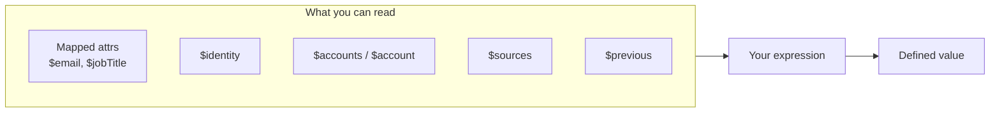

# Define: Attribute Definition

The **Define** step controls how attributes are generated using Apache Velocity expressions, unique identifiers, UUIDs, or counters. This happens after Attribute Mapping (if sources are configured) and before Match scoring (for normal attributes).

**Configuration reference:** [Attribute Definition Settings](../../configuration/definition.md) · [Velocity context](../../reference/velocity-context.md)

!!! note "Didactic guide"
    This page explains **how and when** to configure settings with examples. For field keys, types, defaults, and constraints, see the linked **Configuration reference**.


---

## When to use Attribute Definition

| Goal                        | Use Attribute Definition                      | Example                                        |
| --------------------------- | --------------------------------------------- | ---------------------------------------------- |
| Generate unique usernames   | Yes (Unique type)                             | `jsmith`, `jsmith1`, `jsmith2`                 |
| Assign stable UUIDs         | Yes (UUID type)                               | `a3f2e8b4-7c2d-4f9e-8a1b-3c5d6e7f8g9h`         |
| Sequential employee numbers | Yes (Counter type)                            | 1000, 1001, 1002...                            |
| Computed attributes         | Yes (Normal type with expression)             | Full name from first + last; formatted dates   |
| Normalize/format values     | Yes (Normal type with expression + utilities) | Parse address, format phone, proper case names |

---

## Global settings

| Field                                          | Purpose                                     | Recommended value                                                                |
| ---------------------------------------------- | ------------------------------------------- | -------------------------------------------------------------------------------- |
| **Maximum attempts for unique definition**     | Cap on retries for generating unique values | 20 (default); increase for large datasets with high collision risk (e.g. 50–200) |

**Why this matters:** For **Unique** type attributes, if the generated value already exists, the connector appends a counter and retries. This setting prevents infinite loops if the expression always produces the same value.

---

## Per-attribute definition configuration

Add each attribute under **Normal Attribute Definitions** or **Unique Attribute Definitions**. Look up field keys, types, and defaults in the [Configuration reference](../../configuration/definition.md).

| You configure | Start here |
| --- | --- |
| Name, Velocity expression, static, refresh | [Normal definitions — Attribute Definition](../../configuration/definition.md#name) |
| Case, normalize, spaces, trim, max length | [Transformations](../../configuration/definition.md#case) |
| Unique IDs, counter, UUID, incremental counter | [Unique definitions](../../configuration/definition.md#maxattempts) |
| Global unique retry cap | [Maximum attempts](../../configuration/definition.md#maxattempts) |

**Common patterns:**

| Goal | Section | Expression hint |
| --- | --- | --- |
| Full name (dynamic) | Normal | `$firstname $lastname` with **Refresh on each aggregation?** = Yes |
| Username with collision handling | Unique | `#set($i=$firstname.substring(0,1))$i$lastname` + transforms |
| Immutable UUID | Unique | `$UUID` |
| Sequential employee number | Unique | `EMP-$counter` with **Use incremental counter?** = Yes |


---

## Attribute types explained

### Normal type

**Behavior:** Standard computed attribute; recalculated based on **Refresh on each aggregation?** and **Static** settings.

| Static | Refresh setting | Behavior                                                                   | Use case                                                            |
| ------ | --------------- | -------------------------------------------------------------------------- | ------------------------------------------------------------------- |
| No     | Yes             | Recalculated every aggregation; falsy or failed output **clears** the stored value | Dynamic values that should update (full name, age, formatted dates) |
| No     | No              | Recalculated only when underlying source data changes; falsy or failed output **clears** the stored value | Standard values that update only when source data updates           |
| Yes    | (Ignored)       | Calculated only when it has no value; existing values are never recalculated | Immutable values (initial assignment, one-time calculations)        |

!!! warning "Breaking behavior"
    When a Normal definition runs and the Velocity expression fails or renders empty output, the connector removes the attribute from the Fusion account. Use `$previous` in the expression to retain the last value when source input is temporarily missing, or enable **Static** for write-once attributes.

**Examples:**

```velocity
# Full name (refresh: Yes)
$firstname $lastname

# Formatted hire date (refresh: No, unless hireDate changes)
$Datefns.format($hireDate, 'MMMM dd, yyyy')

# Years of service (refresh: Yes, dynamic)
$Math.floor($Datefns.differenceInDays($Datefns.now(), $hireDate) / 365)
```

### Unique type

**Behavior:** Must be unique across all Fusion accounts; connector adds disambiguation counter on collision. Unique attributes are only computed when a Fusion account is **first created** or when an existing account is **activated** (an internal mechanism to reset unique attributes). They are not refreshed by **Force attribute refresh on next aggregation?** (located at **Advanced Settings → Developer Settings**; applies only to Normal-type attributes).

**How it works:**

1. Generate value from expression
2. Check if value exists on any account
3. If unique → use value
4. If collision → append counter (starting at 1), check again
5. Repeat up to **Maximum attempts**

**Counter format:** `{base value}{counter}` (e.g. `jsmith1`, `jsmith2`)
**Zero-padding:** Use **Minimum counter digits** to pad counter (e.g. digits=3 → `jsmith001`)

!!! note "Maximum length"
    If a **Maximum length** is configured, the connector intelligently truncates the surrounding text to ensure the `$counter` is perfectly preserved without being chopped off, even if the counter is injected in the middle of a string.

**`$isUnique(value)` helper:** Unique definitions can call `$isUnique(...)` inside the Velocity expression to test whether a candidate value is currently free after the same trim/case/spaces/normalize/maxLength rules are applied. Use this to choose between candidate formats before the connector falls back to automatic `$counter` disambiguation.

!!! tip "Template safety"
    The connector auto-appends `$counter` to unique expressions that do not already reference `$counter` or `$UUID`, but the auto-append is **skipped when the expression contains Velocity directives** (`#if`, `#set`, `#else`, `#end`, etc.) because appending after `#end` would break parsing. In that case include `$counter` explicitly in your expression (or use `$UUID`).

**Examples:**

```
Expression: #set($i=$firstname.substring(0,1))$i$lastname
Case: Lower case
Normalize: Yes
Spaces: Yes

Firstname="John", Lastname="Smith"
→ Generate: "jsmith"
→ Check: Already exists
→ Append counter: "jsmith1"
→ Check: Unique
→ Result: "jsmith1"
```

```velocity
## Conditional candidate selection using $isUnique
#set($base = "$firstname.$lastname")
#set($alt = "$firstname$lastname")
#if($isUnique($base))
  $base
#elseif($isUnique($alt))
  $alt
#else
  $base
#end
```

### Unique sub-mode: UUID

**Behavior:** Generates an immutable universally unique identifier (v4 UUID). The expression is **required**; include `$UUID` anywhere in the expression and the connector injects a fresh v4 UUID per attempt.

**Characteristics:**

- Globally unique (extremely low collision probability)
- Immutable (never changes once generated)
- Format: 36 characters (8-4-4-4-12 hex digits)
- Example: `a3f2e8b4-7c2d-4f9e-8a1b-3c5d6e7f8a9b`

**Use cases:**

- **Native identity** in ISC (stable reference that never changes)
- **Account name** when you need immutable identifier
- Cross-system correlation (UUID as common key)

**Example expression:**

```velocity
$UUID
```

### Unique sub-mode: Incremental counter

**Behavior:** Sequential incrementing number; each account gets the next number in sequence. The counter is persistent (survives across aggregations) and always increments.

**How it works:**

1. The connector reads the current counter value for this attribute from state.
2. It increments, applies **Minimum counter digits** for zero-padding, and substitutes `$counter` in the expression.
3. The new counter value is persisted for the next account.

**Fields:**

- **Use incremental counter?** (Unique type only): turn on to switch from collision-based disambiguation to a persistent, always-incrementing counter.
- **Counter start value:** First number in sequence (e.g. 1, 1000, 50000). Ignored unless the persistent counter has not been seeded yet.
- **Minimum counter digits:** Zero-padding (e.g. 5 → `00001`, `00002`).

**Example expression with prefix:**

```velocity
# Employee number with prefix
EMP-$counter

Counter start: 1000, Digits: 5
→ EMP-01000, EMP-01001, EMP-01002
```

---

## Apache Velocity context

The **Apache Velocity expression** field provides a templating language with access to utilities and data. For the complete API catalog, see [Velocity context reference](../../reference/velocity-context.md).

### Available data

Templates combine mapped attributes, identity fields, and account snapshots. Definitions run **top to bottom** — each result is available to the next.



#### Quick reference

| Access | Use it for | Example |
| --- | --- | --- |
| `$firstname`, `$email` | Mapped (or raw source) attributes | `$firstname $lastname` |
| `$identity.*` | Identity fields when scope includes identities | `$identity.name` |
| `$accounts[n]` | Managed accounts in source order | `$accounts[0].schema.id` |
| `$sources.SourceName` | Accounts grouped by source | `$sources.Workday[0].jobTitle` |
| `$account` | The **origin** snapshot only | `$account.schema.name` |
| `$originAccount` | Origin key string | Managed: `sourceId::nativeId` |
| `$previous.*` | Last generated Fusion state | `$previous.username` |

#### Mapped attributes

Reference mapped names after **Map** is configured: `$jobTitle`, `$department`, `$email`. Without mapping, use raw source names: `$firstname`, `$hireDate`.

#### Identity attributes

When **Include identities in the scope** is on:

| Variable | Meaning |
| --- | --- |
| `$identity.name` | Root identity name |
| `$identity.<attr>` | Any identity attribute |
| `$name` | Falls back to identity name when no mapped `name` exists (identity-origin rows) |

#### `$accounts` — all linked managed accounts

Each entry includes source attributes plus nested metadata:

| Part | Key fields |
| --- | --- |
| Attributes | All fields from the managed account |
| `source.id` / `source.name` | Source identifier (`id` absent for Identities rows) |
| `schema.id` / `schema.name` | Native identity and display name |
| `IIQDisabled` | Disabled flag when present |

**Order:** configured sources → insertion order within each source → unknown sources last. When `mainAccount` is set, that account moves to index `0`.

!!! tip "$accounts[0] is not always the origin"
    `$accounts[0]` follows **source configuration order**. `$account` is always the **origin** row. When `mainAccount` differs from the origin, use `$account` for origin-specific logic.

```velocity
$accounts[0].source.name
$accounts[0].schema.id
```

#### `$sources` — same data, grouped by source name

```velocity
$sources.Workday[0].jobTitle
$sources.ActiveDirectory.size()
```

#### Origin fields

| Variable | Description |
| --- | --- |
| `$originSource` | Source that created the Fusion account (`Identities`, `Workday`, …) |
| `$originAccount` | Key string — managed: `sourceId::nativeIdentity`; identity: identity id |
| `$account` | Full origin snapshot (same shape as `$accounts[]`); for Identities origin use `$account.name` and `source.name = Identities` |

#### `$previous`

Prior Fusion account values — useful for one-time assignments or change detection.

#### Unique-only helpers

| Variable | Behavior |
| --- | --- |
| `$counter` | Collision suffix for Unique definitions (auto-appended unless you use `#if` / `#set` directives) |
| `$UUID` | Fresh v4 UUID per attempt |
| `$isUnique(value)` | Test whether a candidate value is already taken |

See [Unique type](#unique-type) above for collision and `$isUnique` examples.

### Available utilities

Helper objects are injected into every expression. Common patterns:

| Helper | Typical use | Example |
| --- | --- | --- |
| `$Math` | Numeric operations | `$Math.floor(x)` |
| `$Datefns` | Format and compare dates | `$Datefns.format($hireDate, 'yyyy-MM-dd')` |
| `$Normalize` | Phone, date, name, address, ASCII | `$Normalize.phone($phone, "GB")` |
| `$AddressParse` | State/region code lookup | `$AddressParse.getStateCode("California", "US")` |
| `$JSON` | Parse or stringify JSON | `$JSON.parse($payload)` |
| `$MD5` | Deterministic hash id | `$MD5($email)` |

#### Examples you will use often

```velocity
## Full name
$firstname $lastname

## Formatted date
$Datefns.format($hireDate, 'MMMM dd, yyyy')

## Normalized username base
$Normalize.ascii($firstname, "de")$Normalize.ascii($lastname, "de")

## US address state code
$Normalize.address("$city, $state $zip", "US")
```

!!! note "Full helper API"
    Method signatures, optional parameters, and edge-case behavior for every helper are documented in [Velocity context reference](../../reference/velocity-context.md#available-utilities).

---

## Order of operations

Understanding the sequence helps design correct configurations:

| Step | Phase                 | Action                                                | Example                                                                                |
| ---- | --------------------- | ----------------------------------------------------- | -------------------------------------------------------------------------------------- |
| 1    | **Attribute Mapping** | Merge per mapping rules (MAP)                         | Map `[title, jobTitle]` → `jobTitle`, merge: first found → "Engineer"                  |
| 2    | **Normal Define**     | Generate non-unique attributes from mapped data       | Generate `fullName` from `$firstname $lastname` → "John Smith"                         |
| 3    | **Match / Scoring**   | Compare normal attributes against existing identities | Normal attributes feed into Match scoring                                              |
| 4    | **Unique Define**     | Generate unique attributes with collision detection   | Generate `username` from `$firstname.$lastname` → "jsmith" (or "jsmith1" on collision) |

**Key insights:**

- Normal attribute definitions run **before** Match matching. Their output is available to the scoring engine and to unique definitions.
- Unique attribute definitions run **after** all Match matching has completed (as a global sweep over every account). They can reference normal attribute values but not the other way around.
- Attribute Definition expressions can reference attributes created by Attribute Mapping. Ensure mapped attributes exist before referencing in expressions.

---

## nativeIdentity and account name immutability

The `nativeIdentity` (account identifier) and account `name` (display attribute) are **set at creation time and never changed afterwards**, even if an attribute definition would otherwise overwrite them.

- If you define a **unique attribute** that maps to the same schema attribute as the fusion identity attribute, it will only be generated once (at account creation). Subsequent aggregations and enable/disable cycles will not change it for identity-linked accounts.
- Use a **UUID** unique attribute as native identity when you need a truly immutable, stable reference.

### Unique attribute reset on enable/disable

Use regular unique attribute schemas to define attributes you may want to change, like usernames or email aliases. Disabling and then re-enabling a Fusion account triggers a **unique attribute reset**:

- **Disable**: preserves all existing unique attribute values.
- **Enable**: resets and regenerates all unique attribute values, ensuring collision-free values after the account has been inactive.

---

## Preventing Fusion account creation (empty nativeIdentity skip pattern)

One can purposely generate an **empty** `nativeIdentity` in conjunction with the **"Skip accounts with a missing identifier"** processing option to prevent specific managed accounts or identities from generating Fusion accounts.

1. Define an attribute definition (normal or unique) that maps to the fusion identity attribute.
2. Design the expression so it evaluates to an empty string for accounts you want to exclude.
3. Enable **"Skip accounts with a missing identifier"** in Processing Control settings.

```velocity
## Example: only generate identity for accounts with an email
#if($email && $email != "")
  $email
#end
```


