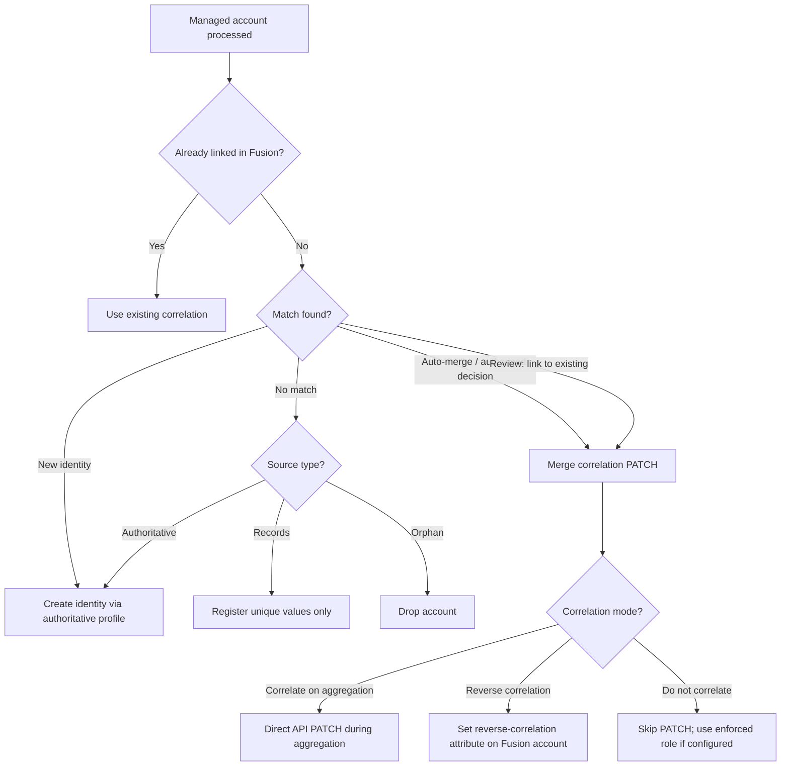

# Managing correlation

This guide explains how Identity Fusion NG correlates managed source accounts to ISC identities — per-source **correlation modes**, **reverse correlation**, **enforced correlation roles**, and how correlation relates to Match outcomes.

**Configuration reference:** [Source Settings — Processing Control](../../configuration/source.md)

!!! note "Didactic guide"
    This page explains **how and when** to choose correlation strategies. For field keys, types, defaults, and constraints, see the linked **Configuration reference** and [Configuring sources and scope](configuring-sources-and-scope.md).

## Correlation in the Map → Define → Match pipeline

Correlation links a managed account on an authoritative source to an ISC identity (or Fusion account row). It is distinct from **Match scoring**, which finds candidate identities — correlation is the ISC-side link that makes a managed account "owned" by an identity.

## Per-source correlation mode

Each managed source exposes **Correlation mode** under **Source Settings → Processing Control**. Choose one strategy per source.

| Mode | What the connector does | When to use |
| --- | --- | --- |
| **Correlate missing accounts on aggregation** | PATCH-correlates new or previously missing managed accounts to their Fusion identity during aggregation (Refresh/Process phases) | Default for production Match deployments; Fusion drives correlation directly |
| **Reverse correlation from managed source** | Writes a dedicated Fusion account attribute (configured by **Correlation attribute name** / **Correlation display name**) that ISC native correlation rules consume | When ISC identity profiles or source correlation must own the link; disable **Optimized aggregation** so all accounts are reprocessed |
| **Do not correlate** | Skips automatic PATCH correlation during aggregation | Testing, phased rollouts, or when correlation is delegated to an **enforced correlation role** or manual process |

**Configuration reference:** [Source Settings — Correlation mode](../../configuration/source.md)

### Correlate missing accounts on aggregation

- Fusion issues correlation PATCH requests when Match or refresh logic determines a managed account should link to an identity.
- Required (alongside or instead of enforced role) when reviewers choose **Link to existing identity** and you expect the managed account to correlate automatically on the next run.
- Logs use **link** segments during Refresh/Process (`correlations link=triggers/accounts`).

!!! warning "Match merge decisions"

    When merging a new managed account with an existing identity, automatic managed-account correlation occurs only when **Correlation mode** is **Correlate missing accounts on aggregation** **or** an **enforced correlation role** is configured. See [Matching identities](matching-identities.md).

### Reverse correlation from managed source

- Fusion sets a technical attribute on the Fusion account (for example `reverseCorrelationKey`) instead of PATCH-correlating immediately.
- ISC source or identity-profile correlation rules map managed accounts using that attribute.
- **Disable Optimized aggregation** for sources using reverse correlation so unchanged accounts are still evaluated each run.

### Do not correlate

- No automatic PATCH during aggregation.
- Managed accounts stay uncorrelated until another mechanism links them (enforced role, manual correlation in ISC, or a later mode change).
- Useful during large onboarding when correlation load must be staged.

## Link vs merge correlation activity

During `accountList`, the connector distinguishes two PATCH-driven correlation paths:

| Path | Phase | Trigger | Log segment |
| --- | --- | --- | --- |
| **Link** | Refresh / correlated sweep | Correlation-on-aggregation for missing managed accounts on a source | `correlations link=` |
| **Merge** | Process | Reviewer or auto-merge decision to attach a managed account to an existing identity | `correlations merge=` |

Both respect the selected **Correlation mode** and dry-run persistence flags. Monitor `completed=` and `pending=` on STATUS lines during Output/Epilogue for queue drain progress.

See [Connection and observability tuning](../operation/connection-and-observability-tuning.md) for log grep patterns.

## Enforced correlation role

An **enforced correlation role** is an ISC role Fusion assigns to identities that need managed accounts brought into correlation without using **Correlate missing accounts on aggregation**.

- Targets Fusion identities that have the **correlated action** or **status uncorrelated** entitlement.
- Assignment criteria intentionally include the same entitlement the role grants so uncorrelated accounts receive the correlated-action entitlement and existing correlated accounts retain it.
- Supported companion when **Correlation mode** is **Do not correlate** but you still need ISC-driven correlation after aggregation.

See [Managing reviewers](managing-reviewers.md) for entitlement and access-profile context.

## Correlation and Match outcomes

| Match outcome | Correlation behavior |
| --- | --- |
| **Automatic merge** (score ≥ automatic merge threshold) | Merge correlation PATCH when mode allows |
| **Review: link to existing** | Correlates on next aggregation after form submission (requires correlate-on-aggregation or enforced role) |
| **Review: create new identity** | New identity via authoritative profile; managed account correlates when mode allows |
| **No match (authoritative)** | New identity created when Fusion is authoritative |
| **No match (orphan)** | Account dropped; optional disable |
| **No match (records)** | Unique registration only; no Fusion account output |

## Planning correlation load

!!! tip

    Already-processed uncorrelated managed accounts remain in the Fusion work queue internally — disabling correlation during initial load does not block Match. Correlation PATCHes are expensive; plan mode changes and enforced roles before full production cutover.

!!! tip

    Managed accounts must be **uncorrelated** to enter Match scoring. Correlated managed accounts are treated as part of the baseline. See [Configuring sources and scope](configuring-sources-and-scope.md).

## Related guides

| Topic | Guide |
| --- | --- |
| Source types, filters, aggregation timing | [Configuring sources and scope](configuring-sources-and-scope.md) · [Source types](source-types.md) |
| Match rules and thresholds | [Matching identities](matching-identities.md) |
| Review decisions that drive merge correlation | [Review forms and reviewers](review-forms-and-reviewers.md) |
| First aggregation setup | [Use guides overview](../index.md#first-aggregation-checklist) |

