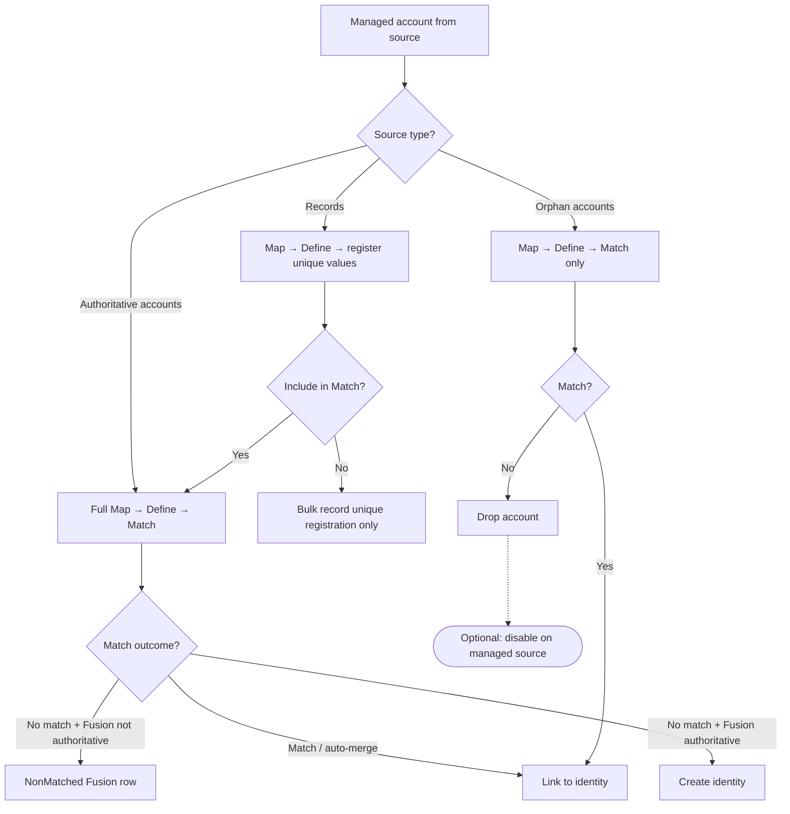
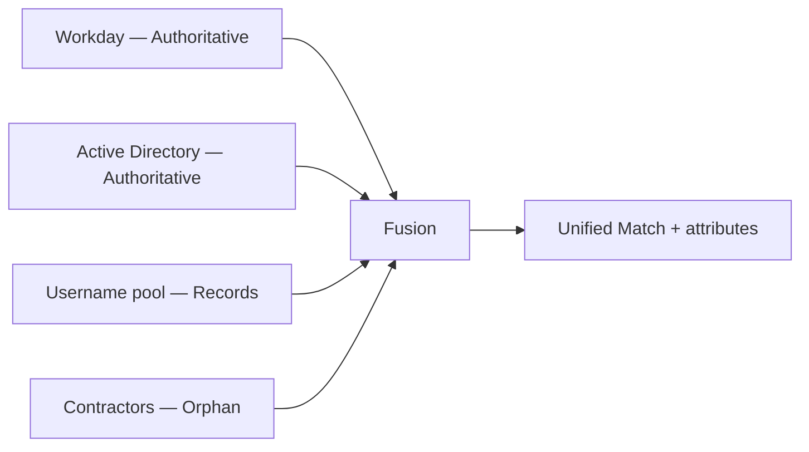

# Source types

Each managed source in **Source Settings** has a **Source type** that controls how its accounts flow through Map, Define, and Match. Choose the type based on what Fusion should **own** for that source.

**Configuration reference:** [Source Settings — Sources](../../configuration/source.md)

**Prerequisites:** [Configuring sources and scope](configuring-sources-and-scope.md) — scope, umbrella vs side-car, and aggregation.

!!! note "Didactic guide"
    This page explains **how and when** to pick a source type. For field keys, types, defaults, and constraints, see the linked **Configuration reference**.

## Overview

| Source type | Creates identities? | Emits Fusion accounts? | Typical deployment |
| --- | --- | --- | --- |
| **Authoritative accounts** (default) | When Fusion is authoritative and no match | Yes | HR, AD, SaaS apps in umbrella Match |
| **Records** | No | Only when Match links to existing identity | Username / employee-ID generation pools |
| **Orphan accounts** | Never | Only when Match links to existing identity | Supplemental directories for Match only |

## Authoritative accounts

The default type for managed sources that contribute to identity lifecycle decisions.

**Processing:**

1. **Map** — merge attributes from this source into the Fusion schema.
2. **Define** — evaluate Normal and Unique definitions.
3. **Match** — score against baseline; auto-merge, review form, or non-match path.

**When Fusion is authoritative (umbrella mode):**

- Non-matched accounts can create new ISC identities through the Fusion identity profile.
- Match merge decisions correlate managed accounts to existing identities.

**When Fusion is non-authoritative (side-car mode):**

- Match still runs but Fusion does not authoritatively create identities.
- Useful for analysis, reporting, or pre-production tuning.

**Additional options:**

| Option | Purpose |
| --- | --- |
| **Deferred candidate matching** | When enabled, compares non-matched accounts to other deferred candidates from the **same source in the same run**. Defers identity creation when the best match is another deferred candidate. Never cross-source. Disable when one person may appear as multiple accounts in a single aggregation and each should be evaluated independently. |

!!! warning "Reviewers required for Match"
    Sources without a valid reviewer setup skip scoring and are added as non-matched. Configure **global reviewers** (source owner and/or governance group with **Owners are global reviewers?**) or **per-source reviewer entitlements** before enabling Match on a source. See [Managing reviewers](managing-reviewers.md).

## Records

Register unique attribute values **without** emitting Fusion accounts for non-matched rows.

**Processing when Include record accounts in Match is on (default):**

- Full Map, Define, and Match run.
- Non-matched rows register unique values globally but do not create Fusion account rows or identities.

**Processing when Include record accounts in Match is off:**

- Skips identity and deferred-candidate scoring.
- Runs bulk **record unique registration** — selective Map plus unique-value registration (passthrough or coincident attribute maps only).
- Normal Define and full Match processing do **not** run for those accounts.

**Typical use cases:**

| Use case | Example |
| --- | --- |
| Username pool | Generate and reserve usernames from a CSV source before HR onboarding |
| Employee number registry | Register IDs globally to prevent collisions across aggregations |
| Pre-Match dedup check | Keep Match on to find duplicates before registering a unique value |

**Deployment note:** Records sources usually sit in **side-car** deployments (Fusion non-authoritative). Pair with an authoritative HR source when Match should link records to real identities.

## Orphan accounts

Supplemental data used **only** to improve Match — never to create identities from non-matched rows.

**Processing:**

1. Map and Define run to prepare attributes for scoring.
2. Match compares against baseline.
3. **Match found** — managed account links to existing identity (same as authoritative).
4. **No match** — account is **dropped** from Fusion output (not emitted as a Fusion account).

**Optional: Disable non-matching accounts**

When enabled, triggers a background `POST /accounts/{id}/disable` on the managed source for orphan rows that fail to match. Requires `idn:accounts-state:manage` on the connector PAT.

**Typical use cases:**

| Use case | Example |
| --- | --- |
| Contractor directory | Match contractors to employees; disable stale contractor accounts with no match |
| Legacy system cleanup | Find orphan accounts that correspond to active identities; disable the rest |
| Match-only enrichment | Add attributes from a read-only source without identity creation risk |

**Deployment note:** Orphan sources are almost always used in **side-car** mode. Fusion must **not** be authoritative for identity creation from that source — by design, orphan non-matches never create identities.

## Choosing a source type

| Goal | Source type | Fusion authoritative? |
| --- | --- | --- |
| Full Match with identity creation | Authoritative accounts | Yes (umbrella) |
| Multi-source deduplication | Authoritative accounts (2+) | Yes |
| Unique ID generation only | Records | Usually no (side-car) |
| Supplemental Match data | Orphan | No (side-car) |
| Map/Define enrichment only | Authoritative or Records | No (side-car) |

## Combining types in one Fusion source

A single Fusion connector commonly mixes types:

Example:

- **Workday** — Authoritative (HR baseline, creates identities).
- **Active Directory** — Authoritative (directory accounts).
- **Username pool CSV** — Records (register usernames; optional Match dedup).
- **Contractor LDAP** — Orphan (Match-only; disable non-matches).

Configure scope and aggregation per source in [Configuring sources and scope](configuring-sources-and-scope.md).

## Related guides

| Topic | Guide |
| --- | --- |
| Scope, umbrella vs side-car, aggregation | [Configuring sources and scope](configuring-sources-and-scope.md) |
| Correlation after Match | [Managing correlation](managing-correlation.md) |
| Match thresholds and review | [Matching identities](matching-identities.md) |
| Status and reviewer entitlements | [Entitlement list](../../operations/entitlement-list.md) · [Managing reviewers](managing-reviewers.md) |

