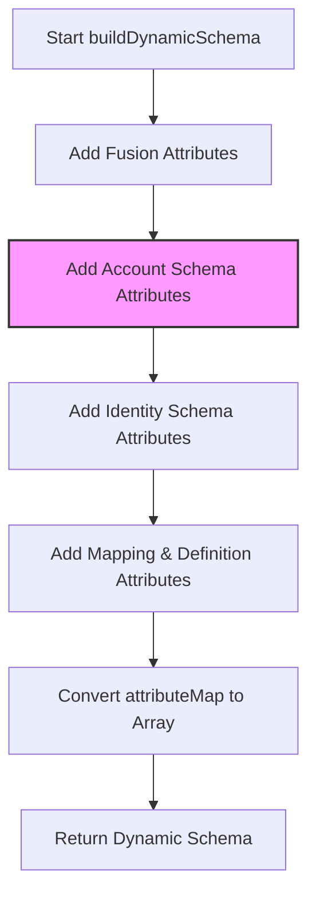

## Context

During schema discovery, the connector dynamically builds a schema by merging attributes from static definition files, managed sources (account schemas), identity attributes, and configuration mappings. 

Several gaps exist when fetching and merging identity attributes:
1. Missing/empty names on identity attributes result in a schema attribute named `"undefined"`.
2. Case collisions (e.g. `EmployeeID` vs `employeeid`) are resolved by overwriting, which can change the casing to whatever was processed last.
3. Unrecognized attribute types returned from the Identity API are passed through directly, causing connector framework validation issues.
4. Failures calling `listIdentityAttributes` are swallowed, which makes it harder to diagnose authentication or connection setup issues.

## Goals / Non-Goals

**Goals:**
- Sanitize identity attributes to ensure they have valid names and types.
- Ensure case deduplication preserves the original casing (preferring existing account schema casing over identity attribute casing).
- Improve error logging and handling when the Identity API fails.

**Non-Goals:**
- Modifying how SailPoint handles identity profiles or identity schemas.

## Decisions

### 1. Identity Attribute Filtering and Sanitization
- **Decision**: Filter out identity attributes with missing, empty, or whitespace-only names.
- **Decision**: Map raw identity attribute types to lowercase standard connector types (`string`, `boolean`, `int`, `long`). Default unrecognized types to `string`.

### 2. Case-Insensitive Deduplication with Casing Preservation
- **Decision**: When adding attributes to `attributeMap` in `buildDynamicSchema()`, if an attribute with the same case-insensitive name already exists, preserve the casing of the first-added attribute.
- **Rationale**: Since `accountSchemaAttributes` are processed before `identitySchemaAttributes`, this ensures the casing of the source account schema takes precedence.

## Risks / Trade-offs

- *Risk*: An identity attribute might be discarded if its name is empty.
  *Mitigation*: This is expected and prevents generating invalid `"undefined"` attributes in the schema.

## Migration Plan

No migration needed. This affects schema discovery dynamic resolution only.

## Open Questions

None.
