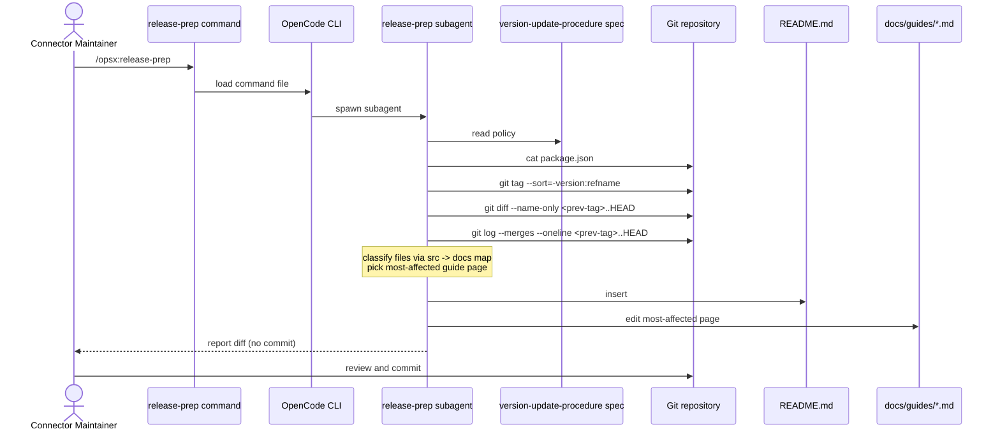

# Design: version-update-procedure

## Context

Identity Fusion NG is a SailPoint SaaS connector shipped from this repository
as a versioned zip. A version bump in `package.json` currently has no
coordinated process around it. Three things drift apart:

- The hand-curated `## Changelog` in `README.md`. The CI guard
  `scripts/ci-check-readme-changelog.cjs` only enforces "if product files
  changed then README was touched"; it does not detect that the version was
  bumped or that a new `### X.Y.Z` heading was added under the section.
- The MkDocs site under `docs/`. `deploy-docs-pages.yml` rebuilds the site
  on every push to `main`, regardless of whether the docs reflect the new
  version.
- The GitHub Release body, auto-generated by
  `softprops/action-gh-release` from merged PR titles. It is generated
  completely independently of the curated `## Changelog`, and the two can --
  and do -- disagree.

The change introduces a single source of truth (an OpenSpec spec) and a
single executor (a new opencode subagent + command) that any developer can
run locally after bumping `package.json`. The full motivation, the list of
capabilities, and the impact are in `proposal.md`; this document is the
"how".

### In-force ADR review

`openspec/adr/` contains a single ADR: `0001-identity-origin-orphan-detection.md`
(accepted, no `Supersedes` field). It governs whether identity-origin Fusion
accounts are eligible for orphan deletion. It is unrelated to the release
workflow and does not constrain this design. No new ADR is needed for this
change; no in-force ADR needs supersession.

## Goals / Non-Goals

**Goals**

- Codify the rules every version bump must follow in a reviewable, version-
  controlled, machine-readable form (`openspec/specs/version-update-procedure/spec.md`).
- Provide a developer-runnable artifact -- `.opencode/commands/release-prep.md`
  delegating to `.opencode/agents/release-prep.md` -- that always:
  1. detects a version bump in `package.json`,
  2. drafts a `### X.Y.Z` block at the top of `## Changelog` in `README.md`,
  3. edits the most-affected `docs/guides/*.md` page so the MkDocs site
     reflects the release.
- Keep the MkDocs site, the README changelog, and the auto-generated
  GitHub Release body aligned as much as the release-body auto-generation
  workflow allows (entries in `## Changelog` are derived from merged PR
  titles since the previous version tag, the same source the auto-gen uses).

**Non-Goals**

- Enforce the rules in CI. Per the proposal, the agent is the executor and
  CI is unchanged. `ci-check-readme-changelog.cjs` and
  `new-version-full-review.yml` stay as-is.
- Add a dedicated `docs/release-notes.md`. The "at least one `docs/**` file
  must change" rule is satisfied by editing the most-affected existing
  guide, not by maintaining a release-notes page.
- Modify the GitHub Release auto-generation workflow
  (`softprops/action-gh-release`). The drift between the auto-generated
  body and the curated `## Changelog` is reduced by deriving both from the
  same source (merged PR titles), not by overriding the auto-gen.
- Bump the version in `package.json` for the developer. The developer still
  edits `package.json` by hand; the agent runs after that.

## Decisions

### Decision 1: OpenSpec spec as the policy

The rules live in `openspec/specs/version-update-procedure/spec.md` as
OpenSpec Requirements + Gherkin Scenarios (matching the style of
`openspec/specs/identity-origin-orphan-detection/spec.md`).

**Why:** the spec is reviewable in code review, version-controlled with
the code, and machine-readable by any future automation. A markdown policy
file in `docs/` would be reviewable and version-controlled but not
machine-readable; a `package.json` script would be machine-runnable but
opaque to humans.

**Alternatives considered:**
- Markdown policy in `docs/`: rejected -- not machine-readable.
- A custom Node.js script invoked by a new GitHub Action: rejected -- the
  proposal explicitly chose agent-driven enforcement so the procedure is
  contextual (reads the diff, picks the most-affected page) and developer-
  run.

### Decision 2: opencode subagent + command, not a CI check

Two new opencode artifacts:

- `.opencode/agents/release-prep.md` -- the executor. Reads the spec,
  detects the bump, gathers the diff, drafts the changelog, picks the
  most-affected guide page, edits it.
- `.opencode/commands/release-prep.md` -- the entry point. A thin wrapper
  that delegates to the subagent so the developer runs `/opsx:release-prep`.

**Why:** the procedure is contextual (it inspects the diff, classifies each
file, drafts a changelog from PR titles, edits a curated guide). An LLM
agent expresses that naturally; a CI script would be a long shell pipeline.
Per the proposal, the enforcement is by the agent, not the pipeline.

**Alternatives considered:**
- A new CI job that runs a Node script: rejected -- loses the natural-
  language drafting step.
- A `release-drafter`-style GitHub Action: rejected -- does not edit
  `docs/**` and does not run before the PR is opened.

### Decision 3: `src -> docs` scope map

The agent must always edit at least one `docs/**` file. To pick the right
one, the agent consults a static `src -> docs` map. The map is defined
here (in `design.md`) and the agent reads it directly from this file
during the release-prep run.

**Initial map.** A `src` path maps to at most one `docs/guides/*.md` page.
The agent counts changed files per page and picks the page with the most
hits. Ties are broken by lexicographic order of the page path.

| `src` glob (relative to repo root)                | Target guide page                          |
| ------------------------------------------------- | ------------------------------------------ |
| `src/services/attributeService/**`               | `docs/guides/define.md`                    |
| `src/services/fusionService/**`                  | `docs/guides/map.md`                       |
| `src/services/formService/**`                     | `docs/guides/match.md`                     |
| `src/services/scoringService/**`                 | `docs/guides/matching-algorithms.md`       |
| `src/services/sourceService/**`                  | `docs/guides/source-configuration.md`      |
| `src/services/schemaService/**`                  | `docs/guides/source-configuration.md`      |
| `src/services/entitlementService.ts`             | `docs/guides/source-configuration.md`      |
| `src/services/identityService.ts`                 | `docs/guides/source-configuration.md`      |
| `src/services/clientService/**`                  | `docs/guides/advanced-connection-settings.md` |
| `src/services/lockService.ts`                    | `docs/guides/advanced-connection-settings.md` |
| `src/services/logService/**`                     | `docs/guides/advanced-connection-settings.md` |
| `src/services/messagingService/**`               | `docs/guides/advanced-connection-settings.md` |
| `src/services/proxyService.ts`                   | `docs/guides/proxy-mode.md`                |
| `src/services/recordingService.ts`               | `docs/guides/troubleshooting.md`            |
| `src/services/reportService.ts`                  | `docs/guides/troubleshooting.md`           |
| `connector-spec.json`                            | `docs/guides/source-configuration.md`      |

**Paths with no guide page.** Changes that only touch `src/operations/**`,
`src/utils/**`, `src/model/**`, `src/data/**`, `src/index.ts`, or
`package.json` / `package-lock.json` map to no guide. The agent uses a
fallback: pick `docs/guides/troubleshooting.md` for ops-only changes
(operations surface area is operationally adjacent to troubleshooting) and
`docs/guides/advanced-connection-settings.md` for dependency-only changes
(dependency upgrades most often affect queue, retry, or timeout
behavior). The spec records the fallback rules so the agent does not
have to re-derive them.

**Why a static map:** the map is small, stable, and curated. A learned or
keyword-based classifier would add complexity without value. A developer
who disagrees with the pick can re-run the agent with a manual override
(an explicit "edit page X instead" flag in the spec).

### Decision 4: Algorithm in the agent

The agent's algorithm (in plain English -- the Gherkin scenarios in the
spec pin this down):

1. Read `package.json`. If its version equals the version on the previous
   version tag (or the most recent commit if no tag exists), exit with no
   changes.
2. Identify the previous version tag (`git tag --sort=-version:refname |
   head -1` or, if absent, the initial commit).
3. List files changed between that tag and `HEAD`
   (`git diff --name-only <prev-tag>..HEAD`).
4. Classify each changed file using the `src -> docs` map. Count hits per
   guide page. Pick the page with the most hits, with lexicographic
   tie-breaking.
5. Collect the merged PR titles since the previous tag
   (`git log --oneline <prev-tag>..HEAD` filtered to merge commits, then
   the first line of each commit body).
6. Insert a `### X.Y.Z` block at the top of the `## Changelog` section in
   `README.md`, dated with today (UTC, `YYYY-MM-DD`). Each entry is a
   bulleted line in the existing style (e.g. `"- (2026-06-22) Fixed
   identity schema discovery bugs..."`).
7. Edit the picked guide page so it reflects the new version (e.g. a
   `Last updated for X.Y.Z` note at the top, or a substantive edit to
   the section most affected by the diff).
8. Report the diff to the developer. Do not commit -- the developer
   reviews and commits.

### Decision 5: Changelog block format

The new `### X.Y.Z` block uses the existing `### X.Y.Z` style (no
trailing date) seen at the top of the current `## Changelog`. Older
entries use the historical `### X.Y.Z - YYYY-MM-DD` style and are
preserved as-is. The date in each bullet is UTC `YYYY-MM-DD` and matches
the merge date of the corresponding PR.

**Why this format:** it matches the convention already in
`README.md` (line 395) for the most recent release. Keeping the format
stable means the existing README changelog and the new block look the
same to readers.

### Decision 6: Container architecture

See the companion C4 Container diagram at
[`c4-release-prep.drawio`](./c4-release-prep.drawio). Open the file in
draw.io (desktop or https://app.diagrams.net) to view or edit it. The
key relationships:

- The `release-prep` command is a thin wrapper; the subagent does the
  work.
- The subagent reads the spec as its policy and reads the Git repository
  (via `git` CLI) for `package.json`, the previous tag, and PR titles.
- The subagent writes back to two external targets: the `## Changelog`
  block in `README.md` and the most-affected page in `docs/guides/*.md`.

## Risks / Trade-offs

- **[Risk] `src -> docs` map goes stale** -> Mitigation: the map lives in
  this design file, and the spec scenario for the "always edit a docs
  page" rule requires the agent to read it. Any change to the connector's
  module layout updates the map at the same time.
- **[Risk] Agent drafts a low-quality changelog** -> Mitigation: entries
  are derived from merged PR titles (the same source the GitHub Release
  auto-gen uses), so they read like the existing changelog. The developer
  reviews the diff before committing.
- **[Risk] Agent picks a docs page that does not need updating** ->
  Mitigation: the static map is curated. The developer can re-run with
  an explicit "edit page X" override. The spec documents the override.
- **[Risk] Agent breaks the existing `## Changelog` formatting** ->
  Mitigation: the spec pins the exact heading style and bullet format
  (matching `README.md` lines 395-414). A Gherkin scenario asserts the
  heading appears and the first entry line has a `(YYYY-MM-DD)` prefix.
- **[Risk] The auto-generated GitHub Release body still disagrees with
  the curated `## Changelog`** -> Mitigation: both are now derived from
  the same source (merged PR titles since the last version tag), so
  disagreement is reduced to PR-title editing. A full reconciliation
  (overriding the auto-gen) is out of scope.
- **[Trade-off] Agent-driven vs CI-driven** -> The procedure is more
  flexible as an agent but requires the developer to remember to run it.
  We accept the human-in-the-loop step because the alternative -- a CI
  job that runs on a synthetic "release PR" -- would either (a) duplicate
  the agent's work in CI or (b) move the failure mode from "forgot to run
  the agent" to "the release PR failed and the developer has to fix it
  before merge", which is strictly worse.

## Migration Plan

This is a new process, not a migration. Adoption is the three new files
landing together:

- `openspec/specs/version-update-procedure/spec.md` (in the change;
  archived to `openspec/specs/version-update-procedure/spec.md` after
  merge).
- `.opencode/agents/release-prep.md` (new file at repo root).
- `.opencode/commands/release-prep.md` (new file at repo root).

**Rollback.** Delete the three files. The procedure disappears, and the
connector returns to the current ad-hoc state (hand-curated changelog,
docs drift, GitHub Release body auto-gen). No data migration is needed;
the `## Changelog` in `README.md` remains in its current shape.

**Cutover.** Once the three files are in `main`, the next time a
maintainer bumps `package.json` they run `/opsx:release-prep` in opencode
and review the diff. There is no "switch to flip" -- the process is on
the first time it's used.

## Open Questions

None. The change does not revisit any in-force ADR, and the design
choices above are all decided.

---

### Appendix A: C4 Container diagram

`c4-release-prep.drawio` in this directory. Open with draw.io desktop or
https://app.diagrams.net (`File > Open from Device`). The diagram shows
the system boundary (`Release Preparation`), the four containers inside
it (command, OpenCode CLI, subagent, spec data), the three external
targets (Git repo, README changelog, docs/guides), the actor
(Connector Maintainer), and the seven synchronous connections between
them.

### Appendix B: Runtime sequence (Mermaid)

